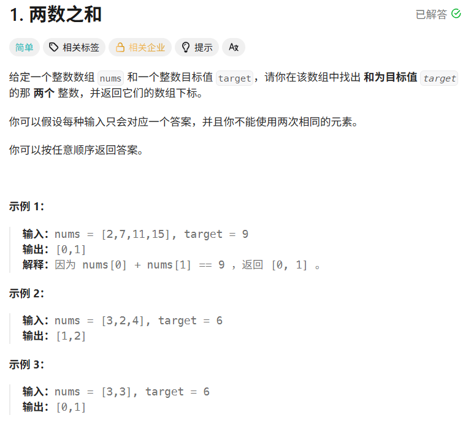
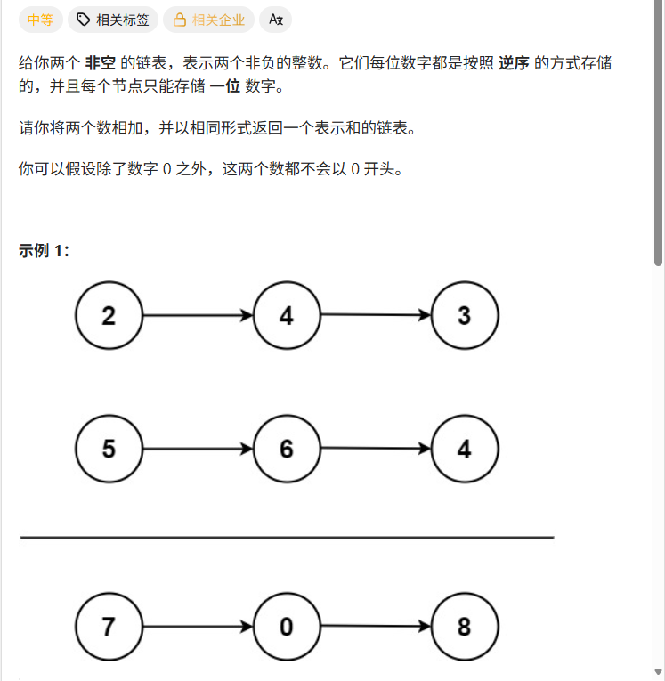
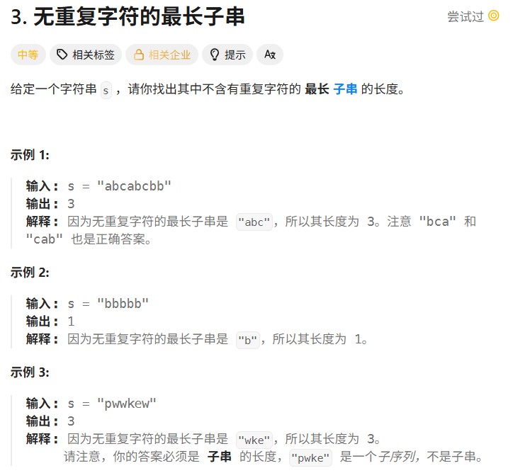

# Hot100第一天|1.两数之和，2.两数相加，xxx.题目3

## 1.两数之和



## 我的思路

用sort排序，然后双指针搜索。一个指针指向第一个，一个指向第二个。第二个向后移动直到大于target。第一个向左移动，fast回到slow右边。依次循环。

## 问题总结

1.不可以用sort，会改变数组下标

2.这题应该用哈希表，思考一下。

--先遍历一遍数组，把每个存入哈希表，用target-value作为键，value的下标作为值，在遍历过程中找哈希表中有没有键为value的，有就说明匹配上了。

## 优秀思路

## 我的代码

```
class Solution {
public:
    vector<int> twoSum(vector<int>& nums, int target) {
     unordered_map<int,int> mp;
        for(int i=0;i<nums.size();i++){
            if(mp.find(nums[i])==mp.end()){
                mp.insert({target-nums[i],i});
            }
            else
            return {mp[nums[i]],i};
        }
        return  {};
    }
};
```


## 2.两数相加



## 我的思路

## 问题总结

1.我把头节点的使用方法没搞清楚。作为重复使用的node一开始应该指向头节点，然后node不断node=node->netx.而不是头节点的next指向node。

头节点的写法是dummy

2.untime error: member access within null pointer of type 'ListNode' (solution.cpp)

访问了空指针，检查next操作

3.其他的做一些cout调试就可以发现问题，比单步调试速度快。

4.每天至少练一题acm模式吧，不然链表框架很容易忘。

## 优秀思路

## 我的代码

```
/**
 * Definition for singly-linked list.
 * struct ListNode {
 *     int val;
 *     ListNode *next;
 *     ListNode() : val(0), next(nullptr) {}
 *     ListNode(int x) : val(x), next(nullptr) {}
 *     ListNode(int x, ListNode *next) : val(x), next(next) {}
 * };
 */
class Solution {
public:
    ListNode* addTwoNumbers(ListNode* l1, ListNode* l2) {
         ListNode* dummy=new ListNode();
       ListNode* node=dummy;
       int add=0;

       while(l1!=NULL||l2!=NULL){
        node->next=new ListNode();
        node=node->next;
        int val1,val2;
        if(l1!=NULL)val1=l1->val;
        else val1=0;
        cout<<"val1="<<val1;
        if(l2!=NULL)val2=l2->val;
        else val2=0;
        cout<<"val1="<<val2;
        node->val=(val1+val2+add)%10;
        add=(val1+val2+add)/10;
        cout<<"node="<<node->val<<endl;
        if(l1!=NULL)l1=l1->next;
         if(l2!=NULL)l2=l2->next;
       }
       if(add!=0){
        node->next=new ListNode(add);
       }
       return dummy->next;
        
    }
};
```


## 3.无重复字符的最长子串



## 我的思路

想用暴力打的，大部分用例都过不去。

要不试试滑动窗口。两个index，在不重复的情况下fast一直扩张，有重复的slow就一直收缩

## 问题总结

一开始写的太乱了，用fast做for循环，每次只处理一个字符，加入、收缩。套while容易搞得乱七八糟。

被提示误导了，有其他字符，把vector换成unordered map了。我说怎么通过率这么低。

## 优秀思路

右指针负责把字符拿进来，左指针负责在重复时把多余字符扔出去。

## 我的代码

```
class Solution {
public:
    int lengthOfLongestSubstring(string s) {
        unordered_map<char, int> mp;
        int result = 0;
        int slow = 0;

        for (int fast = 0; fast < s.size(); fast++) {
            mp[s[fast]]++;

            while (mp[s[fast]] > 1) {
                mp[s[slow]]--;
                slow++;
            }

            result = max(result, fast - slow + 1);
        }

        return result;
    }
};
```

