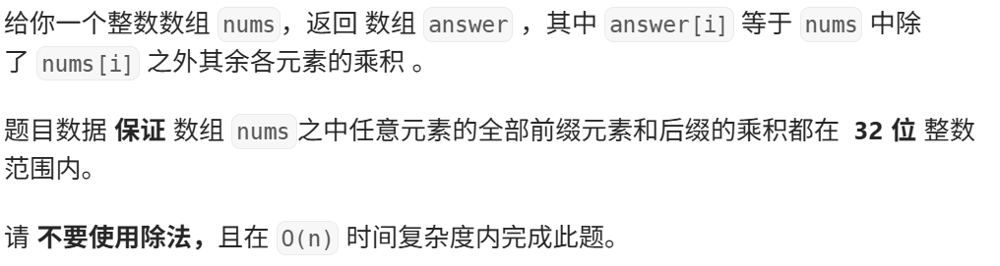
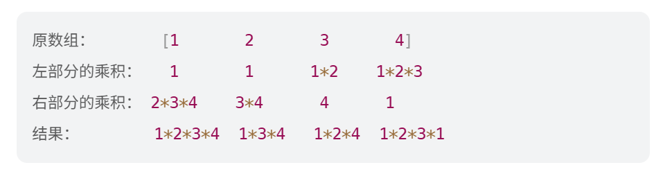

# Hot100第七天|238.除自身以外数组的乘积，41.缺失的第一个正数，73.矩阵置零

## 238.除自身以外数组的乘积



## 我的思路

我没有思路。

## 问题总结

## 优秀思路



由图观察可知，每个数相应的resullt就是左部分*右部分，因此需要遍历两次数组，算出前后缀后算result。

前后缀可以在一次遍历中算啊。

压缩空间使用的方法是先把前缀和放进result，然后倒序算后缀和的同时直接乘前缀和给result赋值。

## 我的代码

```
class Solution {
public:
    vector<int> productExceptSelf(vector<int>& nums) {
        vector<int> Pre(nums.size(),1);
        vector<int>back(nums.size(),1);
        for(int i=1;i<nums.size();i++){
            Pre[i]=Pre[i-1]*nums[i-1];
            back[nums.size()-1-i]=back[nums.size()-i]*nums[nums.size()-i];

        }

        vector<int>result(nums.size(),1);
        for(int i=0;i<nums.size();i++){
            result[i]=Pre[i]*back[i];
        }
        return result;
    }
};
```


## 41.缺失的第一个正数


## 我的思路

## 问题总结

有个点要注意，新换过来的数字也要放进正确位置，所以要用while一直换到当前位置正确为止。

## 优秀思路

不开新哈希表，而是让数组本身当哈希表。
 数字 `x` 出现过，就尽量把它放到下标 `x - 1` 的位置。
 最后哪个位置没放对，哪个正数就缺失。

神了。

## 我的代码

```
class Solution {
public:
 
    int firstMissingPositive(vector<int>& nums) {
        int n=nums.size();
        for(int i=0;i<nums.size();i++){
              while(nums[i] > 0 && nums[i] <= n && nums[nums[i] - 1] != nums[i]){
                swap(nums[i], nums[nums[i] - 1]);
            }
        }
        for(int i=0;i<nums.size();i++){
            if(nums[i]!=i+1)return i+1;
        }

       
        return nums.size()+1;
    }
};
```


## 73.矩阵置零


## 我的思路

我感觉空间复杂度倒是没什么问题，我有一个时间复杂度为2*m*n的方法……

我天，如果我要把0的行列都存起来，额外空间也就（m+n）了。

## 问题总结

当第一行和第一列被征用，标记和赋值的范围就要从1开始了，别还从0开始。

这题和上一题都是原地算法，原地算法就要用数组的一部分或者结果数组来保存中间结果。如果占用了原来的有用数据，考虑能不能用o(1)额外空间来保存这一部分数据。

## 优秀思路

我们可以用矩阵的第一行和第一列代替方法一中的两个标记数组，以达到 O(1) 的额外空间。但这样会导致原数组的第一行和第一列被修改，无法记录它们是否原本包含 0。因此我们需要额外使用两个标记变量分别记录第一行和第一列是否原本包含 0。

在实际代码中，我们首先预处理出两个标记变量，接着使用其他行与列去处理第一行与第一列，然后反过来使用第一行与第一列去更新其他行与列，最后使用两个标记变量更新第一行与第一列即可。

小trick，但很有用。

## 我的代码

```
class Solution {
public:
    void setZeroes(vector<vector<int>>& matrix) {
      bool flagLineOne=false;
      bool flagRowOne=false;
      for(int i=0;i<matrix.size();i++)
        if(matrix[i][0]==0)flagLineOne=true;
       
      for(int j=0;j<matrix[0].size();j++)
        if(matrix[0][j]==0)flagRowOne=true;
        

      for(int i=1;i<matrix.size();i++){
        for(int j=1;j<matrix[0].size();j++){
            if(matrix[i][j]==0){
                matrix[i][0]=0;
                matrix[0][j]=0;
            }
        }
      }
      
      for(int i=1;i<matrix.size();i++){
        for(int j=1;j<matrix[0].size();j++){
            if(matrix[i][0]==0||matrix[0][j]==0)
            matrix[i][j]=0;
        }
      }

      if(flagLineOne){
        for(int i=0;i<matrix.size();i++)matrix[i][0]=0;
      }
      if(flagRowOne){
        for(int j=0;j<matrix[0].size();j++)matrix[0][j]=0;
      }


    }
};
```

