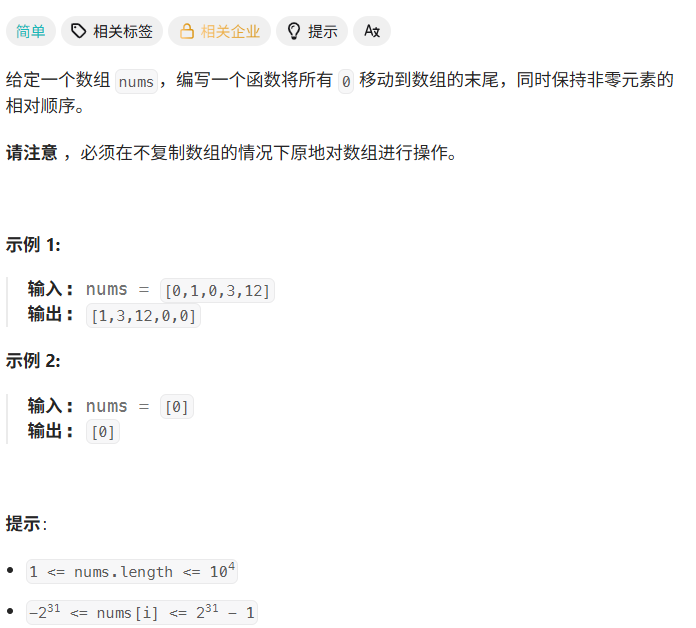
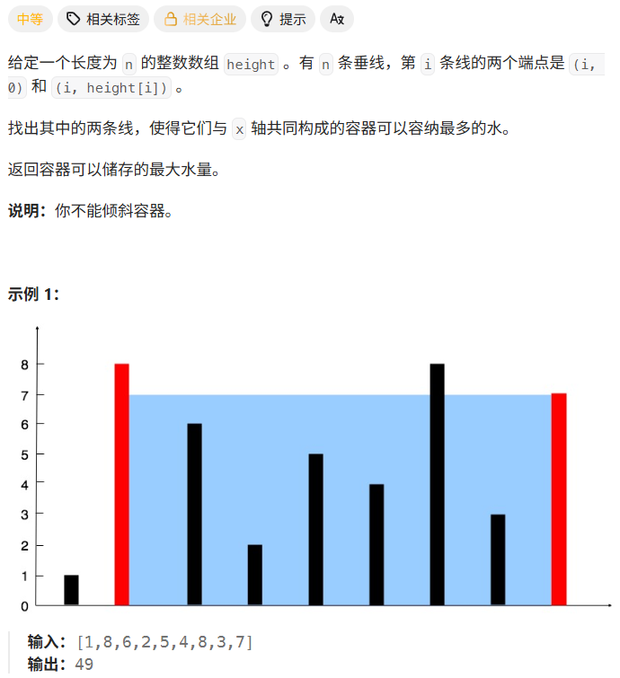
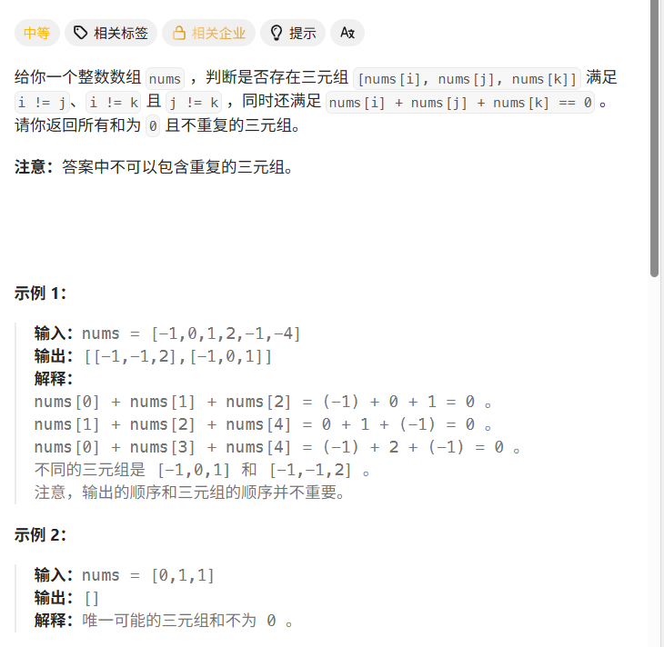

# Hot100第x天|283.移动零，11.盛最多水的容器，15.三数之和

## 283.移动零



## 我的思路

计算0的个数然后把不是0的往前挪，最后全补上0。比较简单

## 问题总结

## 优秀思路

## 我的代码

```
class Solution {
public:
    void moveZeroes(vector<int>& nums) {
        int zero=0;
        for(int i=0;i<nums.size();i++){
            if(nums[i]==0)zero++;
            else nums[i-zero]=nums[i];
        }
        for(int i=0;i<zero;i++){
            nums[nums.size()-1-i]=0;
        }
        
    }
};
```


## 11.盛最多水的容器



## 我的思路

我有一个N*N的思路你要不要……

超时了……

## 问题总结

## 优秀思路

容量由两端决定，可以推出双指针的大体方法。

从最两侧往里收缩可以包含所有情况。

那么如何收缩？

考虑收缩后有可能改善的路径，其实无非是收缩左或者右，那分别按高矮去分析就可以推算出来。

- 左边高度是 `height[l]`
- 右边高度是 `height[r]`

当前面积由谁卡住？

是 **较短的那条线**。

所以如果你想让后面面积变大，缩小宽度以后，必须想办法让这个“短板”变高。

这时关键问题来了：

- 如果 `height[l] < height[r]`，你移动右指针有意义吗？

右边本来更高，短板在左边。
 你把右边往里挪，宽度变小了，但短板还是左边，面积很难变大。
 所以这时候更值得动的是 **左边那个短板**。

## 我的代码

```
class Solution {
public:
    int maxArea(vector<int>& height) {
       int left=0,right=height.size()-1;
       int result=right*min(height[right],height[left]);
       while(left<right){
        if(height[left]<height[right]){
            left++;
            result=max(result,(right-left)*min(height[left],height[right]));
        }
        else{
             right--;
            result=max(result,(right-left)*min(height[left],height[right]));
        }
       }
       return result;

    }
};
```


## 15.三数之和



## 我的思路

不能重复、顺序不重要->可以先用set去重和排序。

但是set不好做遍历。而且set会把[-1,-1,2]这种筛掉。去重可以排序后在数组中实现。

主要还是用数组。在gpt的提醒下想出来了。

三元组固定一个数，然后用双指针从两侧夹，得到一个和为0的组。注意固定的数对应的剩下两个数不一定只有一组，所以找到一组后应该继续fast--，slow++。

去重是看第一个数是不是跟nums里上一个数一样，如果一样情况就是一样的。

## 问题总结

注意固定的数对应的剩下两个数不一定只有一组，所以找到一组后应该继续fast--，slow++。

## 优秀思路

## 我的代码

```
class Solution {
public:
    vector<vector<int>> threeSum(vector<int>& nums) {
       
        vector<vector<int>>result;
        sort(nums.begin(),nums.end());
       for(int i=0;i<nums.size();i++){
        if(i!=0&&nums[i]==nums[i-1])continue;
        int slow=i+1,fast=nums.size()-1;
        while(fast>slow){
            if(nums[fast]+nums[slow]+nums[i]<0)slow++;
            else if(nums[fast]+nums[slow]+nums[i]>0)fast--;
            else {result.push_back({nums[i],nums[fast],nums[slow]});fast--;slow++;}
        }
       }
        return result;
    }
};
```

