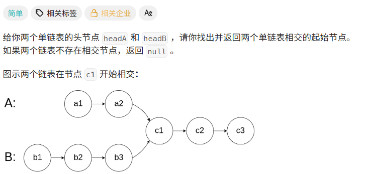
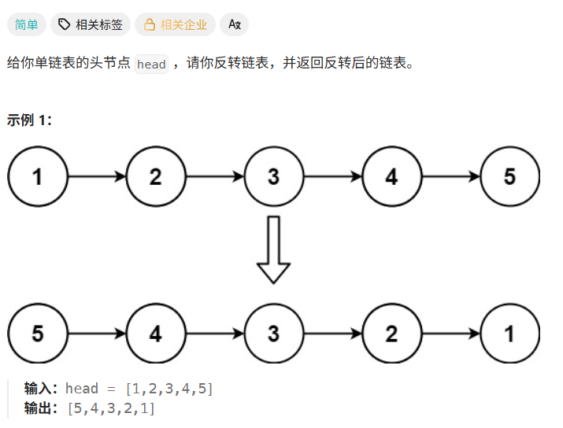
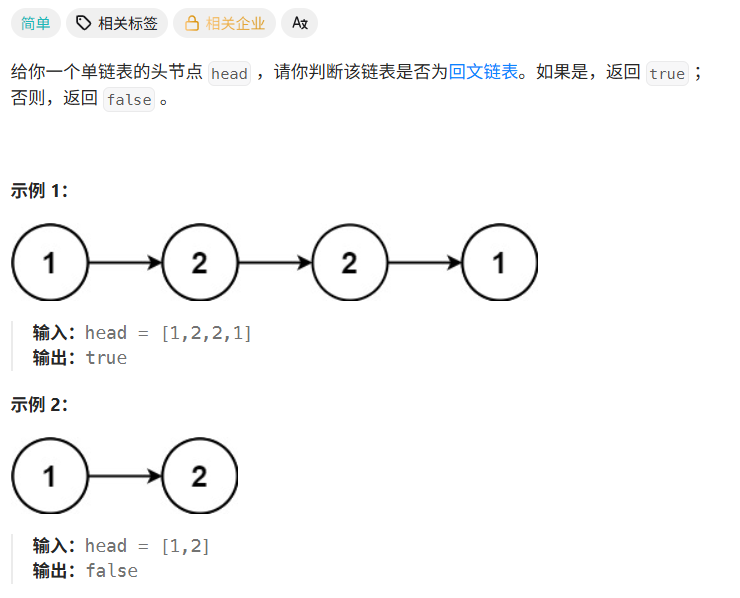

# Hot100第九天|160.相交链表，206.反转链表，234.回文链表

## 160.相交链表



## 我的思路

我准备用一个set存其中一个链表的next，然后在遍历另一个的时候在set里找有没有一样的next.

怎么说呢感觉这个方法有点邪门，看看标准思路是什么。

噢还行，属于简单的想法。还有一个思路是把两个链表长度补齐，然后一起前进。

## 问题总结

虚拟头节点的next要指向head，不是虚拟头节点=head

## 优秀思路

## 我的代码

```
/**
 * Definition for singly-linked list.
 * struct ListNode {
 *     int val;
 *     ListNode *next;
 *     ListNode(int x) : val(x), next(NULL) {}
 * };
 */
class Solution {
public:
    ListNode *getIntersectionNode(ListNode *headA, ListNode *headB) {
        
        set<ListNode*>se;
        ListNode* nummpyA=new ListNode();
        nummpyA->next=headA;
        ListNode* nummpyB=new ListNode();
        nummpyB->next=headB;
        ListNode* nodeA=nummpyA;
        ListNode* nodeB=nummpyB;
        while(nodeA!=NULL&&nodeA->next!=NULL){
             se.insert(nodeA->next);
              nodeA=nodeA->next;
        }

        while(nodeB!=NULL&&nodeB->next!=NULL){
           cout<<nodeB->val<<' ';
            if(se.find(nodeB->next)!=se.end())return nodeB->next;
            
            nodeB=nodeB->next;
        }
        return NULL;
    }
};
```


## 206.反转链表



## 我的思路

虽然是简单题，但是能理清思路也不错。

## 问题总结

## 优秀思路

## 我的代码

```
/**
 * Definition for singly-linked list.
 * struct ListNode {
 *     int val;
 *     ListNode *next;
 *     ListNode() : val(0), next(nullptr) {}
 *     ListNode(int x) : val(x), next(nullptr) {}
 *     ListNode(int x, ListNode *next) : val(x), next(next) {}
 * };
 */
class Solution {
public:
    ListNode* reverseList(ListNode* head) {
        if(!head)return NULL;
        if(!head->next)return head;
        if(!head->next->next){
            ListNode* node=head->next;
            head->next->next=head;
            head->next=NULL;
            return node;
        }

        ListNode* pre=NULL;
        ListNode* now=head;
        ListNode*next=head->next;
        while(next){
            now->next=pre;

            pre=now;
            now=next;
            next=next->next;
        }
        now->next=pre;
        return now;

    }
};
```


## 234.回文链表



## 我的思路

没有原地算法。

行吧大多数人还是快慢指针+反转链表。也想过，感觉有点复杂就没实现

## 问题总结

## 优秀思路

## 我的代码

```
class Solution {
public:
    bool isPalindrome(ListNode* head) {
        if (!head || !head->next) return true;

        ListNode* fast = head;
        ListNode* slow = head;

        // 找到链表中点
        while (fast && fast->next) {
            fast = fast->next->next;
            slow = slow->next;
        }

        // 如果 fast 不为空，说明是奇数个节点，slow 跳过中间节点
        if (fast) {
            slow = slow->next;
        }

        // 反转后半部分链表
        ListNode* pre = nullptr;
        ListNode* cur = slow;

        while (cur) {
            ListNode* nxt = cur->next;
            cur->next = pre;
            pre = cur;
            cur = nxt;
        }

        // pre 是反转后后半段的头节点
        ListNode* left = head;
        ListNode* right = pre;

        // 从两端向中间比较
        while (right) {
            if (left->val != right->val) {
                return false;
            }
            left = left->next;
            right = right->next;
        }

        return true;
    }
};
```

