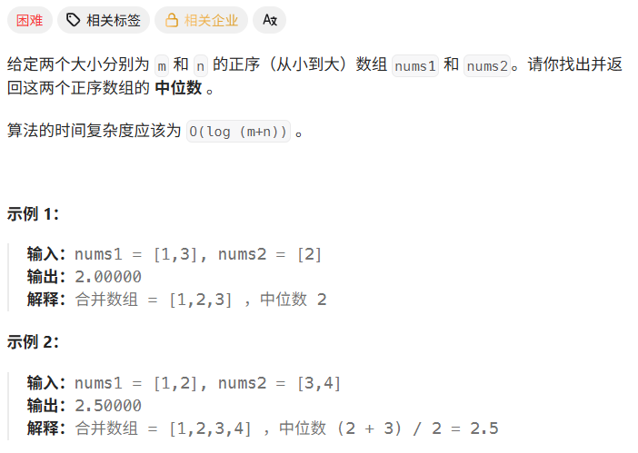
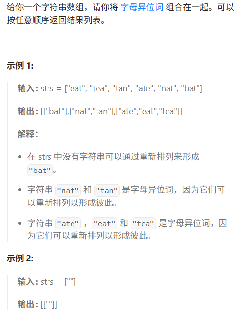
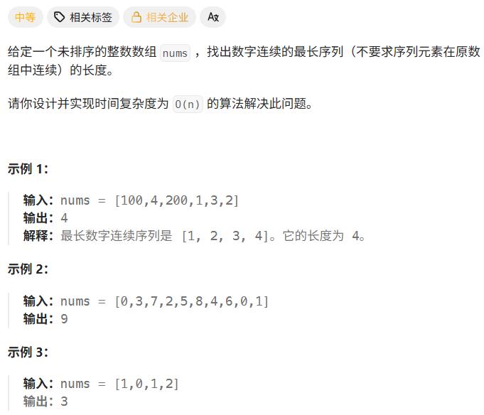

# Hot100第二天|4.寻找两个正序数组的中位数，49.字母异位词分组，128.最长连续序列

## 4.寻找两个正序数组的中位数



## 我的思路

每次找两个数组里小的那个，一直找到中位数个数。

## 问题总结

1.INT最大是十位，需要最大值的时候可以用。看清楚每个变量的范围，不要看错了

2.这题要log（m+n）的复杂度，得用二分

## 优秀思路

## 我的代码

```
class Solution {
public:
    double findMedianSortedArrays(vector<int>& nums1, vector<int>& nums2) {
        int m=nums1.size(),n=nums2.size();
        bool isJishu=false;
        if((m+n)%2==1)isJishu=true;
        int i=0,j=0;
        int mid=0,last=0;
        for(int k=0;k<(m+n)/2+1;k++){
            cout<<"i="<<i<<" j="<<j<<endl; 
            int n1,n2;
            if(i<nums1.size())n1=nums1[i];
            else n1=INT_MAX;
            cout<<"n1="<<n1;
            if(j<nums2.size())n2=nums2[j];
            else n2=INT_MAX;
            cout<<"n2="<<n2;
            last=mid;
            mid=min(n1,n2);
            if(n1==mid)i++;
            else j++;

        }
        if(isJishu)return mid;
        else return (float)(mid+last)/2;
        
    }
};
```


## 49.字母异位词分组



## 我的思路

可以用数组来统计词的各个字母出现的个数。但是怎么才能快速把异位词分组呢。

经过gpt的提示，有两种思路。第一种是直接把每个字符串sort，异位词的字符串就真的一样了，但是要用额外空间，sort本身也费时。

第二种是把统计数组的key变成数字字符串，比较字符串是否一样。

最后写出来是用的第二种，不过时间复杂度有点高了。

调试好痛苦，改出来好爽。给活人整成m了

## 问题总结

1.时间复杂度高的原因是：

①第 1 步和第 2 步完全可以合在一起。每处理一个字符串时，当场统计、当场生成 key、当场塞进哈希表，不用额外存整个 `ve` 和 `strs1`。

②这里有重复查表：

```
if(mp.find(strs1[i])!=mp.end()) mp[strs1[i]].push_back(strs[i]);
else mp[strs1[i]].push_back(strs[i]);
```

你这两个分支一模一样，所以 `if else` 完全没意义。
 而且 `find` 查了一次，`mp[strs1[i]]` 又查一次，白跑一趟。

③最后取结果时也多查了一次：

```
for(auto &k:mp){
    result.push_back(mp[k.first]);
}
```

这里 `k` 已经是 map 里的元素了，再 `mp[k.first]` 又查一次哈希表。

直接写：

```
for(auto &k:mp){
    result.push_back(k.second);
}
```

## 优秀思路

## 我的代码

```
class Solution {
public:
    vector<vector<string>> groupAnagrams(vector<string>& strs) {
        vector<vector<int>>ve(strs.size(),vector<int>(26,0));
        for(int i=0;i<strs.size();i++){
            for(int j=0;j<strs[i].size();j++){
                ve[i][strs[i][j]-'a']++;
            }
        }

        cout<<"字母统计数组"<<endl;
        for(int i=0;i<strs.size();i++){
            for(int j=0;j<26;j++){
              cout<<ve[i][j]<<' ';
            }
            cout<<endl;
        }

        

        vector<string>strs1;
        for(int i=0;i<strs.size();i++){
            string s;
            for(int j=0;j<26;j++){
              s+=to_string(ve[i][j])+'#';
            }
            strs1.push_back(s);
        }

        cout<<"压缩成字符串"<<endl;
        for(int i=0;i<strs.size();i++){
            cout<< strs1[i]<<endl;
        }

        vector<vector<string>>result;
 

        unordered_map<string,vector<string>> mp;
        for(int i=0;i<strs1.size();i++){
            if(mp.find(strs1[i])!=mp.end())mp[strs1[i]].push_back(strs[i]);
            else mp[strs1[i]].push_back(strs[i]);
        }

     cout<<"转字典"<<endl;
for(int i=0;i<strs1.size();i++){
    cout<<"mp "<<strs1[i]<<' ';
    for(auto &s : mp[strs1[i]]){
        cout<<s<<' ';
    }
    cout<<endl;
}

        for(auto &k:mp){
            result.push_back(mp[k.first]);
        }

       
        return result;
        

        
    }
};
```


## 128.最长连续序列



## 我的思路

没思路。直观的想法是sort，然后找连续，但是时间复杂度是O（N*logN）

## 问题总结

1.怎么把nums转set

unordered_set<int> st(nums.begin(), nums.end());

2.unordered_set查找的时间复杂度是O（1），最坏情况是O（n）。

3.**不要对每个元素都做完整工作，只对“有资格触发计算”的元素做。**

第二，**用哈希表换时间**。
 这题之所以能快，是因为把“某个数在不在”这个操作变成了哈希查找。
 所以你可以记住一种判断：

- 如果题目里频繁问“某个元素是否存在”
- 并且不太在乎顺序
- 那就优先想 `unordered_set` / `unordered_map`

也就是把问题从“遍历找”变成“查表找”。

第三，**看到连续、相邻、前驱、后继，先想集合化处理**。
 这题表面上是数组题，但真正高效的做法几乎不依赖原数组顺序。
 因为我们关心的不是位置，而是：

- `x-1` 在不在
- `x+1` 在不在

## 优秀思路

**简单来说就是每个数都判断一次这个数是不是连续序列的开头那个数**。

- 怎么判断呢，就是用哈希表查找这个数前面一个数是否存在，即num-1在序列中是否存在。存在那这个数肯定不是开头，直接跳过。
- 因此只需要对每个开头的数进行循环，直到这个序列不再连续，因此复杂度是O(n)。
  以题解中的序列举例:
  **[100，4，200，1，3，4，2]**
  去重后的哈希序列为：
  **[100，4，200，1，3，2]**
  按照上面逻辑进行判断：

1. 元素100是开头,因为没有99，且以100开头的序列长度为1
2. 元素4不是开头，因为有3存在，过，
3. 元素200是开头，因为没有199，且以200开头的序列长度为1
4. 元素1是开头，因为没有0，且以1开头的序列长度为4，因为依次累加，2，3，4都存在。
5. 元素3不是开头，因为2存在，过，
6. 元素2不是开头，因为1存在，过。
   完

## 我的代码

```
class Solution {
public:
    int longestConsecutive(vector<int>& nums) {
        unordered_set<int> st(nums.begin(),nums.end());
        int result=0;
        int temp=0;
        for(auto i:st){
            if(st.find(i-1)!=st.end())continue;
            else{
                temp++;
                while(st.find(i+1)!=st.end()){temp++;i++;}
            }
            result=max(result,temp);
            temp=0;
        }
        return result;
    }
};
```

