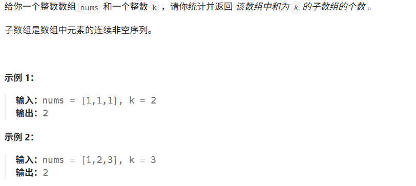
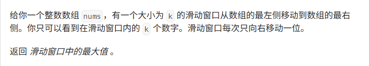

# Hot100第五天|977.有序数组的平方，239.滑动窗口的最大值2，76.最小覆盖子串

## 260.和为K的子数组



## 我的思路

感觉跟子序列差不多，区别在哪里呢？先用滑动窗口做做看吧。

该怎么去重。

滑动窗口是没有办法跳着取的，感觉有点问题。

试试回溯。

连续非空序列，我觉得下次做题应该先长眼睛。

滑动窗口。

可是小于target扩张，大于tartget收缩这套对负数没用。

## 问题总结

这题有点长知识。

这题用的是前缀和，把每个子数组都看作前缀和s[j]-s[i]

因为s[j]-s[i]=k

除了暴力双层循环，还可以：

s[i]=s[j]-k;

只需要一边遍历一边保存前缀和，找前面有没有出现过这个前缀和就可以。

1.用map不用set的原因是同一个前缀和可能出现很多次，所以要用一个int来保存次数。

2.边界情况没有考虑好，就是全量的时候，也就是s[0]=1，就是前缀和为0，一个都不选的时候也是一种前缀。

## 优秀思路

## 我的代码

```
class Solution {
public:
    int subarraySum(vector<int>& nums, int k) {
        map<int,int>mp;
        mp[0]=1;
        int preSum=0;
        int result=0;
        for(int i=0;i<nums.size();i++){
            preSum+=nums[i];
            
            if(mp.find(preSum-k)!=mp.end())result+=mp[preSum-k];
            else if(preSum==k)result++;  
            mp[preSum]++;
             
        }
        for(auto i:mp){
            cout<<i.first<<' '<<i.second<<endl;
        }
        return result;
    }
};
```


## 239.滑动窗口的最大值



## 我的思路

这题我知道，用单调队列来做，但是快晚上11点了让我做hard实在有点为难……明天来写吧。

维护一个单调队列，每次如果队尾有比当前数字小的，就弹出直到队尾比当前数字大，然后当前数字入队。然后取队头的数字，看看是不是该弹出了，如果是k之外的，就弹出。单调队里只存数组下标。

## 问题总结

1.单调队列是用双端队列deque实现的。

函数：empty（），pop_back(),pop_front(),push_back(),push_front()

front(),back()

## 优秀思路

## 我的代码

```
class Solution {
public:
    vector<int> maxSlidingWindow(vector<int>& nums, int k) {
        deque<int>deq;
        vector<int>result;

        for(int i=0;i<nums.size();i++){
            while(!deq.empty()&&nums[deq.back()]<nums[i]){
                deq.pop_back();
            }
            deq.push_back(i);
            if(deq.front()<=i-k)deq.pop_front();
            if(i>k-2)
            result.push_back(nums[deq.front()]);

        }
        return result;
    }
};
```


## 76.最小覆盖子串


## 我的思路

我有一个M*N的思路……

## 问题总结

## 优秀思路

用 need 哈希表统计 t 中每个字符的出现次数
初始化 left = 0, right = 0, count = 0
right 不断右移：
如果 s[right] 是 t 中的字符，更新 window，如果该字符数量刚好满足需求，count++
当 count == need.size() 时，尝试收缩窗口
left 不断右移收缩窗口：
如果 s[left] 是 t 中的字符，更新 window，如果该字符数量不够了，count--
更新最小窗口的起始位置和长度
重复 3-4 直到 right 遍历完 s


## 我的代码

```
class Solution {
public:
    string minWindow(string s, string t) {
        map<char, int> mp;
        map<char, int> have;
        
        for (char c : t) mp[c]++;
        
        int start = 0;
        int count = 0;
        int minLen = INT_MAX;
        int minStart = 0;
        
        for (int end = 0; end < s.size(); end++) {
            // 扩展窗口
            if (mp.find(s[end]) != mp.end()) {
                have[s[end]]++;
                if (have[s[end]] == mp[s[end]]) count++;
            }
            
            // 收缩窗口：找到有效窗口后尝试缩小
            while (count == mp.size()) {
                // 更新最小窗口
                if (end - start + 1 < minLen) {
                    minLen = end - start + 1;
                    minStart = start;
                }
                
                // 移除左边字符
                if (mp.find(s[start]) != mp.end()) {
                    if (have[s[start]] == mp[s[start]]) count--;
                    have[s[start]]--;
                }
                start++;  // 左边界右移
            }
        }
        
        return minLen == INT_MAX ? "" : s.substr(minStart, minLen);
    }
};
```

