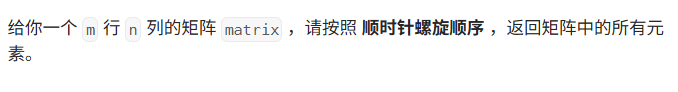
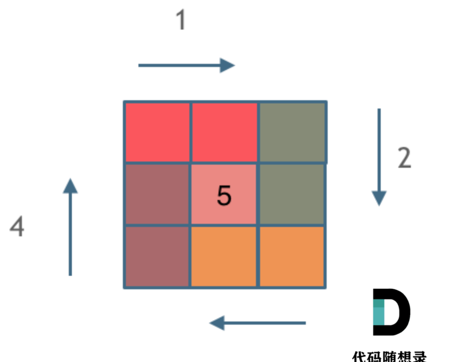
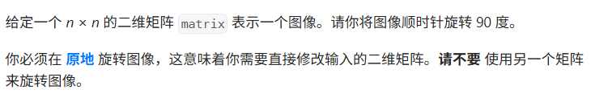
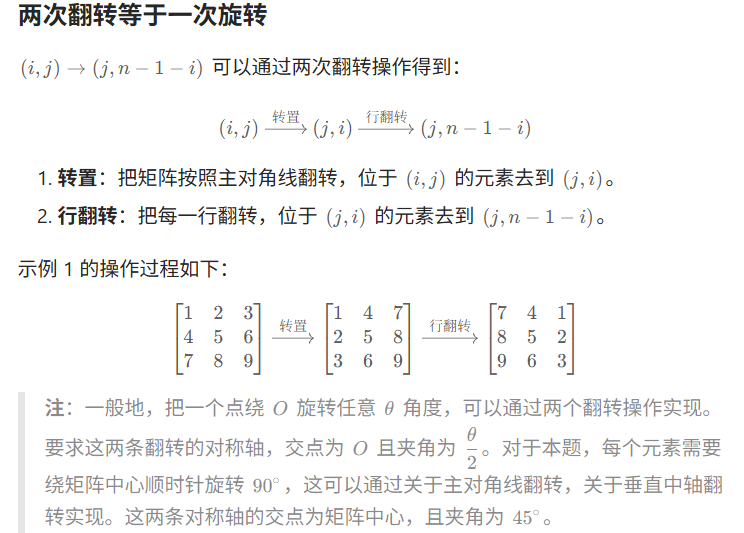
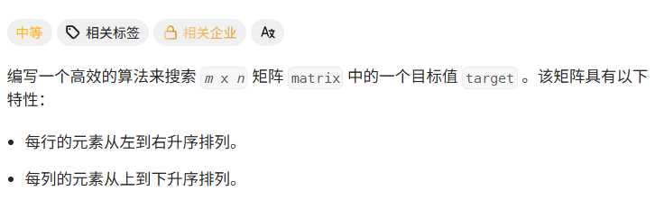

# Hot100第八天|977.有序数组的平方，xxx.题目2，xxx.题目3

## 54.螺旋矩阵



## 我的思路

又遇到了，我决定把代码背下来……

好，看了代码有信心了，自己写写看。

## 问题总结

## 优秀思路

1.确定开闭原则

左闭右开




## 我的代码

```
class Solution {
public:
    vector<int> spiralOrder(vector<vector<int>>& matrix) {
        int n=matrix.size(),m=matrix[0].size();
        vector<int>ans;
        int left=0,top=0,right=m-1,bottom=n-1;

        while(ans.size()<n*m){
            for(int j=left;j<=right&&ans.size()<n*m;j++)
            ans.push_back(matrix[top][j]);
            top++;
            for(int i=top;i<=bottom&&ans.size()<n*m;i++)
            ans.push_back(matrix[i][right]);
            right--;
            for(int j=right;j>=left&&ans.size()<n*m;j--)
            ans.push_back(matrix[bottom][j]);
            bottom--;
            for(int i=bottom;i>=top&&ans.size()<n*m;i--)
            ans.push_back(matrix[i][left]);
            left++;
        }
        return ans;

    }
};
```


## 48.旋转图像



## 我的思路

## 问题总结

## 优秀思路

- 第 *i* 行的元素去到第 *n*−1−*i* 列。（*i* 从 0 开始）
- 即 (*i*,*j*)→(*j*,*n*−1−*i*)。
- 

## 我的代码

```
class Solution {
public:
    void rotate(vector<vector<int>>& matrix) {
        for(int i=0;i<matrix.size();i++){
            for(int j=i;j<matrix[0].size();j++){
                swap(matrix[i][j],matrix[j][i]);
            }
        }

        for(int i=0;i<matrix.size();i++){
            reverse(matrix[i].begin(),matrix[i].end());
        }
    }
};
```


## 240.搜索二维矩阵II



## 我的思路

## 问题总结

## 优秀思路

## 我的代码

```
class Solution {
public:
    bool searchMatrix(vector<vector<int>>& matrix, int target) {
         int m = matrix.size(), n = matrix[0].size();
        int i = 0, j = n - 1; // 从右上角开始
        while (i < m && j >= 0) { // 还有剩余元素
            if (matrix[i][j] == target) {
                return true; // 找到 target
            }
            if (matrix[i][j] < target) {
                i++; // 这一行剩余元素全部小于 target，排除
            } else {
                j--; // 这一列剩余元素全部大于 target，排除
            }
        }
        return false;
    }

};
```

