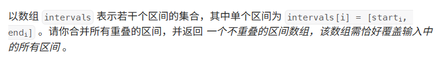
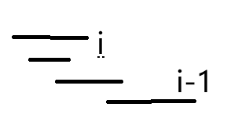

# Hot100第六天|53.最大子数组和，56合并区间，189.轮转数组

## 53.最大子数组和


## 我的思路

好奇怪，怎么感觉这题也写过。

没完全学会，这题跟和为K是长得比较像。

## 问题总结

这次学了动态规划，下次学分治法吧。

选最小值的时候，放在外面定义的首个数字不能忘了。

## 优秀思路

学一个动态规划吧。

1.dp数组及下标含义

以i为结尾的子数组的最大值（保证了子数组的连续性，要么必须选这个，要么从这个开始新开一个子数组）

2.初始化

dp[0]=nums[0]，其他都为INT_MIN;

3.递推公式

dp[i]=max(dp[i-1],dp[i-1]+nums[i]);

4.遍历顺序

从前向后

## 我的代码

```
class Solution {
public:
    int maxSubArray(vector<int>& nums) {
        vector<int>dp(nums.size(),INT_MIN);
        dp[0]=nums[0];
        int result=nums[0];
        for(int i=1;i<nums.size();i++){
            dp[i]=max(nums[i],dp[i-1]+nums[i]);
            result=max(result,dp[i]);
        }
        return result;
        
        
    }
};
```


## 56.合并区间



## 我的思路

三种情况



之前刷过，就简单画个示意图了。

## 问题总结

相等的边界情况一定要考虑一定要考虑。

## 优秀思路

## 我的代码

```
class Solution {
public:
    static bool cmp(vector<int>&a,vector<int>&b){
        return a[0]<b[0];
    }
    vector<vector<int>> merge(vector<vector<int>>& intervals) {
        vector<vector<int>>result;
        sort(intervals.begin(),intervals.end(),cmp);
        for(int i=0;i<intervals.size()-1;i++){
            if(intervals[i+1][0]>intervals[i][1])
            result.push_back(intervals[i]);
            else if(intervals[i+1][1]<=intervals[i][1])
           { intervals[i+1][1]=intervals[i][1];
           intervals[i+1][0]=intervals[i][0];
           }
            else if(intervals[i+1][0]<=intervals[i][1]&&intervals[i+1][1]>intervals[i][1])
            intervals[i+1][0]=intervals[i][0];
        }
        result.push_back(intervals[intervals.size()-1]);
        return result;
    }
};
```


## 189.轮转数组


## 我的思路

难道真的有天才能想出原地算法？

提醒我反转，那我知道了。

翻转整个数组，再对两个数组分别反转

## 问题总结

## 优秀思路

## 我的代码

```
class Solution {
public:
    void reverse(vector<int>&nums,int a,int b){
        while(a<b){
            int temp=nums[a];
            nums[a]=nums[b];
            nums[b]=temp;
            a++;
            b--;
        }
    }
    void rotate(vector<int>& nums, int k) {
        reverse(nums,0,nums.size()-1);
        reverse(nums,0,k%nums.size()-1);
        reverse(nums,k%nums.size(),nums.size()-1);
        
    }
};
```

