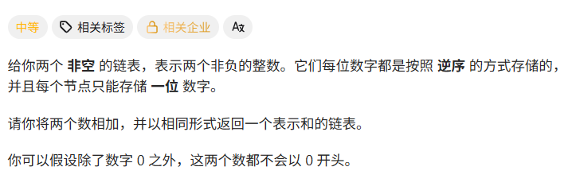
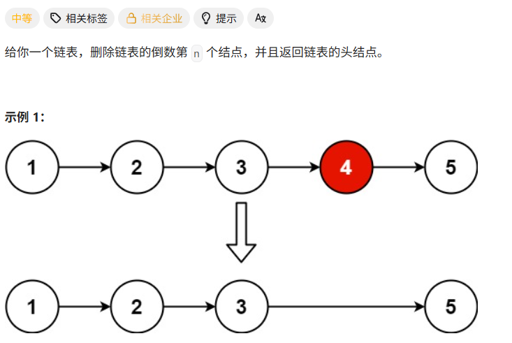
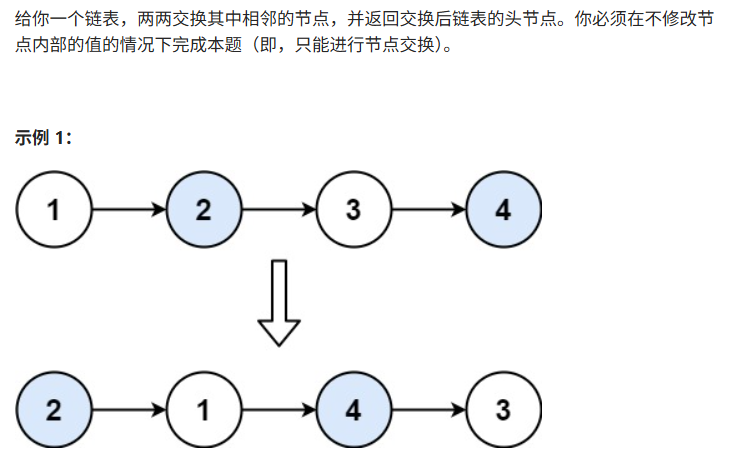

# Hot100第十一天|2.两数相加，19.删除链表的倒数第N个结点，24.两两交换链表中的节点

## 2.两数相加



## 我的思路

我怎么有种鬼打墙的感觉，怎么感觉这题做过几遍了啊。

## 问题总结

别忘了进位。

在循环开始还是结束建新节点？

答案是开始，因为在结束时建最后会多出来一个，不好删。

## 优秀思路

## 我的代码

```
/**
 * Definition for singly-linked list.
 * struct ListNode {
 *     int val;
 *     ListNode *next;
 *     ListNode() : val(0), next(nullptr) {}
 *     ListNode(int x) : val(x), next(nullptr) {}
 *     ListNode(int x, ListNode *next) : val(x), next(next) {}
 * };
 */
class Solution {
public:
    ListNode* addTwoNumbers(ListNode* l1, ListNode* l2) {
        ListNode* Result=new ListNode();
        ListNode*index3=Result;
        index3->next=new ListNode();
        ListNode* index1=l1;
        ListNode* index2=l2;
        int add=0;
        while(index1||index2){
            index3->next=new ListNode();
            index3=index3->next;
            int val=0;
            if(index1){
                val=index1->val;
                index1=index1->next;
            }
            if(index2){
                val+=index2->val;
                index2=index2->next;
            }
            val+=add;
            add=0;
            if(val>9){
                add=1;
                val=val%10;
            }
            index3->val=val;
            
        }
        if(add==1)
        index3->next=new ListNode(1);
        
        return Result->next;
    }
};
```


## 19.删除链表的倒数第N个结点



## 我的思路

快慢指针

## 问题总结

示例里面的特殊情况要考虑到。删头节点的情况。

## 优秀思路

## 我的代码

```
/**
 * Definition for singly-linked list.
 * struct ListNode {
 *     int val;
 *     ListNode *next;
 *     ListNode() : val(0), next(nullptr) {}
 *     ListNode(int x) : val(x), next(nullptr) {}
 *     ListNode(int x, ListNode *next) : val(x), next(next) {}
 * };
 */
class Solution {
public:
    ListNode* removeNthFromEnd(ListNode* head, int n) {
        ListNode* fast=head;
        ListNode* numppyhead=new ListNode();
        numppyhead->next=head;
        ListNode* slow=numppyhead;
        while(n--){
            fast=fast->next;
        }
        while(fast){
            fast=fast->next;
            slow=slow->next;
        }
        slow->next=slow->next->next;
        // if(slow==numppyhead)return NULL;
        return numppyhead->next;
    }
};
```


## 24.两两交换链表中的节点



## 我的思路

我怎么觉得这题也做过了呢

## 问题总结

## 优秀思路

## 我的代码

```
/**
 * Definition for singly-linked list.
 * struct ListNode {
 *     int val;
 *     ListNode *next;
 *     ListNode() : val(0), next(nullptr) {}
 *     ListNode(int x) : val(x), next(nullptr) {}
 *     ListNode(int x, ListNode *next) : val(x), next(next) {}
 * };
 */
class Solution {
public:
    ListNode* swapPairs(ListNode* head) {
        if(head==NULL)return NULL;
        ListNode*numppyhead=new ListNode();
        numppyhead->next=head;
        ListNode* pre=numppyhead;
        ListNode*index1=head;
        ListNode*index2=head->next;

        while(index1&&index2){
            index1->next=index2->next;
            index2->next=index1;
            pre->next=index2;

            pre=index1;
            index1=index1->next;
            if(index1)index2=index1->next;
            else index2=NULL;
        }
        return numppyhead->next;
    }
};
```

