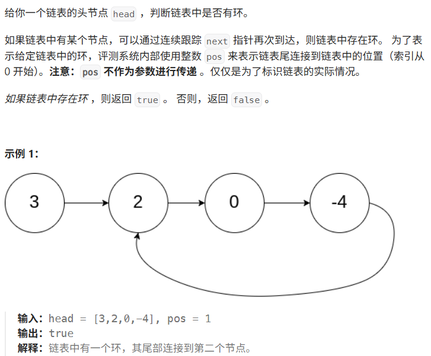
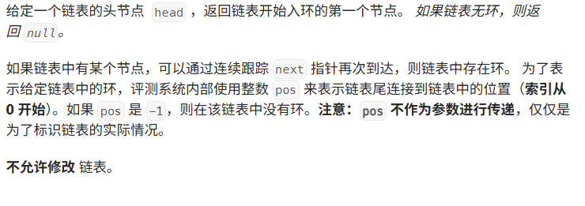
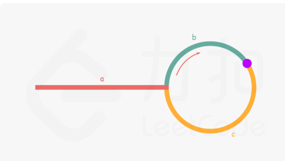
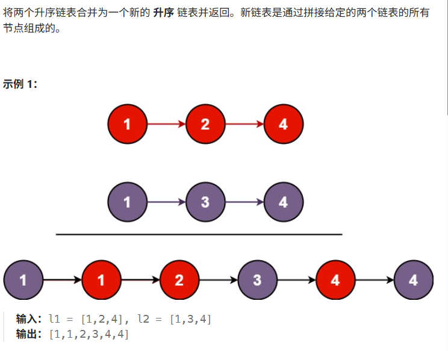

# Hot100第十天|141.环形链表，142.环形链表II，21.合并两个有序链表

## 141.环形链表



## 我的思路

不太难。

## 问题总结

## 优秀思路

## 我的代码

```
/**
 * Definition for singly-linked list.
 * struct ListNode {
 *     int val;
 *     ListNode *next;
 *     ListNode(int x) : val(x), next(NULL) {}
 * };
 */
class Solution {
public:
    bool hasCycle(ListNode *head) {
        if(head==NULL||head->next==NULL)return false;
        ListNode* fast=head;
        ListNode*slow=head;
        while(fast!=NULL&&fast->next!=NULL){
            fast=fast->next->next;
            slow=slow->next;
            if(fast==slow)return true;
        }
        return false;
        
    }
};
```


## 142.环形链表II



## 我的思路

## 问题总结

## 优秀思路

如下图所示，设链表中环外部分的长度为 a。slow 指针进入环后，又走了 b 的距离与 fast 相遇。此时，fast 指针已经走完了环的 n 圈，因此它走过的总距离为 a+n(b+c)+b=a+(n+1)b+nc。



根据题意，任意时刻，fast 指针走过的距离都为 slow 指针的 2 倍。因此，我们有

a+(n+1)b+nc=2(a+b)⟹a=c+(n−1)(b+c)
有了 a=c+(n−1)(b+c) 的等量关系，我们会发现：从相遇点到入环点的距离加上 n−1 圈的环长，恰好等于从链表头部到入环点的距离。

因此，当发现 slow 与 fast 相遇时，我们再额外使用一个指针 ptr。起始，它指向链表头部；随后，它和 slow 每次向后移动一个位置。最终，它们会在入环点相遇。


## 我的代码

```
/**
 * Definition for singly-linked list.
 * struct ListNode {
 *     int val;
 *     ListNode *next;
 *     ListNode(int x) : val(x), next(NULL) {}
 * };
 */
class Solution {
public:
    ListNode *detectCycle(ListNode *head) {
        ListNode* fast=head;
        ListNode* slow=head;
        while(fast!=NULL&&fast->next!=NULL){
            fast=fast->next->next;
            slow=slow->next;
            if(slow==fast){
                ListNode*result=head;
                
                while(slow!=result){
                    slow=slow->next;
                    result=result->next;
                   
                }
                return result;
            }
        }
        return NULL;

    }
};
```


## 21.合并两个有序链表



## 我的思路

## 问题总结

## 优秀思路

## 我的代码

```
/**
 * Definition for singly-linked list.
 * struct ListNode {
 *     int val;
 *     ListNode *next;
 *     ListNode() : val(0), next(nullptr) {}
 *     ListNode(int x) : val(x), next(nullptr) {}
 *     ListNode(int x, ListNode *next) : val(x), next(next) {}
 * };
 */
class Solution {
public:
      ListNode* mergeTwoLists(ListNode* list1, ListNode* list2) {
        ListNode* index1 = list1;
        ListNode* index2 = list2;
        ListNode* numpyhead = new ListNode();
        ListNode* index3 = numpyhead;

        while (index1 || index2) {
            if (index1 && (!index2 || index1->val < index2->val)) {
                index3->next = index1;
                index3 = index3->next;
                index1 = index1->next;
            }
            else {
                index3->next = index2;
                index3 = index3->next;
                index2 = index2->next;
            }
        }

        return numpyhead->next;
    }
};
```

