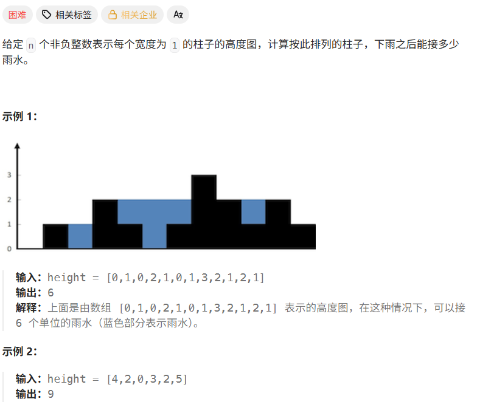
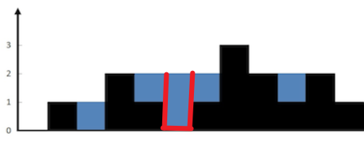
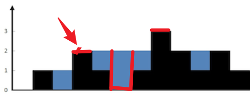
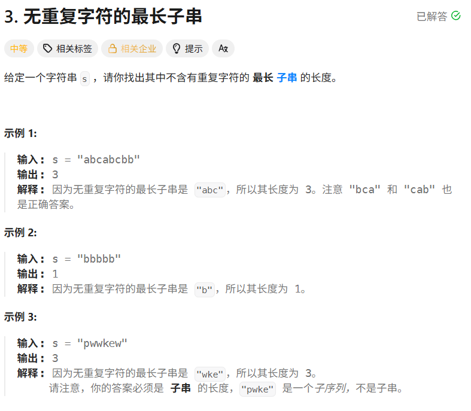
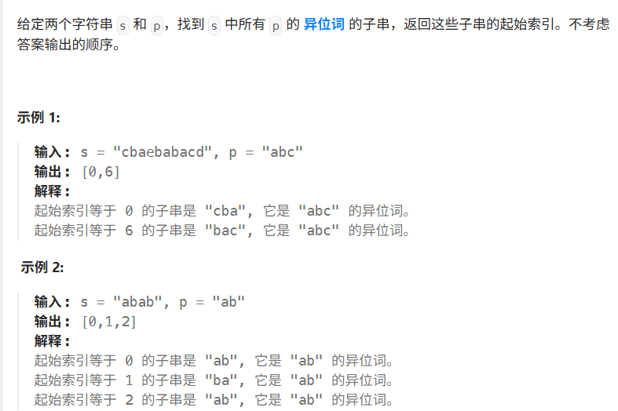

# Hot100第四天|42.接雨水，3.无重复字符的最长子串，438.找到字符串中所有字母的异位词

## 42.接雨水



## 我的思路

冤家路窄，前段时间没看懂的，又回来了。今天搞通吧。

把思路整理好后代码一遍ac，开心

## 问题总结

## 优秀思路

把每一数列看成一个桶去接雨水。



对于每一个桶，能接的雨水的量为左右两边最高高度的小者，减去当前高度。



那么就可以用一个前缀表、一个后缀表，去表示到每一个位置，他前面和后面最高的墙壁的高度。

进一步地，可以用两个指针从两头往前移动，同时记录两侧的最高墙。

当左大于右（左右指的是左右指针遍历到的位置对应侧的最高墙），对于右边指针指的水桶，能接到的水就是右的值减当前高度。

同理，当右大于左（左右指的是左右指针遍历到的位置对应侧的最高墙），对于左边指针指的水桶，能接到的水就是右的值减当前高度。

每次可以确定矮的一侧的。

每一步，只结算较矮边当前那一格的水量，然后把这一侧指针向中间移动。

## 我的代码

```
class Solution {
public:
    int trap(vector<int>& height) {
        int left=0,right=height.size()-1;
        int leftMax=height[left],rightMax=height[right];
        int result=0;
        while(left<=right){
            leftMax=max(leftMax,height[left]);
            rightMax=max(rightMax,height[right]);
            if(leftMax<rightMax){
                result+=(leftMax-height[left]>0?leftMax-height[left]:0);
                left++;
            }
            else{
                result+=(rightMax-height[right]>0?rightMax-height[right]:0);
                right--;
            }
        }
        return result;
    }
};
```


## 3.无重复字符的最长子串



## 我的思路

因为前两天换过题库了所以出现了重复的题，正好复习一下。

用滑动窗口，一个fast，一个slow指针，用一个哈希表记录当前窗口内的字母，每次push入一个字母，如果哈希表内当前字母不为0，那么一直收缩直到把这个字母踢出去。然后记录长度

## 问题总结

## 优秀思路

## 我的代码

```
class Solution {
public:
    int lengthOfLongestSubstring(string s) {
        int slow=0,result=0;
        unordered_map<char,int> mp;
        for(int fast=0;fast<s.size();fast++){
           mp[s[fast]]++;

           while(mp[s[fast]]>1){
            mp[s[slow]]--;
            slow++;
           }
           result=max(result,fast-slow+1);
        }
        return result;
    }
};
```


## 438.找到字符串中所有字母的异位词



## 我的思路

滑动窗口，用哈希表来记录字母出现的次数，但是怎么匹配呢。

匹配就是need==window就可以了，vector可以按位匹配。

## 问题总结

指针处理一定要在指针移动之前，切记。

## 优秀思路

## 我的代码

```
class Solution {
public:
    vector<int> findAnagrams(string s, string p) {
        vector<int>need(26,0);
        vector<int>window(26,0);
        vector<int>result;
        for(int i=0;i<p.size();i++){
            need[p[i]-'a']++;
        }
        int fast=0,slow=0;

        while(fast<s.size()){
            window[s[fast++]-'a']++;

            if((fast-slow)==p.size()){
                if(window==need){
                    result.push_back(slow);
                }
                window[s[slow]-'a']--;
                slow++;
                
            }
        }
        return result;
    }
};
```

