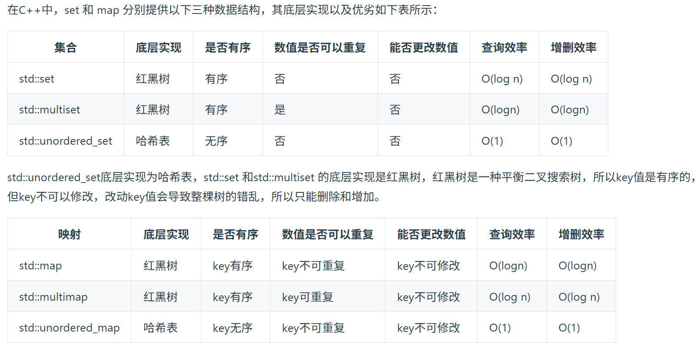
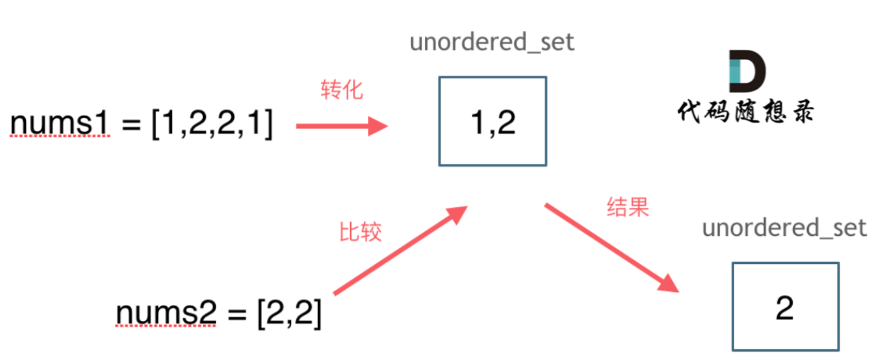
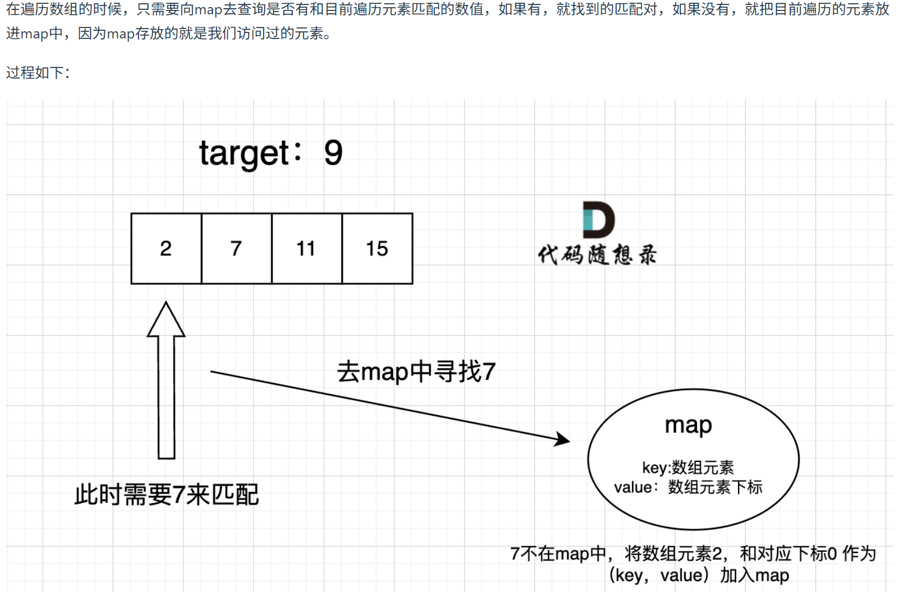

# 代码随想录算法训练营第二天| **242.有效的字母异位词** ， **349. 两个数组的交集** ， **202. 快乐数** ， **1. 两数之和** 

**要快速判断一个元素是否出现集合里的时候，就要考虑哈希法**

哈希法的三种数据结构：

数组、集合set、映射map



1.unorder代表key无序

2.multi代表key可重复

3.集合优先使用unordered_set，因为它的查询和增删效率是最优的

4.如果需要集合是有序的，那么就用set

5.如果要求不仅有序还要有重复数据的话，那么就用multiset。

##### set和map的区别

✅ **set**

只存“值”
 自动去重
 按序排列

就像一个：

> **自动排序 + 自动去重 的容器**

------

✅ **map**

存“键值对 (key → value)”
 key 唯一
 按 key 排序

就像一个：

> **带索引的字典 / 哈希表（但有序）**

##### 语法

```
#include <iostream>
#include <set>
#include <map>
using namespace std;

int main() {

    /*========================
        一、set 的基本用法
      ========================*/

    set<int> s;  
    // set：存“值”，自动去重 + 自动排序（默认升序）

    s.insert(10);  
    s.insert(5);
    s.insert(10);  
    // 插入元素：重复不会存

    cout << "set内容：";
    for(auto x : s)
        cout << x << " ";
    cout << endl;
    // 遍历 set：只有一个值

    if(s.count(5))
        cout << "5存在" << endl;
    // count(x)：判断是否存在，返回0或1

    auto it = s.find(10);
    if(it != s.end())
        cout << "找到10" << endl;
    // find：返回迭代器，没找到返回 end()

    s.erase(5);
    // 删除元素


    /*========================
        二、map 的基本用法
      ========================*/

    map<string,int> mp;
    // map：存 key -> value
    // key 唯一，按 key 自动排序

    mp["alice"] = 90;
    mp["bob"] = 85;
    // 最常用插入方式：类似数组访问

    mp.insert({"tom", 95});
    // 另一种插入方式

    cout << "alice的成绩：" << mp["alice"] << endl;
    // 通过 key 直接访问 value

    cout << "map遍历：" << endl;
    for(auto p : mp)
        cout << p.first << " " << p.second << endl;
    // 遍历：first 是 key，second 是 value

    if(mp.count("bob"))
        cout << "bob存在" << endl;
    // 判断 key 是否存在

    auto it2 = mp.find("tom");
    if(it2 != mp.end())
        cout << "tom成绩：" << it2->second << endl;
    // find 返回迭代器

    mp.erase("bob");
    // 删除某个 key


    /*========================
        三、刷题中的典型用法
      ========================*/

    // 1️⃣ set：去重
    int arr[] = {1,2,2,3,3,4};
    set<int> dedup(arr, arr+6);
    // 一行完成去重


    // 2️⃣ map：统计频率（最常见）
    string str = "aabcc";
    map<char,int> freq;

    for(char c : str)
        freq[c]++;
    // 统计每个字符出现次数

    cout << "字符频率：" << endl;
    for(auto p : freq)
        cout << p.first << ":" << p.second << endl;


    return 0;
}
```


## **242.有效的字母异位词** 

[242.有效的字母异位词 | 代码随想录](https://programmercarl.com/0242.有效的字母异位词.html)

## 我的思路

把两个词的每个字母分别映射到26个字母的数组中，再比较两个数组的26个位置是否一致。

## 问题总结

比较的时候循环大小写成词长度了，应该是26.

## 卡的思路

没有

## 我的代码

```
class Solution {
public:
    bool isAnagram(string s, string t) {
        int sSUM[26]={0};
        int tSUM[26]={0};
        int lenS=s.size();
        int lenT=t.size();
        if(lenS!=lenT)return false;

        for(int i=0;i<lenS;i++){
            sSUM[s[i]-'a']++;
            tSUM[t[i]-'a']++;
        }
        for(int j=0;j<26;j++){
            if(sSUM[j]!=tSUM[j])return false;
        }
        return true;
        
    }
};
```


## 349. 两个数组的交集

[349. 两个数组的交集 | 代码随想录](https://programmercarl.com/0349.两个数组的交集.html)

## 我的思路

set是去重，map可以统计两个数组的元素，但是每个数组本身的各元素不是唯一的，应该用什么思路？

-

本身不是唯一但结果的元素是去重的，用unorderedmap可以提高查找效率到n*logn

## 问题总结

1.去重集合的声明方法

```
set<int> num1(nums1.begin(),nums1.end());
```

2.查找set中是否存在某个值如果没找到返回的是end不是0

3.vector插入函数是push_back()

## 卡的思路



如果哈希值比较少、特别分散、跨度非常大，使用数组就造成空间的极大浪费！

## 我的代码

```
class Solution {
public:
    vector<int> intersection(vector<int>& nums1, vector<int>& nums2) {
       unordered_set<int> num1(nums1.begin(),nums1.end());
        unordered_set<int> num2(nums2.begin(),nums2.end());
        vector<int> result;
        for(auto x:num1){
            if(num2.find(x)!=num2.end())result.push_back(x);
        }
        return result;
        
    }
};
```

## 第202题. 快乐数

[第202题. 快乐数 | 代码随想录](https://programmercarl.com/0202.快乐数.html)

## 我的思路

一开始没思路了，看到无限循环的提示会了

## 问题总结

1.求各个位置上的数

```cpp
 int getSum(int n) {
        int sum = 0;
        while (n) {
            sum += (n % 10) * (n % 10);
            n /= 10;
        }
        return sum;
    }
```

## 卡的思路

题目中说了会 **无限循环**，那么也就是说**求和的过程中，sum会重复出现，这对解题很重要！**

正如：[关于哈希表，你该了解这些！ (opens new window)](https://programmercarl.com/哈希表理论基础.html)中所说，**当我们遇到了要快速判断一个元素是否出现集合里的时候，就要考虑哈希法了。**

所以这道题目使用哈希法，来判断这个sum是否重复出现，如果重复了就是return false， 否则一直找到sum为1为止。

判断sum是否重复出现就可以使用unordered_set。

## 我的代码

```
class Solution {
public:
    bool isHappy(int n) {
        unordered_set<int> se;
        n=pfh(n);
        while(n!=1){
            if(se.find(n)==se.end()){
                se.insert(n);
                n=pfh(n);
            }
            else
            return false;   
        }
        return true;
        
    }

    int pfh(int num){//平方和
        int sum=0;
        while(num/10){
            sum+=(num%10)*(num%10);
            num=num/10;
        }
        sum+=(num*num);
        return sum;
    }
};
```

## 1.两数之和

[两数之和 | 代码随想录](https://programmercarl.com/0001.两数之和.html)

## 我的思路

把给出的整数数组排序，然后从最小的开始遍历，找有没有对应的整数，直到当前数大于要求整数。因为要返回数组下标，先用map把数组存一下。--那就在map里检索好了，本来就是有序的

## 问题总结

1.multimap的插入方法：

`mapnum.insert({nums[i], i});`

注意{}，注意不能用[]访问因为键不唯一

2.`for(auto x : mapnum)`中x的数据访问方式是`.first`和`.second`，不是`.key（）`也不是`.first()`

3.逻辑 bug：会匹配到自己

这一句：

```
mapnum.find(target - x.first)
```

可能会找到：

```
同一个元素自己
```

例如：

```
nums = [3]
target = 6
```

就会变成：

```
3 + 3
```

但其实只有一个 3。

要确保不是同一个索引：

```
auto it = mapnum.find(target - x.first);auto it = mapnum.find（target - x.first）;

if(it != mapnum.end() && it->second != x.second)if（it ！= mapnum.end（） & it->second ！= x.second）
```

4.这题用无序map速度会更快因为无序比有序的插入和查找都要快很多

## 卡的思路



## 我的代码

```
class Solution {
public:
    vector<int> twoSum(vector<int>& nums, int target) {

        multimap<int,int> mapnum;

        for(int i=0;i<nums.size();i++)
            mapnum.insert({nums[i],i});

        for(auto x : mapnum)
        {
            auto it = mapnum.find(target - x.first);

            if(it != mapnum.end() && it->second != x.second)
                return {x.second, it->second};
        }

        return {};
    }
};
```

## 时长  

100分钟
