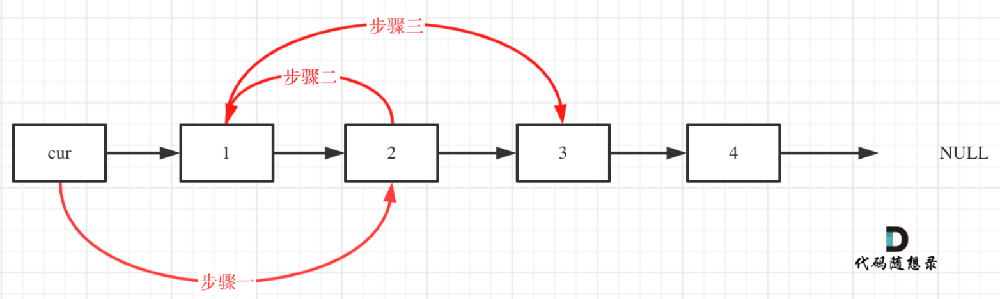
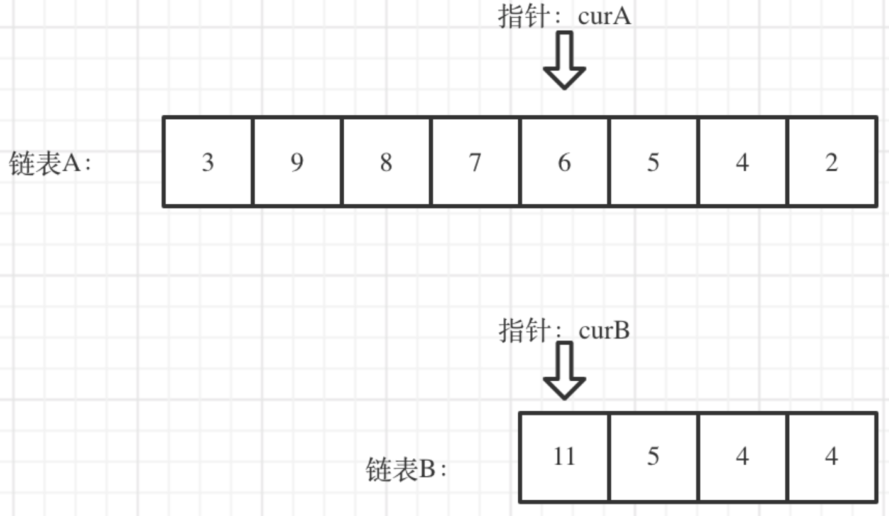
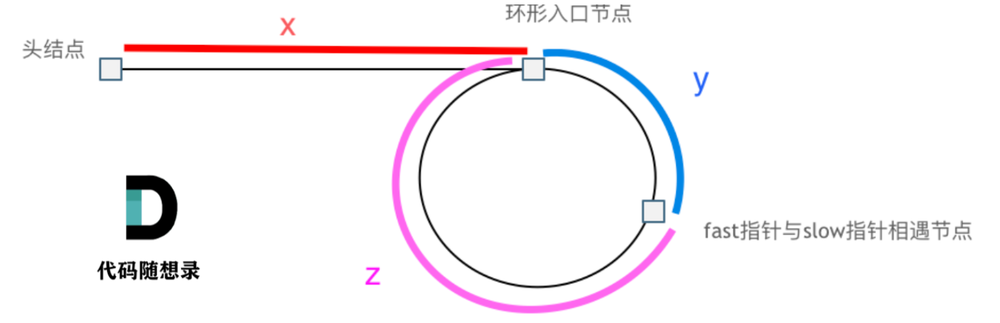

# 代码随想录算法训练营第1天|24.两两交换链表中的节点，19.删除链表的倒数第N个节点，面试题0207.链表相交，142.环形链表II

## 24.两两交换链表中的节点

[24. 两两交换链表中的节点 | 代码随想录](https://programmercarl.com/0024.两两交换链表中的节点.html)

### 我的思路：

用now、next来定当前的两个节点，在while中循环两两交换，注意要两个next都不为空。

### 问题总结：

1.多指针变量声明：

`ListNode* now,last,next;❌`

`ListNode* now,*last,*next;`√

2.排除传进来的head是NULL

3.

```
ListNode* temp;
temp->next = next->next;
```

这种写法没有初始化指针，错误写法

正确写法：

`ListNode* temp = next->next;`

4.按组交换节点不仅要注意接上下一组，也要保存上一组的后一个节点，接上上一组。

交换时下一组的节点头用temp保存。

### 卡的思路：

用虚拟头节点统一链表操作

```
 ListNode* dummyHead = new ListNode(0); // 设置一个虚拟头结点
 dummyHead->next = head; // 将虚拟头结点指向head，这样方便后面做删除操作
```



我漏了步骤一

```
class Solution {
public:
    ListNode* swapPairs(ListNode* head) {
        if(head==NULL)return NULL;
        if(head->next==NULL)return head;
        ListNode* now,*next;
        now=head;
        next=head->next;
        head=next;
        ListNode* prev=nullptr;
        while(now&&next){
            ListNode* temp=next->next;
            now->next=temp;
            next->next=now;
            if(prev)prev->next=next;
            prev=now;
            now=temp;
            if(now){
                
                next=now->next;
            }
        }
        return head;
    }
};
```


## 19.删除链表的倒数第N个节点

[19.删除链表的倒数第N个节点 | 代码随想录](https://programmercarl.com/0019.删除链表的倒数第N个节点.html)

## 我的思路

快慢指针、虚拟头节点

## 问题总结

1.虚拟头节点初始化了但是一开始没有用进解题中。所以fast和slow一开始就要指向dummyhead，然后就不用考虑删头节点的问题了。

2.几个特殊情况：

链表为空->直接返回空

删头节点->用虚拟头节点统一规避（只要涉及删除）

n非法->一般不存在

3.指针越界问题，让slow初始化为dummyhead可以让slow最后停在待删节点的前一个，特殊情况避免越界。也可以不用before来存前一个节点。

4.初始化指针别忘了new

`ListNode* dummyhead = new ListNode(0, head);`

## 卡的思路

差不多

```
class Solution {
public:
    ListNode* removeNthFromEnd(ListNode* head, int n) {
        ListNode* dummyhead=new ListNode(0,head);
        ListNode* fast=dummyhead;
        ListNode*slow=dummyhead;

        if(!head)return head;
        

        for(int i=0;i<n;i++){
            fast=fast->next;
        }
        while(fast->next){
            fast=fast->next;
            slow=slow->next;
        }

       slow->next=slow->next->next;
        return dummyhead->next;     
    }
};
```


## 0207.链表相交

[面试题 02.07. 链表相交 | 代码随想录](https://programmercarl.com/面试题02.07.链表相交.html#思路)

## 我的思路

数值相等不等于节点相等，那怎么判断节点相等？

## 问题总结

1.居然没有报错一遍通过了？！

2.这种方法可以避免分类讨论两个表的长度

```cpp
 // 让curA为最长链表的头，lenA为其长度
        if (lenB > lenA) {
            swap (lenA, lenB);
            swap (curA, curB);
        }
        // 求长度差
        int gap = lenA - lenB;
```

## 卡的思路



从交界处往后的长度是一样的，也就是说可以尾部对齐，然后从一样长的地方开始往后搜索。只要curA==curB就是交接节点，这里的==既判断了数值也判断了指针。

```
class Solution {
public:
    ListNode *getIntersectionNode(ListNode *headA, ListNode *headB) {
        int lenA=0,lenB=0;
        ListNode *A,*B;
        A=headA;
        B=headB;
        while(A){
            lenA++;
            A=A->next;
        }
        while(B){
            lenB++;
            B=B->next;
        }

        if(lenA>lenB){
            A=headA;
            B=headB;
            for(int i=0;i<lenA-lenB;i++){
                A=A->next;
            }
            while(A&&B&&A!=B){
                A=A->next;
                B=B->next;
            }
            if(!A)return NULL;
            else
                return A;
        }

       else{
            A=headA;
            B=headB;
            for(int i=0;i<lenB-lenA;i++){
                B=B->next;
            }
            while(A&&B&&A!=B){
                A=A->next;
                B=B->next;
            }
            if(!A)return NULL;
            else
                return A;
        }


        
    }
};
```


## 142.环形链表II

[142.环形链表II | 代码随想录](https://programmercarl.com/0142.环形链表II.html)

## 我的思路

1.不作为参数进行传递是啥意思

2.怎么找环入口？

## 问题总结

1.错误点 ：相遇判断逻辑错了

正确逻辑应该是：

1️⃣ 先让快慢指针走起来
 2️⃣ 在循环内部判断是否相遇

而不是写在 while 条件里。因为一开始fast和slow是相等的，写在while里一次都不会进入。

## 卡的思路



相遇时： slow指针走过的节点数为: `x + y`， fast指针走过的节点数：`x + y + n (y + z)`，n为fast指针在环内走了n圈才遇到slow指针， （y+z）为 一圈内节点的个数A。

因为fast指针是一步走两个节点，slow指针一步走一个节点， 所以 fast指针走过的节点数 = slow指针走过的节点数 * 2：

```
(x + y) * 2 = x + y + n (y + z)
```

两边消掉一个（x+y）: `x + y = n (y + z)`

因为要找环形的入口，那么要求的是x，因为x表示 头结点到 环形入口节点的的距离。

所以要求x ，将x单独放在左面：`x = n (y + z) - y` ,

再从n(y+z)中提出一个 （y+z）来，整理公式之后为如下公式：`x = (n - 1) (y + z) + z` 注意这里n一定是大于等于1的，因为 fast指针至少要多走一圈才能相遇slow指针。

这个公式说明什么呢？

先拿n为1的情况来举例，意味着fast指针在环形里转了一圈之后，就遇到了 slow指针了。

当 n为1的时候，公式就化解为 `x = z`，

这就意味着，**从头结点出发一个指针，从相遇节点 也出发一个指针，这两个指针每次只走一个节点， 那么当这两个指针相遇的时候就是 环形入口的节点**。

也就是在相遇节点处，定义一个指针index1，在头结点处定一个指针index2。

让index1和index2同时移动，每次移动一个节点， 那么他们相遇的地方就是 环形入口的节点。

```
class Solution {
public:
    ListNode *detectCycle(ListNode *head) {
        ListNode*fast=head;
        ListNode*slow=head;
        while(fast&&fast->next){
            fast=fast->next->next;
            slow=slow->next;
            if(fast==slow){
                ListNode* index2=fast;
                ListNode*index1=head;
                while(index1!=index2){
                    index1=index1->next;
                    index2=index2->next;
                }
                return index1;

            }

        }
        return NULL;

        
        
    }
};
```
###时长：
2.5h

