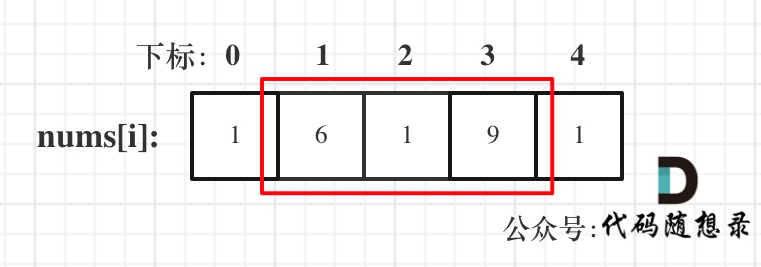
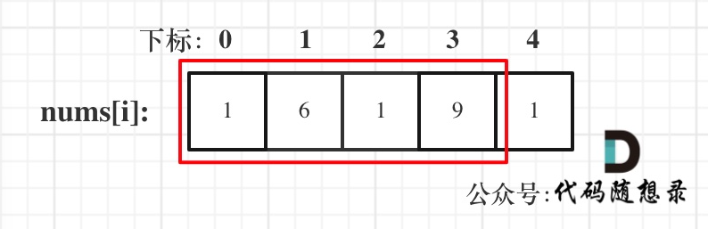

# 代码随想录算法训练营第三十一天|**198.打家劫舍**  ，**213.打家劫舍II** ，**337.打家劫舍III**

打家劫舍的一天……

## 198.打家劫舍

[198.打家劫舍 | 动态规划 | 状态转移 | 代码随想录](https://programmercarl.com/0198.打家劫舍.html)

## 我的思路

看完题解来复述一下思路：

1.dp数组及下标的含义

dp[i]表示考虑第i家及之前的能够打劫到的最多钱

2.递推公式

dp[j]=max(dp[j-1],dp[j-2]+value[j]);

3.初始化

dp[0]=value[0] dp[1]=max(value[0],value[1]);

4.遍历顺序

从前向后

## 问题总结

练到这个时候了做题也该细致一点了，看看题目给的数值的范围，考虑考虑边界情况。那nums只有一个的时候，别忘了单独return

## 卡的思路

## 我的代码

```
class Solution {
public:
    int rob(vector<int>& nums) {
        if(nums.size()==1)return nums[0];
        vector<int> dp(nums.size(),0);
        dp[0]=nums[0];
        dp[1]=max(nums[0],nums[1]);
        for(int i=2;i<nums.size();i++){
            dp[i]=max(dp[i-1],dp[i-2]+nums[i]);
        }
        return dp[nums.size()-1];
    }
};
```


## 213.打家劫舍II

[213.打家劫舍II | 动态规划 | 状态转移 | 代码随想录](https://programmercarl.com/0213.打家劫舍II.html#思路)

## 我的思路

思路复述：

成环之后最后一个和第一个只能选一个，所以分成两种情况。





红框所圈出来的是考虑去偷，并不是一定去偷，具体偷不偷用递推公式去判断。

## 问题总结

边界情况没搞清楚

## 卡的思路

## 我的代码

```
class Solution {
public:
    int robRange(vector<int>& nums, int left, int right) {
        if (left == right) return nums[left];
        int prev2 = nums[left];
        int prev1 = max(nums[left], nums[left+1]);
        for (int i = left+2; i <= right; i++) {
            int cur = max(prev1, prev2 + nums[i]);
            prev2 = prev1;
            prev1 = cur;
        }
        return prev1;
    }

    int rob(vector<int>& nums) {
        int n = nums.size();
        if (n == 1) return nums[0];
        if (n == 2) return max(nums[0], nums[1]);
        // 第一段 [0, n-2]，第二段 [1, n-1]
        return max(robRange(nums, 0, n-2), robRange(nums, 1, n-1));
    }
};
```


## 337.打家劫舍III

[337.打家劫舍 III | 树形动态规划 | 后序遍历 | 状态转移 | 代码随想录](https://programmercarl.com/0337.打家劫舍III.html#算法公开课)

## 我的思路

## 问题总结

## 卡的思路

## 我的代码