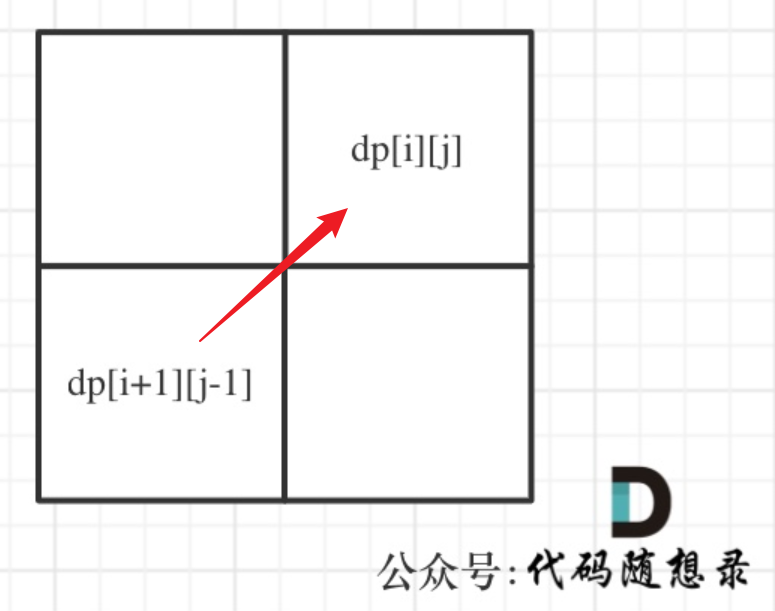
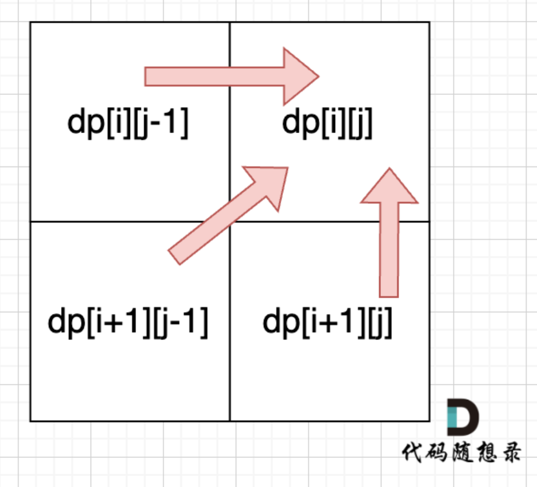

# 代码随想录算法训练营第三十七天| **647. 回文子串**   ， **516.最长回文子序列** ， **动态规划总结篇** 

##  **647. 回文子串**   

[647. 回文子串 | 动态规划 | 双指针法 | 代码随想录](https://programmercarl.com/0647.回文子串.html)

## 我的思路

可能的想法是。

1.dp数组含义

当子串以j-1开头，以i-1结尾时的累计的回文字串的数目

2.递推公式

想的有点问题，感觉不太合理。

## 问题总结

## 卡的思路

复述思路。

1.dp数组含义

`dp[i][j]`i到j形成的子串（左闭右闭）是否是回文的bool

2.递推公式

`if(s[i]==s[j])`

分三种情况

若i==j 单个字母->回文

若ij相差1 例如aa，回文

若j-i>1，看 `dp[i+1][j-1]`

另设一个变量，发现一个回文串就++

3.初始化

全部false，默认全不是回文。

4.遍历顺序



从下往上，从左往右。

## 我的代码

```
class Solution {
public:
    int countSubstrings(string s) {
        vector<vector<bool>>dp(s.size(),vector<bool>(s.size(),false));
        int result=0;
        for(int i=s.size()-1;i>-1;i--){
            for(int j=i;j<s.size();j++){
                if(s[i]==s[j]){
                    if(i==j||j-i==1){
                        dp[i][j]=true;
                        result++;
                    }
                    else{
                        if(dp[i+1][j-1]==true){dp[i][j]=true;result++;}
                        else dp[i][j]=false;
                    }
                }
                else dp[i][j]=false;
            }
        }
        return result;
    }
};
```


##  **516.最长回文子序列** 

[516.最长回文子序列 | 动态规划 | 回文子序列 | 状态转移 | 代码随想录](https://programmercarl.com/0516.最长回文子序列.html)

## 我的思路

首先得是子序列，其次是回文。

子串需要连续，子序列不需要。

1.dp数组含义

以i、j为两端的序列中最长的回文子序列

## 问题总结

## 卡的思路

复述思路。

**1.dp数组含义**

`dp[i][j]`表示从i到j的左闭右闭的区间的最长回文子序列

**2.递推公式**

`if(s[i]==s[j])dp[i][j]=dp[i+1][j-1]+2`在里面的回文长度的基础上加上首尾两个

如果不相同，分别考虑两个字母分别加进来

如果考虑i `dp[i][j]=dp[i][j-1]`

如果考虑j`dp[i][j]=dp[i-1][j]`

取最大值

**3.初始化**

i一直往左移动，j一直向右移动，因此i==j是最基础的情况

当i==j时，初始化为1，此时是回文子序列

其他都初始化为0；

4.遍历顺序



从下往上，从左往右。

## 我的代码

```
class Solution {
public:
    int longestPalindromeSubseq(string s) {
        vector<vector<int>>dp(s.size(),vector<int>(s.size(),0));
        for(int i=0;i<s.size();i++)dp[i][i]=1;
        for(int i=s.size()-1;i>-1;i--){
            for(int j=i+1;j<s.size();j++){
                if(s[i]==s[j])dp[i][j]=dp[i+1][j-1]+2;
                else{
                    dp[i][j]=max(dp[i+1][j],dp[i][j-1]);
                }
            }
        }
        return dp[0][s.size()-1];
    }
};
```


##  **动态规划总结篇** 

[动态规划最强总结篇！ | 动态规划 | 动规五部曲 | 背包问题 | 代码随想录](https://programmercarl.com/动态规划总结篇.html)

背包、股票、打家劫舍、子序列。