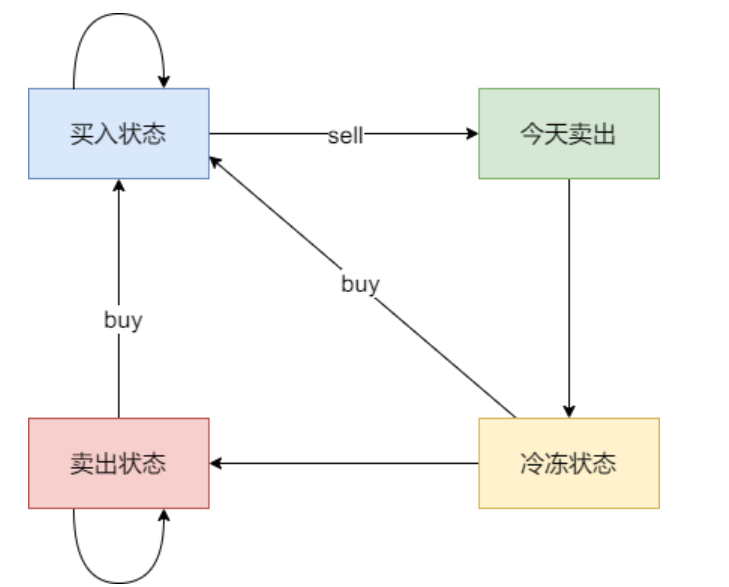

# 代码随想录算法训练营第三十三天| **188.买卖股票的最佳时机IV** ，**309.最佳买卖股票时机含冷冻期**

[188.买卖股票的最佳时机IV | 动态规划 | 状态转移 | dp数组 | 代码随想录](https://programmercarl.com/0188.买卖股票的最佳时机IV.html)

## 我的思路

按照Ⅲ的思路，是不是得加一个k的循环。

## 问题总结

## 卡的思路

思路复述：

买卖k次，有`2*k+1`个状态

2.递推公式

yong一个for循环，递推第i天的两种状态

```
`dp[i][j+1]=max(dp[i-1][j+1],dp[i-1][j]-price[i])`
`dp[i][j+2]=max(dp[i-1][j+2],dp[i-1][j+1]+price[i])`
```

难点在于如何把第二个数组下标用j表示


3.初始化

用一个for循环对第0天的2*k+1个状态进行初始化。

下标为奇数的都是-price[0]，因为是卖出

其余都为0

## 我的代码

```
class Solution {
public:
    int maxProfit(int k, vector<int>& prices) {
        vector<vector<int>>dp(prices.size(),vector<int>(2*k+1,0));
        for(int i=1;i<=k;i++){
            dp[0][2*i-1]=-prices[0];
        }

        for(int i=1;i<prices.size();i++){
            for(int j=0;j<2*k-1;j+=2){
                dp[i][j+1]=max(dp[i-1][j+1],dp[i-1][j]-prices[i]);
                dp[i][j+2]=max(dp[i-1][j+2],dp[i-1][j+1]+prices[i]);
            }

        }
        return dp[prices.size()-1][2*k];
    }
};
```


## 309.最佳买卖股票时机含冷冻期

[309. 买卖股票的最佳时机含冷冻期 - 力扣（LeetCode）](https://leetcode.cn/problems/best-time-to-buy-and-sell-stock-with-cooldown/description/)

## 我的思路

再加一个冷冻期的状态，当前的状态依然可以由前面的状态推导而出。

但是可以无限买卖

## 问题总结

## 卡的思路

复述思路。

1.dp数组的含义

`dp[i][0]`持有股票的状态

`dp[i][1]`保持卖出的状态

**`dp[i][2]`卖出股票**

**把这个状态拆出来是因为冷冻期的状态需要前一天具体地卖出股票**

`dp[i][3]`冷冻期

2.递推公式

```
//持股状态可以由三个状态推出：①前一天已经是持股状态②前一天是冷冻期，今天买入③前一天是卖出股票的状态，今天买入
dp[i][0]=max(dp[i-1][0],dp[i-1][3]-price[i],dp[i-1][1]-price[i])

//保持卖出股票的状态可以由两个个状态推出：①前一天就是保持卖出股票的状态②前一天是冷冻期
dp[i][1]=max(dp[i-1][1]，dp[i-1][3])

//卖出股票可以由一个状态推出：①前一天持有股票
dp[i][2]=dp[i-1][0]+price[i]

//冷冻期的状态可以由一个状态推出：前一天卖出
dp[i][3]=dp[i-1][2]

```



3.初始化

```
dp[0][0]=-price[i]//理解成当天买入
dp[0][1]=0//本状态是一个非法状态，所以由递推公式看看需要初始化成多少//代入第一天，发现第0天需要的是0
dp[0][2]=0//递推公式
dp[0][3]=0
```

4.遍历顺序

从前往后