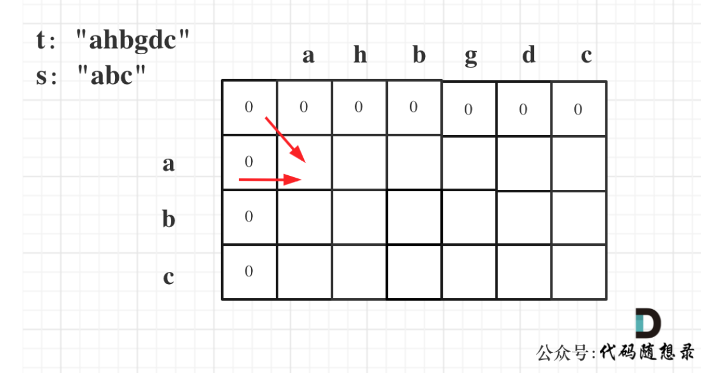

# 代码随想录算法训练营第三十五天|**1143.最长公共子序列**，**1035.不相交的线**，**53. 最大子序和** ，**392.判断子序列** 

## 1143.最长公共子序列

[1143.最长公共子序列 | 动态规划 | 状态转移 | dp数组 | 代码随想录](https://programmercarl.com/1143.最长公共子序列.html)

## 我的思路

1.dp数组含义

`dp[i][j]`表示以i-1和j-1为结尾的最长公共子序列。

2.递推公式

如果当前nums的ij相等，`dp[i][j]=dp[i-1][j-1]+1`

**若不相等，`dp[i][j]=dp[i-1][j-1]`**

这里不对↑，如果text1[i - 1] 与 text2[j - 1]不相同，那就看看text1[0, i - 2]与text2[0, j - 1]的最长公共子序列 和 text1[0, i - 1]与text2[0, j - 2]的最长公共子序列，取最大的。

3.初始化

全0

4.遍历顺序

双层for循环，从左向右

最后的结果在`dp[size][size]`

## 问题总结

## 卡的思路

## 我的代码

```
class Solution {
public:
    int longestCommonSubsequence(string text1, string text2) {
        vector<vector<int>>dp(text1.size()+1,vector<int>(text2.size()+1,0));
        for(int i=1;i<=text1.size();i++){
            for(int j=1;j<=text2.size();j++){
                if(text1[i-1]==text2[j-1])
                dp[i][j]=dp[i-1][j-1]+1;
                else
                dp[i][j]=max(dp[i][j-1],dp[i-1][j]);
            }
        }
        return dp[text1.size()][text2.size()];
    }
};
```


## 1035.不相交的线

[1035.不相交的线 | 最长公共子序列 | 动态规划 | 代码随想录](https://programmercarl.com/1035.不相交的线.html)

## 我的思路

最大的重复子序列

1.dp数组含义

`dp[i][j]`以i-1，j-1结尾的最大重复子序列

2.递推公式

若`nums1[i]==nums2[j]`则`dp[i][j]=dp[i-1][j-1]+1`

3.初始化

0

4.遍历顺序

双层for循环

找最大的dp

## 问题总结

## 卡的思路

## 我的代码

```
class Solution {
public:
    int maxUncrossedLines(vector<int>& nums1, vector<int>& nums2) {
        vector<vector<int>> dp(nums1.size() + 1, vector<int>(nums2.size() + 1, 0));
        for (int i = 1; i <= nums1.size(); i++) {
            for (int j = 1; j <= nums2.size(); j++) {
                if (nums1[i - 1] == nums2[j - 1]) {
                    dp[i][j] = dp[i - 1][j - 1] + 1;
                } else {
                    dp[i][j] = max(dp[i - 1][j], dp[i][j - 1]);
                }
            }
        }
        return dp[nums1.size()][nums2.size()];
    }
};
```


## 53. 最大子序和

[53. 最大子序和 | 动态规划 | 状态转移公式 | dp数组 | 代码随想录](https://programmercarl.com/0053.最大子序和（动态规划）.html)

## 我的思路

1.dp数组含义

以i为结尾的最大连续子数组之和

2.递推公式

dp[i]=max(dp[i-1]+nums[i],nums[i]);

3.遍历顺序

从前往后

4.初始化

dp[0]=nums[0];

其他都为0

## 问题总结

1.一开始我把result初值赋为int_min，只有一个数的时候出错，思维漏洞在哪里

：初始值必须是一个**合法的候选答案**，而不能是一个"等待被覆盖的占位符"，否则当没有循环迭代时就会出错。

用 `INT_MIN` 初始化 `result`，**期望循环来更新它**，但当数组只有 1 个元素时，循环体一次都不执行，`result` 永远是 `INT_MIN`。

## 卡的思路

## 我的代码

```
class Solution {
public:
    int maxSubArray(vector<int>& nums) {
        vector<int>dp(nums.size(),0);
        dp[0]=nums[0];
        int result=nums[0];
        for(int i=1;i<nums.size();i++){
            dp[i]=max(dp[i-1]+nums[i],nums[i]);
            result=result>dp[i]?result:dp[i];
        }
        return result;
        
    }
};
```


## **392.判断子序列** 

[392.判断子序列 | 动态规划 | 子序列 | 状态转移 | 代码随想录](https://programmercarl.com/0392.判断子序列.html)

## 我的思路

愚人节！

在下有一个时间复杂度为（n*m）的联合国方案。

## 问题总结

## 卡的思路

编辑距离的题型。

这题类似于求最长公共子序列

1.dp数组含义

`dp[i][j]`以i-1和j-1为结尾的数组的最长子数列长度。

2.递推公式

如果`s[i-1]==t[j-1]`则`dp[i][j]=dp[i-1][j-1]+1`

若不相同，则需要删除j-1这个位置，即比较i-1和j-2的相同程度

dp`[i][j]`=dp`[i][j-1]`



3.初始化

`dp[i][0]=0 dp[0][j]=0`一个空串和其他串比，相同的长度为0

其他初始化为0即可

4.遍历顺序

每个由左上方和左方推导而来

所以从左到右从上到下

如果`dp[s.size][t.size]==s.size`则说明是有解的

## 我的代码

```
class Solution {
public:
    bool isSubsequence(string s, string t) {
        vector<vector<int>>dp(s.size()+1,vector<int>(t.size()+1,0));
        for(int i=1;i<=s.size();i++){
            for(int j=1;j<=t.size();j++){
                if(s[i-1]==t[j-1])
                dp[i][j]=dp[i-1][j-1]+1;
                else
                dp[i][j]=dp[i][j-1];
            }
        }
        if(dp[s.size()][t.size()]==s.size())return true;
        return false;
    }
};
```

