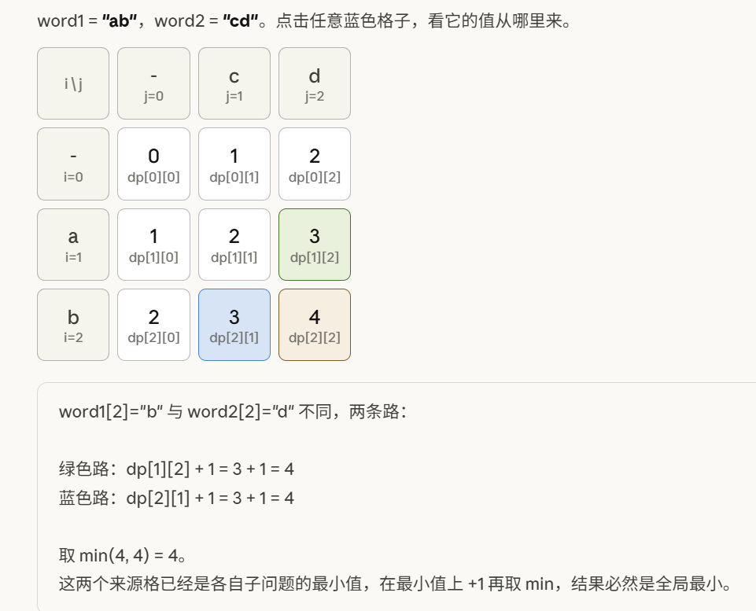
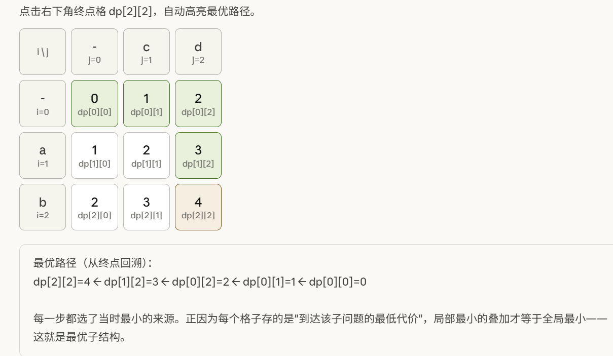

# 代码随想录算法训练营第三十六天|**115.不同的子序列** ，**583. 两个字符串的删除操作** ，**72. 编辑距离**

## 115.不同的子序列

[115.不同的子序列 | 动态规划 | 子序列 | dp数组 | 代码随想录](https://programmercarl.com/0115.不同的子序列.html)

## 我的思路

## 问题总结

### 为什么需要 `uint64_t`？

这是一个很经典的**中间值溢出**问题。

### 题目本质

用 DP 统计 `s` 的子序列中 `t` 出现的次数，转移方程为：

```
dp[i][j] = dp[i-1][j] + dp[i-1][j-1]   (s[i] == t[j])
dp[i][j] = dp[i-1][j]                   (s[i] != t[j])
```

### 问题所在

题目说"**结果**在 32 位有符号整数范围内"，但没说**中间过程**也在范围内。

看这个转移：

```
dp[i][j] = dp[i-1][j] + dp[i-1][j-1]
```

两个中间值相加，**各自可能已经很大**，它们的和可能远超 `int32` 的上限 `2,147,483,647`，即使最终答案能用 `int32` 表示。

## 卡的思路

复述思路。

1.dp数组含义

`dp[i][j]`表示以i-1为结尾的字符串中有以j-1为结尾的字符串的个数

2.递推公式

`若s[i-1]==t[j-1]，dp[i][j]=dp[i-1][j-1]+dp[i-1][j]`

```
即：当s[i - 1] 与 t[j - 1]相等时，dp[i][j]可以有两部分组成。

一部分是用s[i - 1]来匹配，那么个数为dp[i - 1][j - 1]。即不需要考虑当前s子串和t子串的最后一位字母，所以只需要 dp[i-1][j-1]。

一部分是不用s[i - 1]来匹配，个数为dp[i - 1][j]。
```

```
当s[i - 1] 与 t[j - 1]不相等时，dp[i][j]只有一部分组成，不用s[i - 1]来匹配（就是模拟在s中删除这个元素），即：dp[i - 1][j]
```

3.初始化

`dp[i][0]=1,dp[0][j]=0`即空字符串被匹配，空字符串去匹配

## 我的代码

```
class Solution {
public:
    int numDistinct(string s, string t) {
        vector<vector<uint64_t>>dp(s.size()+1,vector<uint64_t>(t.size()+1,0));
        for(int i=0;i<=s.size();i++){
            dp[i][0]=1;

        }
        for(int i=1;i<=s.size();i++){
            for(int j=1;j<=t.size();j++){
                if(s[i-1]==t[j-1])dp[i][j]=dp[i-1][j-1]+dp[i-1][j];
                else dp[i][j]=dp[i-1][j];
            }
        }
               return dp[s.size()][t.size()];
    }
};
```


## **583. 两个字符串的删除操作** 

[583. 两个字符串的删除操作 | 动态规划 | 最长公共子序列 | 代码随想录](https://programmercarl.com/0583.两个字符串的删除操作.html#思路)

## 我的思路

## 问题总结

## 卡的思路





## 我的代码

```
class Solution {
public:
    int minDistance(string word1, string word2) {
        vector<vector<int>>dp(word1.size()+1,vector<int>(word2.size()+1,0));
        for(int i=0;i<=word1.size();i++)dp[i][0]=i;
        for(int j=0;j<=word2.size();j++)dp[0][j]=j;
        for(int i=1;i<=word1.size();i++){
            for(int j=1;j<=word2.size();j++){
                if(word1[i-1]==word2[j-1])dp[i][j]=dp[i-1][j-1];
                else dp[i][j]=min(dp[i-1][j]+1,dp[i][j-1]+1);
            }
        }
        return dp[word1.size()][word2.size()];
    }
};
```


## **72. 编辑距离**

|笔记链接|

## 我的思路

## 问题总结

## 卡的思路

## 我的代码