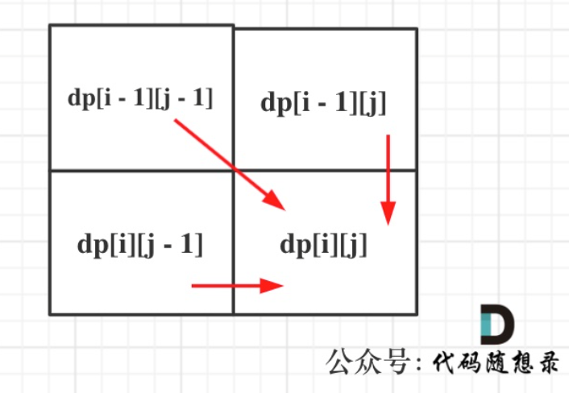

# 代码随想录算法训练营第三十六天|**115.不同的子序列** ，**583. 两个字符串的删除操作** ，**72. 编辑距离**

## 115.不同的子序列

[115.不同的子序列 | 动态规划 | 子序列 | dp数组 | 代码随想录](https://programmercarl.com/0115.不同的子序列.html)

## 我的思路

## 问题总结

### 为什么需要 `uint64_t`？

这是一个很经典的**中间值溢出**问题。

### 题目本质

用 DP 统计 `s` 的子序列中 `t` 出现的次数，转移方程为：

```
dp[i][j] = dp[i-1][j] + dp[i-1][j-1]   (s[i] == t[j])
dp[i][j] = dp[i-1][j]                   (s[i] != t[j])
```

### 问题所在

题目说"**结果**在 32 位有符号整数范围内"，但没说**中间过程**也在范围内。

看这个转移：

```
dp[i][j] = dp[i-1][j] + dp[i-1][j-1]
```

两个中间值相加，**各自可能已经很大**，它们的和可能远超 `int32` 的上限 `2,147,483,647`，即使最终答案能用 `int32` 表示。

## 卡的思路

复述思路。

1.dp数组含义

`dp[i][j]`表示以i-1为结尾的字符串中有以j-1为结尾的字符串的个数

2.递推公式

`若s[i-1]==t[j-1]，dp[i][j]=dp[i-1][j-1]+dp[i-1][j]`

```
即：当s[i - 1] 与 t[j - 1]相等时，dp[i][j]可以有两部分组成。

一部分是用s[i - 1]来匹配，那么个数为dp[i - 1][j - 1]。即不需要考虑当前s子串和t子串的最后一位字母，所以只需要 dp[i-1][j-1]。

一部分是不用s[i - 1]来匹配，个数为dp[i - 1][j]。
```

```
当s[i - 1] 与 t[j - 1]不相等时，dp[i][j]只有一部分组成，不用s[i - 1]来匹配（就是模拟在s中删除这个元素），即：dp[i - 1][j]
```

3.初始化

`dp[i][0]=1,dp[0][j]=0`即空字符串被匹配，空字符串去匹配

## 我的代码

```
class Solution {
public:
    int numDistinct(string s, string t) {
        vector<vector<uint64_t>>dp(s.size()+1,vector<uint64_t>(t.size()+1,0));
        for(int i=0;i<=s.size();i++){
            dp[i][0]=1;

        }
        for(int i=1;i<=s.size();i++){
            for(int j=1;j<=t.size();j++){
                if(s[i-1]==t[j-1])dp[i][j]=dp[i-1][j-1]+dp[i-1][j];
                else dp[i][j]=dp[i-1][j];
            }
        }
               return dp[s.size()][t.size()];
    }
};
```


## **583. 两个字符串的删除操作** 

[583. 两个字符串的删除操作 | 动态规划 | 最长公共子序列 | 代码随想录](https://programmercarl.com/0583.两个字符串的删除操作.html#思路)

## 我的思路

## 问题总结

## 卡的思路


## 我的代码

```
class Solution {
public:
    int minDistance(string word1, string word2) {
        vector<vector<int>>dp(word1.size()+1,vector<int>(word2.size()+1,0));
        for(int i=0;i<=word1.size();i++)dp[i][0]=i;
        for(int j=0;j<=word2.size();j++)dp[0][j]=j;
        for(int i=1;i<=word1.size();i++){
            for(int j=1;j<=word2.size();j++){
                if(word1[i-1]==word2[j-1])dp[i][j]=dp[i-1][j-1];
                else dp[i][j]=min(dp[i-1][j]+1,dp[i][j-1]+1);
            }
        }
        return dp[word1.size()][word2.size()];
    }
};
```


## **72. 编辑距离**

[72. 编辑距离 | 动态规划 | 状态转移 | 编辑距离 | 代码随想录](https://programmercarl.com/0072.编辑距离.html#算法公开课)

## 我的思路

## 问题总结

## 卡的思路

复述思路。

1.dp数组含义

`dp[i][j]表示以i-1，j-1为结尾的字符串最小操作次数`

2.递推公式

`if(word1[i-1]==word2[j-1])`表示两个元素是**相同的**，可以不用操作。即和 `dp[i-1][j-1]`的操作次数相同。

当他们**不相同**时，有三种操作可以选择。

**删除**：此时表示不考虑当前元素。即 `dp[i-1][j]+1或者dp[i][j-1]+1`

**替换**： `dp[i][j]=dp[i-1][j-1]+1`相当于在这一步替换了，在上一步的步数上加1.

**添加**:这里的添加和删除的对于两个相对的word操作是一样的。删除一个相当于另一个添加。所以只考虑删除即可。而且操作步数是一样的

3.遍历顺序

由上、左上、左方向推导而来

因此两层从左到右从上到下

4.初始化

`dp[i][0]=i`一个串和一个空串，那这个串有多少字符就需要操作多少步

`dp[0][j]=j`同上。

其他地方默认0即可，无所谓的。



## 我的代码

```
class Solution {
public:
    int minDistance(string word1, string word2) {
        vector<vector<int>>dp(word1.size()+1,vector<int>(word2.size()+1,0));
        for(int i=0;i<=word1.size();i++)dp[i][0]=i;
        for(int j=0;j<=word2.size();j++)dp[0][j]=j;
        for(int i=1;i<word1.size()+1;i++){
            for(int j=1;j<word2.size()+1;j++){
                if(word1[i-1]==word2[j-1])dp[i][j]=dp[i-1][j-1];
                else{
                    dp[i][j]=min(dp[i-1][j-1]+1,min(dp[i][j-1]+1,dp[i-1][j]+1));
                }
            }
        }
        return dp[word1.size()][word2.size()];
    }
};
```

## 总结

这题其实是包含了前面做的各种子序列编辑问题的各种情况。

[动态规划：392.判断子序列 (opens new window)](https://programmercarl.com/0392.判断子序列.html)给定字符串 s 和 t ，判断 s 是否为 t 的子序列。

相当于是只能删除t中元素，只允许t中元素不匹配，只允许j后退

```text
if (s[i - 1] == t[j - 1]) dp[i][j] = dp[i - 1][j - 1] + 1;
else dp[i][j] = dp[i][j - 1];
```

[动态规划：115.不同的子序列 (opens new window)](https://programmercarl.com/0115.不同的子序列.html)给定一个字符串 s 和一个字符串 t ，计算在 s 的子序列中 t 出现的个数。

配个数的话，可以用当前的字母来配，也可以不用

`当s[i - 1] 与 t[j - 1]相等时，dp[i][j]可以有两部分组成。`

`一部分是用s[i - 1]来匹配，那么个数为dp[i - 1][j - 1]。`

`一部分是不用s[i - 1]来匹配，个数为dp[i - 1][j]。`

```cpp
if (s[i - 1] == t[j - 1]) {
    dp[i][j] = dp[i - 1][j - 1] + dp[i - 1][j];
} else {
    dp[i][j] = dp[i - 1][j];
}
```

[动态规划：583.两个字符串的删除操作 (opens new window)](https://programmercarl.com/0583.两个字符串的删除操作.html)给定两个单词 word1 和 word2，找到使得 word1 和 word2 相同所需的最少步数，每步可以删除任意一个字符串中的一个字符。

删除其实就是不考虑当前的元素了，那么当不匹配的时候，可以不考虑i的也可以不考虑j的，看谁对应的上一步操作最少。或者都不要了。

```cpp
if (word1[i - 1] == word2[j - 1]) {
    dp[i][j] = dp[i - 1][j - 1];
} else {
    dp[i][j] = min({dp[i - 1][j - 1] + 2, dp[i - 1][j] + 1, dp[i][j - 1] + 1});
}
```

[动态规划：72.编辑距离 (opens new window)](https://programmercarl.com/0072.编辑距离.html)给你两个单词 word1 和 word2，请你计算出将 word1 转换成 word2 所使用的最少操作数 。

删除和添加的操作一样，只考虑删除可以。

删除可以删i，删j，也就是可以从2个方向来

替换也就是当前两个当成匹配好了，步数加一就可以。

