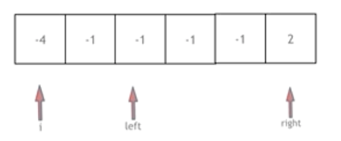

# 代码随想录算法训练营第三天|**454.四数相加II** ， **383. 赎金信**  ， **15. 三数之和** ，**18. 四数之和**  

## 454.四数相加II

[第454题.四数相加II | 代码随想录](https://programmercarl.com/0454.四数相加II.html)

## 我的思路

暴力超时了，用map怎么做。

## 问题总结

#### 1.

.  是“直接访问”（对象）
-> 是“通过指针访问”（it）

find()返回的是指针类型，所以要用->访问second

#### 2.用auto的四种场景

✅ 场景 1：类型特别长（最经典）

比如 STL 迭代器：

```
auto it = mp.begin();
```

否则要写：

```
unordered_map<int,int>::iterator it = mp.begin();
```

这就是 auto 的最大价值。

✅ 场景 2：你只关心“值”，不关心具体类型

比如：

```
auto sum = a + b;
```

你不需要知道是 int 还是 long long。

✅ 场景 3：遍历容器（现代 C++标准写法）

```
for(auto &x : vec)
```

这是最推荐的写法。

✅ 场景 4：函数返回类型复杂

比如：

```
auto result = mp.find(key);
```

你根本不需要记 iterator 的完整名字。

#### 3.问题出在这里：

```
if(result!=a_b.end()&&result->second!=0){
    total++;
    result->second--;
}
```

你在 **错误地“消耗”计数**。

🔴 为什么这是错的？

这题是：

> 统计有多少个四元组满足
>  `nums1[i] + nums2[j] + nums3[p] + nums4[q] == 0`

注意关键词：

👉 **是“统计所有组合数量”**
 不是匹配一对就用掉一次！

因此：不能减少计数！

而是：

```
total += result->second;
```

## 卡的思路

1. 首先定义 一个unordered_map，key放a和b两数之和，value 放a和b两数之和出现的次数。
2. 遍历大A和大B数组，统计两个数组元素之和，和出现的次数，放到map中。
3. 定义int变量count，用来统计 a+b+c+d = 0 出现的次数。
4. 再遍历大C和大D数组，找到如果 0-(c+d) 在map中出现过的话，就用count把map中key对应的value也就是出现次数统计出来。
5. 最后返回统计值 count 就可以了

## 我的代码

```
class Solution {
public:
    int fourSumCount(vector<int>& nums1, vector<int>& nums2, vector<int>& nums3, vector<int>& nums4) {
        int n=nums1.size();
        int sum=0;
        int total=0;
        unordered_map<int,int> a_b;
        for(int i=0;i<n;i++){
            for(int j=0;j<n;j++){
                auto result=a_b.find(nums1[i]+nums2[j]);
                if(result!=a_b.end()){
                    result->second++;
                }
                else
                a_b.insert({nums1[i]+nums2[j],1});
               
            }
        }

        for(int p=0;p<n;p++){
            for(int q=0;q<n;q++){
                auto result=a_b.find(0-(nums3[p]+nums4[q]));
                if(result!=a_b.end()&&result->second!=0){
                    total+=result->second;
                
                }
            }
        }
        return total;
        
    }
};
```


## 383. 赎金信

[383. 赎金信 | 代码随想录](https://programmercarl.com/0383.赎金信.html)

## 我的思路

magazine转字母数组统计每个字母的次数，用ransomNote去匹配，配一个减一个。

## 问题总结

一遍通过。

## 卡的思路

没有

## 我的代码

```
class Solution {
public:
    bool canConstruct(string ransomNote, string magazine) {
        int num[26]={0};
        for(int i=0;i<magazine.size();i++){
            num[magazine[i]-'a']++;

        }

        for(int j=0;j<ransomNote.size();j++){
            if(num[ransomNote[j]-'a']>0){
                num[ransomNote[j]-'a']--;
            }
            else
            return false;
        }
        return true;
        
    }
};
```


## 15. 三数之和

[第15题. 三数之和 | 代码随想录](https://programmercarl.com/0015.三数之和.html)

## 我的思路

两层for循环就可以确定 两个数值，可以使用哈希法来确定 第三个数 0-(a+b) 或者 0 - (a + c) 是否在 数组里出现过

## 问题总结

#### 1.用什么排序

` sort(nums.begin(),nums.end());`

#### 2.去重

①第一个数字的去重应该在for循环的最开始

②第二个第三个数字的去重应该在获得了一个答案之后，对两边的边界进行连续收缩

left,right

#### 3.边界控制

①在循环的时候应该一直控制left小于right，而不是left不等于right，这样在left和right同时变化的时候有可能越界

②可以啊在第二个第三个数字去重的时候你也应该控制，left小于right防止收缩越界

**总体而言在每一个left和right变化的地方都要考虑一下这个地方有没有进行边界控制**


## 卡的思路



首先将数组排序，然后有一层for循环，i从下标0的地方开始，同时定一个下标left 定义在i+1的位置上，定义下标right 在数组结尾的位置上。

依然还是在数组中找到 abc 使得a + b +c =0，我们这里相当于 a = nums[i]，b = nums[left]，c = nums[right]。

接下来如何移动left 和right呢， 如果nums[i] + nums[left] + nums[right] > 0 就说明 此时三数之和大了，因为数组是排序后了，所以right下标就应该向左移动，这样才能让三数之和小一些。

如果 nums[i] + nums[left] + nums[right] < 0 说明 此时 三数之和小了，left 就向右移动，才能让三数之和大一些，直到left与right相遇为止。

## 我的代码

```
class Solution {
public:
    vector<vector<int>> threeSum(vector<int>& nums) {
        vector<vector<int>> result;
        sort(nums.begin(),nums.end());
        int n=nums.size();

        for(int i=0;i<n;i++){
           if(nums[0]>0)return result;
           if(i>0&&nums[i]==nums[i-1])continue;
           int left=i+1;
            int right=n-1;
           while(left<right){
            
            if(nums[i]+nums[left]+nums[right]>0)right--;
            else if(nums[i]+nums[left]+nums[right]<0)left++;
            else{
                result.push_back({nums[i],nums[left],nums[right]});
                while(left<right&&nums[left]==nums[left+1])left++;
                while(right>left&&nums[right]==nums[right-1])right--;
                left++;
                right--;
            }
           }

            }

        
        return result;

    
}};
```


## 18. 四数之和

[第18题. 四数之和 | 代码随想录](https://programmercarl.com/0018.四数之和.html#google_vignette)

## 我的思路

ij走两个嵌套的for循环，再用left和right，时间复杂度应该是n3

## 问题总结

#### 1.整数溢出问题

int 的范围不够装下四个数的和

int≈ ±2 * 10^9

所以相加一定要加`（long）`不然溢出

#### 2.不能用`if(nums[i] > target) return result;`剪枝

因为四数之和是target，两个数可能大于target，再来一个负数可能就小于target了

但是按照三数的经验，保证同时`nums[i]>0`就可以了。

第二个for也按照这个思路剪

## 卡的思路

跟上面差不多。

## 我的代码

```
class Solution {
public:
    vector<vector<int>> fourSum(vector<int>& nums, int target) {
        vector<vector<int>> result;
        sort(nums.begin(),nums.end());
        int n=nums.size();
        

        for(int i=0;i<n;i++){
            if(i!=0&&nums[i-1]==nums[i])continue;
            for(int j=i+1;j<n-2;j++){
                if(j!=i+1&&nums[j]==nums[j-1])continue;

                int left=j+1;
                int right=n-1;
                while(left<right){
                    if((long)nums[i]+nums[j]+nums[left]+nums[right]>target)right--;
                    else if((long)nums[i]+nums[j]+nums[left]+nums[right]<target)left++;
                    else{
                        result.push_back({nums[i],nums[j],nums[left],nums[right]});
                        while(left<right&&nums[left]==nums[left+1])left++;
                        while(left<right&&nums[right]==nums[right-1])right--;
                        left++;
                        right--;
                    }

                }

                
            }
        }
        return result;
        
    }
};
```

## 时长

2.5h