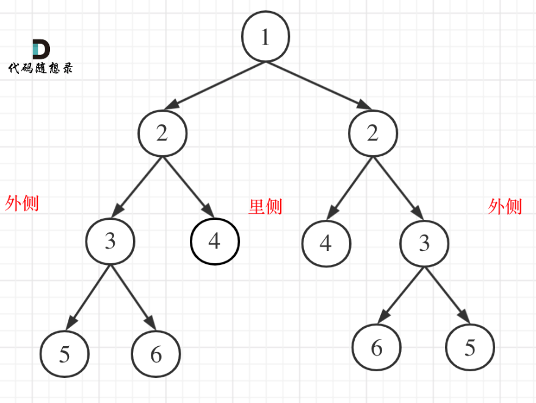

# 代码随想录算法训练营第九天| **226.翻转二叉树**，**101. 对称二叉树**，**104.二叉树的最大深度**，**111.二叉树的最小深度**

## 226.翻转二叉树

[226.翻转二叉树 | 代码随想录](https://programmercarl.com/0226.翻转二叉树.html)

## 我的思路

交换左右孩子即可

## 问题总结

一遍通过

## 卡的思路

前后序遍历都可以，中序遍历会让部分结点交换两次

## 我的代码

```
class Solution {
public:
    TreeNode* invertTree(TreeNode* root) {
        invert(root);
        return root;
        
    }
    void invert(TreeNode* cur){
        if(cur==NULL)return;
        swap(cur->left,cur->right);
        invert(cur->left);
        invert(cur->right);
    }
};
```

## 101. 对称二叉树

[101. 对称二叉树 | 代码随想录](https://programmercarl.com/0101.对称二叉树.html#思路)

## 我的思路

我没有思路

## 问题总结

一遍通过

## 卡的思路

**我们要比较的是两个树（这两个树是根节点的左右子树）**，所以在递归遍历的过程中，也是要同时遍历两棵树。

本题遍历只能是“后序遍历”，因为我们要通过递归函数的返回值来判断两个子树的内侧节点和外侧节点是否相等。

**正是因为要遍历两棵树而且要比较内侧和外侧节点，所以准确的来说是一个树的遍历顺序是左右中，一个树的遍历顺序是右左中。**



1. 确定递归函数的参数和返回值

   要比较的是两个树，参数自然也是左子树节点和右子树节点。

2.确定终止条件

- 左节点为空，右节点不为空，不对称，return false
- 左不为空，右为空，不对称 return false
- 左右都为空，对称，返回true

3.确定单层递归的逻辑

 左右节点都不为空，且数值相同的情况。

- 比较二叉树外侧是否对称：传入的是左节点的左孩子，右节点的右孩子。
- 比较内侧是否对称，传入左节点的右孩子，右节点的左孩子。
- 如果左右都对称就返回true ，有一侧不对称就返回false 。

## 我的代码

```
class Solution {
public:
    bool isSymmetric(TreeNode* root) {
        if(root==NULL)return true;
        return compare(root->right,root->left);
        
    }
    bool compare(TreeNode*left,TreeNode*right){
        if(left==NULL&&right==NULL)return true;
        else if(left==NULL&&right!=NULL||left!=NULL&&right==NULL)return false;
        else if(left->val!=right->val)return false;
        return(compare(left->left,right->right)&&compare(right->left,left->right));
    }
```

## 104.二叉树的最大深度

[104.二叉树的最大深度 | 代码随想录](https://programmercarl.com/0104.二叉树的最大深度.html)

## 我的思路

递归，返回左右子树中大的depth+1即可，当结点为空时开始返回0。

## 问题总结

一遍过

## 卡的思路

本题可以使用前序（中左右），也可以使用后序遍历（左右中），使用前序求的就是深度，使用后序求的是高度。

- 二叉树节点的深度：指从根节点到该节点的最长简单路径边的条数或者节点数（取决于深度从0开始还是从1开始）
- 二叉树节点的高度：指从该节点到叶子节点的最长简单路径边的条数或者节点数（取决于高度从0开始还是从1开始）

**而根节点的高度就是二叉树的最大深度**，所以本题中我们通过后序求的根节点高度来求的二叉树最大深度。

```
 int leftdepth = getdepth(node->left);       // 左
 int rightdepth = getdepth(node->right);     // 右
 int depth = 1 + max(leftdepth, rightdepth); // 中
```

## 我的代码

```
class Solution {
public:
    int maxDepth(TreeNode* root) {
        int d=0;
        return depth(root);
        
    }
    int depth(TreeNode* cur){
        if(cur==NULL)return 0;
        return(max(depth(cur->left),depth(cur->right))+1);

    }
};
```

## 111.二叉树的最小深度

[111.二叉树的最小深度 | 代码随想录](https://programmercarl.com/0111.二叉树的最小深度.html)

## 我的思路

坑在哪里，我还是想返回左右结点中的小值+1。

坑在叶子结点是没有子孩子，如果只有一个孩子，返回的是有孩子的那棵树的高度，不是0.

我把情况分成：

空节点

两个孩子

只有一个孩子

叶子结点

## 问题总结

## 卡的思路

## 我的代码

```
class Solution {
public:
    int minDepth(TreeNode* root) {
        return depth(root);
        
    }
    int depth(TreeNode* cur){
        if(cur==NULL)return 0;
        else if(cur->left==NULL&&cur->right==NULL)return 1;
        else if(cur->left!=NULL&&cur->right!=NULL)
        return(1+min(depth(cur->left),depth(cur->right)));
        else if(cur->left!=NULL&&cur->right==NULL)
        return(depth(cur->left)+1);
        else
        return(depth(cur->right)+1);
    }
};
```

70min
