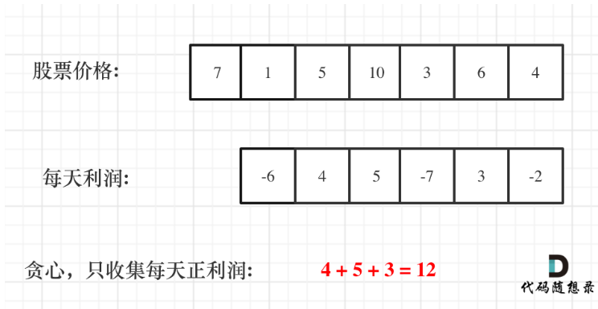

# 代码随想录算法训练营第二十一天|**122.买卖股票的最佳时机II**， **55. 跳跃游戏** ，**45.跳跃游戏II** ， **1005.K次取反后最大化的数组和**  

###  **122.买卖股票的最佳时机II**  

[122.买卖股票的最佳时机 II | 代码随想录](https://programmercarl.com/0122.买卖股票的最佳时机II.html)

**利润拆分是关键点**

## 我的思路

天数只能从第一天向最后一天过，所以只能按顺序遍历数组。

有点像差值最大那题，在山谷买入，山峰卖出。

## 问题总结

## 卡的思路

**如果想到其实最终利润是可以分解的，那么本题就很容易了！**

如何分解呢？

假如第 0 天买入，第 3 天卖出，那么利润为：prices[3] - prices[0]。

相当于(prices[3] - prices[2]) + (prices[2] - prices[1]) + (prices[1] - prices[0])。

**此时就是把利润分解为每天为单位的维度，而不是从 0 天到第 3 天整体去考虑！**

那么根据 prices 可以得到每天的利润序列：(prices[i] - prices[i - 1]).....(prices[1] - prices[0])。



**本题中理解利润拆分是关键点！** 不要整块的去看，而是把整体利润拆为每天的利润。

## 我的代码

```
class Solution {
public:
    int maxProfit(vector<int>& prices) {
        int result=0;
        for(int i=0;i<prices.size()-1;i++){
            if(prices[i+1]-prices[i]>0)result+=(prices[i+1]-prices[i]);
        }
        return result;
    }
};
```


### 10min 

### **55. 跳跃游戏** 

[55. 跳跃游戏 | 代码随想录](https://programmercarl.com/0055.跳跃游戏.html)

## 我的思路

应该怎么想呢。。

## 问题总结

## 卡的思路

不一定非要明确一次究竟跳几步，每次取最大的跳跃步数，这个就是可以跳跃的覆盖范围。

这个范围内，别管是怎么跳的，反正一定可以跳过来。

**那么这个问题就转化为跳跃覆盖范围究竟可不可以覆盖到终点！**

每次移动取最大跳跃步数（得到最大的覆盖范围），每移动一个单位，就更新最大覆盖范围。

**贪心算法局部最优解：每次取最大跳跃步数（取最大覆盖范围），整体最优解：最后得到整体最大覆盖范围，看是否能到终点**。

## 我的代码

```
class Solution {
public:
    bool canJump(vector<int>& nums) {
        if(nums.size()==1)return true;
        int cover=0;
        for(int i=0;i<=cover;i++){
            cover=max(i+nums[i],cover);
            if(cover>=nums.size()-1)return true;

        }
        return false;
        
    }
};
```


###  **45.跳跃游戏II** 

[45.跳跃游戏 II | 代码随想录](https://programmercarl.com/0045.跳跃游戏II.html)

## 我的思路

思路跟上一题一样吗，需要加step记录步数。

## 问题总结

## 卡的思路

## 我的代码

###  **1005.K次取反后最大化的数组和**  

|笔记链接|

## 我的思路

## 问题总结

## 卡的思路

## 我的代码

## 时长   