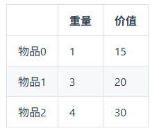
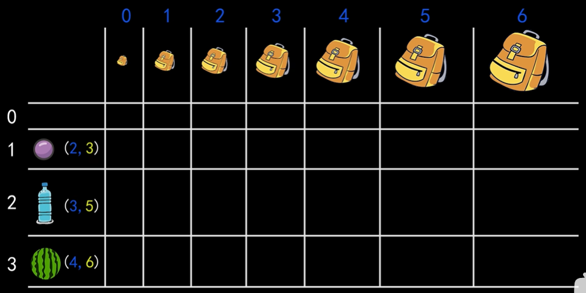
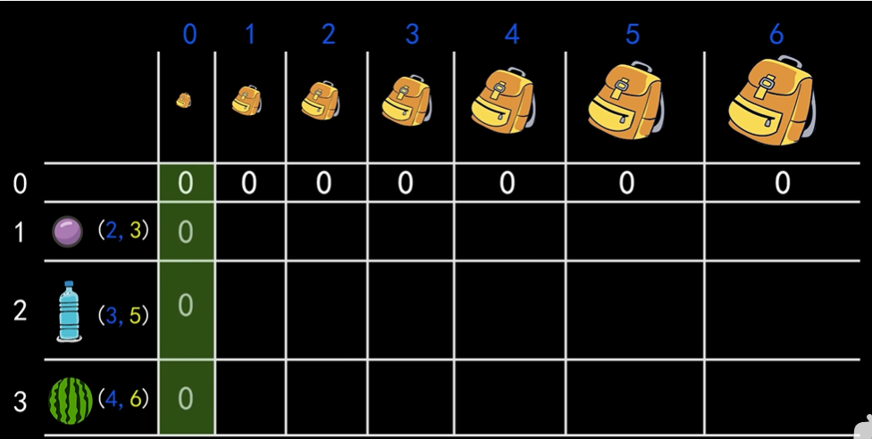

# 代码随想录算法训练营第二十七天|01背包理论，01背包理论基础（滚动数组），416. 分割等和子集

## 01背包理论

[动态规划：01背包理论基础 | 代码随想录](https://programmercarl.com/背包理论基础01背包-1.html#算法公开课)

## 学习笔记

01背包：物品唯一

完全背包：物品数量无限

问题：

有n件物品和一个最多能背重量为w 的背包。第i件物品的重量是weight[i]，得到的价值是value[i] 。**每件物品只能用一次**，求解将哪些物品装入背包里物品价值总和最大。

暴力解法：用回溯枚举所有情况，时间复杂度2^n

dp解法：

1.dp数组和下标的含义

`dp[ i ][ j]` 下标为[0,i]之间的物品任取放进容量为j的背包里  

2.确定递推公式

当前背包的状态取决于当前放或不放物品i

不放物品i `dp[i-1][j]`

放物品i `dp[i-1][j-weight[i]]+value[i]`

`dp[i][j]`=max(上面两者)

1.每一个单元格都是当前背包容量下的最优解 2。对于一个背包先看他能不能放下当前的物体，不能放下就不放（但是得放之前求得的当前背包容量下的最优解（总不可能荣包空着吧），这一格的头上那一个） 3。如果当前面背包可以放下当前物品，就把这个东西放进去，但是只放这个东西的话包可能还有空间。就把包的容量减去当前物品的重量，得到包还剩下多少空间，然后去上一行查这个空间可以放多少东西。

3.初始化

第0行和第0列都为0

## 01背包理论基础（滚动数组）

[动态规划：01背包理论基础（滚动数组） | 代码随想录](https://programmercarl.com/背包理论基础01背包-2.html)

## 学习笔记

歇一下，后面补卡吧。

## 416. 分割等和子集

|笔记链接|

## 我的思路

## 问题总结

## 卡的思路

## 我的代码 
