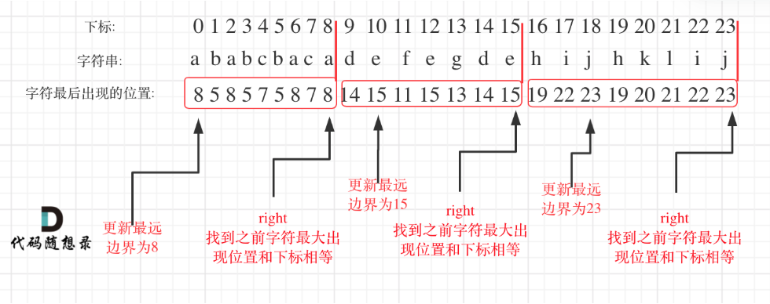

# 代码随想录算法训练营第二十三天|**452. 用最少数量的箭引爆气球**， **435. 无重叠区间**，**763.划分字母区间** 

## 452. 用最少数量的箭引爆气球

[452. 用最少数量的箭引爆气球 | 代码随想录](https://programmercarl.com/0452.用最少数量的箭引爆气球.html)

## 我的思路

尽量射在重叠区间。但是这个重叠区间应该怎么计算？

## 问题总结

## 卡的思路

**为了让气球尽可能的重叠，需要对数组进行排序**。

**如果气球重叠了，重叠气球中右边边界的最小值 之前的区间一定需要一个弓箭**。

怎么判断下一个气球有没有跟前两个重叠呢，用前两个气球的min作为第二个气球的右边界，去跟下一个气球比较。

## 我的代码

```
class Solution {
public:
    static bool cmp(vector<int>&a,vector<int>&b){
        return a[0]<b[0];
    }
    int findMinArrowShots(vector<vector<int>>& points) {
        sort(points.begin(),points.end(),cmp);
        if(points.size()==0)return 0;
        int result=1;
        for(int i=1;i<points.size();i++){
            if(points[i][0]>points[i-1][1])result++;
            else{
                points[i][1]=min(points[i-1][1],points[i][1]);
            }
        }
        return result;
        
    }
};
```


##  **435. 无重叠区间**

[435. 无重叠区间 | 代码随想录](https://programmercarl.com/0435.无重叠区间.html#补充)

## 我的思路

## 问题总结

## 卡的思路

对于跟第一题相比，箭就是不重叠的个数，需要移除的就是size-箭

## 我的代码

```
class Solution {
public:
    static bool cmp(vector<int>&a,vector<int>&b){
        return a[0]<b[0];
    }
    int eraseOverlapIntervals(vector<vector<int>>& intervals) {
        sort(intervals.begin(),intervals.end(),cmp);
        if(intervals.size()==0)return 0;//一个或者0个直接返回
        int result=1;
        for(int i=1;i<intervals.size();i++){
            if(intervals[i-1][1]<=intervals[i][0])result++;
            else{
                intervals[i][1]=min(intervals[i][1],intervals[i-1][1]);
            }
        }
        return intervals.size()-result;
        
    }
};
```


## **763.划分字母区间** 

[763.划分字母区间 | 代码随想录](https://programmercarl.com/0763.划分字母区间.html#思路)

## 我的思路

## 问题总结

我出现了一个错误，就是遍历的时候在用：

> “单个字符的结束位置”

但正确的是：

> “当前区间所有字符的最远结束位置”

所以应该取 的是所有字母的最大值。

## 卡的思路

在遍历的过程中相当于是要找每一个字母的边界，**如果找到之前遍历过的所有字母的最远边界，说明这个边界就是分割点了**。此时前面出现过所有字母，最远也就到这个边界了。

可以分为如下两步：

- 统计每一个字符最后出现的位置
- 从头遍历字符，并更新字符的最远出现下标，如果找到字符最远出现位置下标和当前下标相等了，则找到了分割点
- 

## 我的代码

```
class Solution {
public:
    vector<int> partitionLabels(string s) {
        vector<int>result;
        vector<int> zimu(27,0);
        for(int i=0;i<s.size();i++){
            zimu[s[i]-'a']=i;
        }
        int start=0,end=0;
        for(int i=0;i<s.size();i++){
            end=max(end,zimu[s[i]-'a']);
            if(i==end){
                result.push_back(end-start+1);
                start=i+1;
            }
        }
        return result;
        
    }
};
```


## 时长   

2h