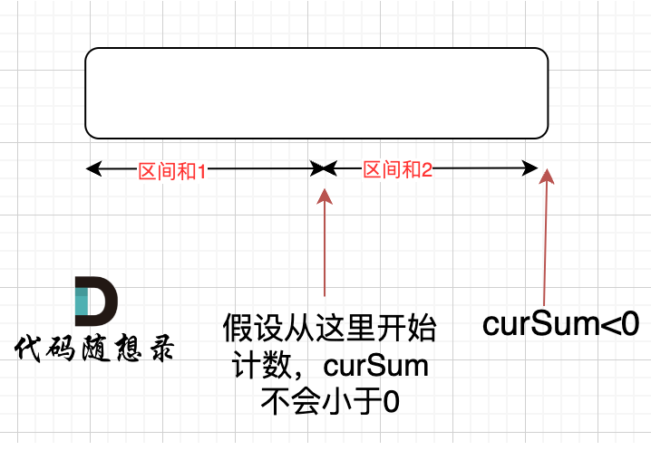

# 代码随想录算法训练营第二十二天| **134. 加油站** ， **135. 分发糖果** ，**860.柠檬水找零**， **406.根据身高重建队列** 

十年灯火磨青锋，一朝长歌动九霄。

## 134. 加油站

[134. 加油站 | 代码随想录](https://programmercarl.com/0134.加油站.html)

## 我的思路

最初的想法是，可以以每个加油站为起点旋转一圈，一边转一边把cost和gas加起来，如果cost>gas，说明以这个为起点不行。可以建一个每段路程剩或者欠多少油的数组，但是怎么根据这个数据找出合适的起点呢。

->看卡的思路

## 问题总结

## 卡的思路

首先如果总油量减去总消耗大于等于零那么一定可以跑完一圈，说明 各个站点的加油站 剩油量rest[i]相加一定是大于等于零的。

每个加油站的剩余量rest[i]为gas[i] - cost[i]。

i从0开始累加rest[i]，和记为curSum，一旦curSum小于零，说明[0, i]区间都不能作为起始位置，因为这个区间选择任何一个位置作为起点，到i这里都会断油，那么起始位置从i+1算起，再从0计算curSum。

两个可能有疑问的点：

一、有没有可能 [0，i] 区间 选某一个作为起点，累加到 i这里 curSum是不会小于零呢？ 如图：



如果 curSum<0 说明 区间和1 + 区间和2 < 0， 那么 假设从上图中的位置开始计数curSum不会小于0的话，就是 区间和2>0。

区间和1 + 区间和2 < 0 同时 区间和2>0，只能说明区间和1 < 0， 那么就会从假设的箭头初就开始从新选择起始位置了。

二、为啥totalSum >= 0，一定能跑一圈呢？

 因为当start = i+1, 且这个start没有被后序的更新替代，则说明从start到数组结束位置（gas.size()-1）之间的sum为正数，若记该sum为B，start之前的sum为A，那么A+B=totalSum, 已知totalSum>=0, A<0, B>0, 所以B>-A, 走完一圈的B+A>=0

## 我的代码

```
class Solution {
public:
    int canCompleteCircuit(vector<int>& gas, vector<int>& cost) {
        int curSUM=0,totalSUM=0,start=0;
        for(int i=0;i<gas.size();i++){
            curSUM+=gas[i]-cost[i];
            totalSUM+=gas[i]-cost[i];
            if(curSUM<0){
                curSUM=0;
                start=i+1;
            }
        }
        if(totalSUM<0)return -1;
        return start;
        
    }
};
```


## 135. 分发糖果

[135. 分发糖果 | 代码随想录](https://programmercarl.com/0135.分发糖果.html)

## 我的思路

我试了一下，如果按顺序发，每个孩子都在条件下发最少，后面会因为有的不能更少而需要把前面的全部上调。那应该怎么做呢

## 问题总结

1.比较的应该是rating的大小，表示left、right的大小，注意一下无意识错误

2.初始化的时候对数组直接赋初值1就不用考虑把第一个单独赋值的问题了

## 卡的思路

从左向右遍历，如果右大于左，右就比左加1。再从右向左遍历，如果左比右大，就左比右加1。这样就能保证在两个方向上都正确。最后的结果取两个方向上的最大值。

这个题目的隐藏的含义在于分数的单调。

我们需要找到分数的峰值和底值，有了这两个以后可以根据单调性的单调次数给峰值和底值先赋值，然后再重新遍历一遍数组进行填数。

你可以想象，其实如果是顺序遍历+单调递增我们很容易就可以一次得出所有的糖果数量，问题就在于可能出现**单调递减**，而你永远不知道递减多少次，所以你就**不知道峰值至少要留多少个糖果**（底值不用考虑因为底值给1个糖果就好），所以只顺序遍历的话只能求出单调递增，**求单调递减需要逆序遍历**。所以说卡尔的从左往右遍历和从右往左遍历恰恰就是很好得把单调递增和单调递减后的峰值都求了出来，然后取最大，表明得出的是对应峰值

## 我的代码

```
class Solution {
public:
    int candy(vector<int>& ratings) {
        vector<int>left(ratings.size(), 1);
        vector<int>rights(ratings.size(), 1);
        int result=0;

        for(int i=1;i<ratings.size();i++){
            if(ratings[i]>ratings[i-1])left[i]=left[i-1]+1;
        }
        for(int i=ratings.size()-2;i>-1;i--){
            if(ratings[i]>ratings[i+1])rights[i]=rights[i+1]+1;
           
        }
        for(int i=0;i<ratings.size();i++){
            result+=max(rights[i],left[i]);
        }
        return result;
        
    }
};
```


## 860.柠檬水找零

[860.柠檬水找零 | 代码随想录](https://programmercarl.com/0860.柠檬水找零.html)

## 我的思路

跟汽油那题很像。计算的是消耗和需要的5美元数量。

但是这题支付顺序是固定的，只要数量出现负就可以结束。

--有点问题，因为10美元和20美元的找零方法可以不一样，所以不能只计算5美元。

如果是20美元，优先用10美元。

## 问题总结

## 卡的思路

## 我的代码

```
class Solution {
public:
    bool lemonadeChange(vector<int>& bills) {
        int n_5=0,n_10=0;
        for(int i=0;i<bills.size();i++){
            if(bills[i]==5)n_5++;
            else if(bills[i]==10){
                if(n_5>0){n_5--;n_10++;}
                else return false;
            }
            else if(bills[i]==20){
                if(n_10!=0&&n_5!=0){n_5--;n_10--;}
                else if(n_5>2)n_5-=3;
                else return false;
            }
        }
        return true; 
    }
};
```


## **406.根据身高重建队列** 

[406.根据身高重建队列 | 代码随想录](https://programmercarl.com/0406.根据身高重建队列.html#算法公开课)

两个维度的题目，先确定一个可以定下来的维度，即按照这个维度排序后，再按照另一个维度排序不会影响上一个维度的信息

## 我的思路

## 问题总结

使用vector是非常费时的，C++中vector（可以理解是一个动态数组，底层是普通数组实现的）如果插入元素大于预先普通数组大小，vector底部会有一个扩容的操作，即申请两倍于原先普通数组的大小，然后把数据拷贝到另一个更大的数组上。

所以使用vector（动态数组）来insert，是费时的，插入再拷贝的话，单纯一个插入的操作就是O(n^2)了，甚至可能拷贝好几次，就不止O(n^2)了。

## 卡的思路

先用hi把身高维度排下来，然后按照人数来依次向前插入。不用担心破坏前面已经排好的，因为在后面的都小于前面的，不会破坏前面的人数累计。

## 我的代码

第一次先写个数组的代码

```
class Solution {
public:
    static bool cmp(vector<int>&a,vector<int>&b){
        if(a[0]==b[0])return a[1]<b[1];
            return a[0]>b[0];
            
        }
    vector<vector<int>> reconstructQueue(vector<vector<int>>& people) {
        sort(people.begin(),people.end(),cmp);
        vector<vector<int>>queue;
        for(int i=0;i<people.size();i++){
            int position=people[i][1];
            queue.insert(queue.begin()+position,people[i]);
        }
        return queue;
    }
};
```


## 时长   

2.5h