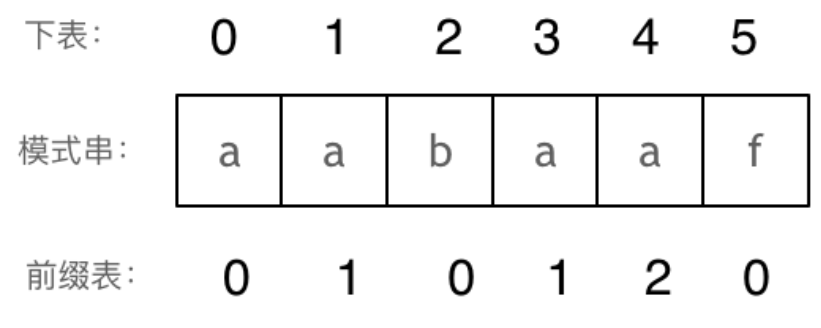
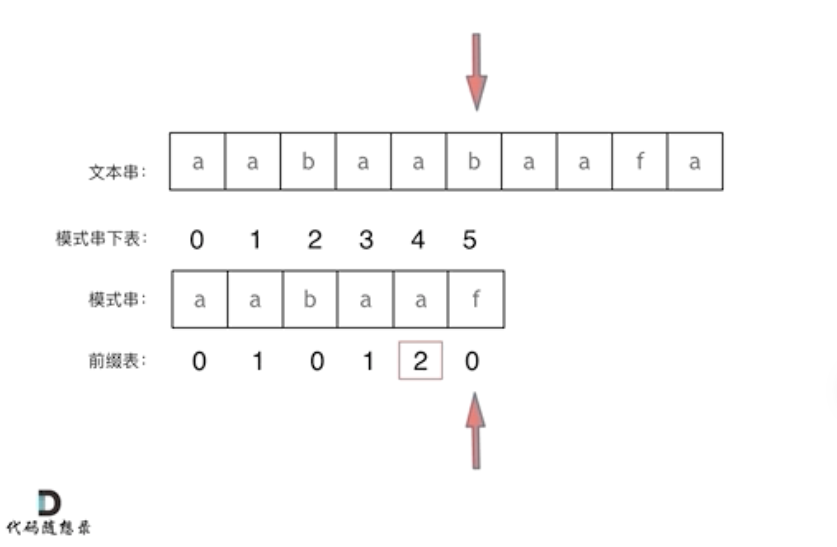

# 代码随想录算法训练营第五天|151.翻转字符串里的单词，卡码网：55.右旋转字符串，28. 实现 strStr()，459.重复的子字符串

## 151.翻转字符串里的单词

[151.翻转字符串里的单词 | 代码随想录](https://programmercarl.com/0151.翻转字符串里的单词.html)

## 我的思路

这题用o（n）空间是容易的，不用额外空间怎么做

## 问题总结

**1.怎么移除中间的空格？**

①erase（）函数本身是o（n）复杂度

②双指针法

fast 在原字符串上跑
 slow 重建一个干净的字符串

2.空格的处理写的好乱，跑不起来，学习一下标准解法。

3.所有 while 都要带边界
 所有数组访问都要想是否越界
 不要 for + while 混着改一个变量

## 卡的思路

解题思路如下：

- 移除多余空格
- 将整个字符串反转
- 将每个单词反转

## 卡的代码

```
class Solution {
public:
    void reverse(string& s,int start,int end){
        while(start<end){
            swap(s[start++],s[end--]);
        }
    }

   /*** void erasekong(string& s){
        int n=s.size();
        int slow=0;
        for(int i=0;i<n;i++){
            while(s[i]!=' '&&i<n){
                if(slow!=0)s[slow++]=' ';//单词间空格
                while(i!=n&&s[i]!=' ')
                s[slow++]=s[i++];
            }
        }
        s.resize(slow);

    }****///我写的一个有点乱的删除空格
    void erasekong(string& s){
    int n = s.size();
    int slow = 0;
    int i = 0;

    while(i < n){

        // 跳过空格
        while(i < n && s[i] == ' ') i++;

        if(i >= n) break;

        // 单词之间加一个空格
        if(slow != 0) s[slow++] = ' ';

        // 复制单词
        while(i < n && s[i] != ' ')
            s[slow++] = s[i++];
    }

    s.resize(slow);
}
    string reverseWords(string s) {
        int n=s.size();
        reverse(s,0,n-1);

        erasekong(s);
        n=s.size();
        int start=0;
        for(int i=0;i<=n;i++){
            if(i==n||s[i]==' '){
                reverse(s,start,i-1);
                start=i+1;
            }
        }

  return s;
        
    }
};
```

时长

1h

## 151.翻转字符串里的单词

[右旋字符串 | 代码随想录](https://programmercarl.com/kamacoder/0055.右旋字符串.html)

## 我的思路

原地右旋一开始看真没思路。

## 问题总结

注意题目中给出的参数输入的顺序

## 卡的思路

整体反转+局部反转

## 我的代码

```
#include<bits/stdc++.h>
using namespace std;
class Solution{
    public:
    void reverse(string &s,int start,int end){
        while(start<end){
            swap(s[start++],s[end--]);
        }
    }
    void right(string &s,int k){
        int n=s.size();
        reverse(s,0,n-1);
        reverse(s,0,k-1);
        reverse(s,k,n-1);

    }
};

int main(){
    string s;
    int k;
    cin>>k;
    cin>>s;
    
    Solution sol;
    sol.right(s,k);
    cout<<s;
    return 0;
} 
```

## **28. 实现 strStr()**

**当出现字符串不匹配时，可以记录一部分之前已经匹配的文本内容，利用这些信息避免从头再去做匹配。**

[28. 实现 strStr() | 代码随想录](https://programmercarl.com/0028.实现strStr.html#思路)

## 我的思路

一刷的时候学的KMP，已经不大记得了。

## 问题总结

## 卡的思路

#### next数组

next数组就是一个前缀表（prefix table）。**前缀表是用来回退的，它记录了模式串与主串(文本串)不匹配的时候，模式串应该从哪里开始重新匹配。**

前缀表记录下标i之前（包括i）的字符串中，有多大长度的相同前缀后缀。

#### 计算next数组



```
void getNext(int* next, const string& s){
    int j = -1;
    next[0] = j;
    for(int i = 1; i < s.size(); i++) { // 注意i从1开始
        while (j >= 0 && s[i] != s[j + 1]) { // 前后缀不相同了
            j = next[j]; // 向前回退
        }
        if (s[i] == s[j + 1]) { // 找到相同的前后缀
            j++;
        }
        next[i] = j; // 将j（前缀的长度）赋给next[i]
    }
}
```


#### 匹配和回溯

找到的不匹配的位置， 那么此时我们要看它的前一 个字符的前缀表的数值是多少。



```
int j = -1; // 因为next数组里记录的起始位置为-1
for (int i = 0; i < s.size(); i++) { // 注意i就从0开始
    while(j >= 0 && s[i] != t[j + 1]) { // 不匹配
        j = next[j]; // j 寻找之前匹配的位置
    }
    if (s[i] == t[j + 1]) { // 匹配，j和i同时向后移动
        j++; // i的增加在for循环里
    }
    if (j == (t.size() - 1) ) { // 文本串s里出现了模式串t
        return (i - t.size() + 1);
    }
}
```

复杂度o（m+n）

## 我的代码

无

时长

1h
