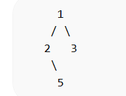

# 代码随想录算法训练营第八天|**递归遍历**，**迭代遍历**，**统一迭代** ， **层序遍历** 

## 递归遍历

[二叉树的递归遍历 | 代码随想录](https://programmercarl.com/二叉树的递归遍历.html#算法公开课)

## 我的思路

## 问题总结

有点忘了及时复习一下

## 卡的思路

1.递归三要素

①确定参数和返回类型

②确定终止条件

③确定单层递归的逻辑

## 我的代码

前序遍历

```
class Solution {
public:
void traversal(TreeNode*cur,vector<int> &result){
         if(cur==NULL)return;
         result.push_back(cur->val);
         traversal(cur->left,result);
         traversal(cur->right,result);
    }
    vector<int> preorderTraversal(TreeNode* root) {
        vector<int> result;
        traversal(root,result);
        return result;
       

        
    }
    
};
```

后序遍历

```
class Solution {
public:
void traversal(TreeNode*cur,vector<int> &result){
         if(cur==NULL)return;
         
         traversal(cur->left,result);
         traversal(cur->right,result);
         result.push_back(cur->val);
    }
    vector<int> postorderTraversal(TreeNode* root) {
         vector<int> result;
        traversal(root,result);
        return result;
        
    }
};
```

中序遍历

```
class Solution {
public:
void traversal(TreeNode*cur,vector<int> &result){
         if(cur==NULL)return;
         traversal(cur->left,result);
        result.push_back(cur->val);
         traversal(cur->right,result);
        
    }
    vector<int> inorderTraversal(TreeNode* root) {
        vector<int> result;
        traversal(root,result);
        return result;
    }
};
```

## 迭代遍历

[二叉树的迭代遍历 | 代码随想录](https://programmercarl.com/二叉树的迭代遍历.html#思路)

## 我的思路

给出一个栈，每次从中取出一个节点，处理当前节点：如果是中左右的话，把右孩子先放进栈里，再把左孩子放进栈里。

## 问题总结

1.根节点一不为NULL

2.对于每一个子节点都可能为NULL,所以在用节点之前一定要判断

## 卡的思路

**先序遍历**是中左右，后序遍历是左右中，那么我们只需要调整一下先序遍历的代码顺序，就变成中右左的遍历顺序，然后在反转result数组，输出的结果顺序就是左右中了

## 我的代码

先序遍历

```

class Solution {
public:
    vector<int> preorderTraversal(TreeNode* root) {
        stack<TreeNode*> st;
        st.push(root);
        vector<int> result;
        if(root==NULL)return result;
        while(st.size()!=0){
            TreeNode* cur=st.top();
            st.pop();
            if(cur!=NULL){
                result.push_back(cur->val);
            st.push(cur->right);
            st.push(cur->left);
            }          
        }
        return result;
        
    }
};
```

后序遍历

```
class Solution {
public:
    vector<int> postorderTraversal(TreeNode* root) {
        stack<TreeNode*> st;
        st.push(root);
        vector<int> result;
        if(root==NULL)return result;
        while(st.size()!=0){
            TreeNode* cur=st.top();
            st.pop();
            if(cur!=NULL){
            result.push_back(cur->val);
            st.push(cur->left);
            st.push(cur->right);
            }          
        }
        reverse(result.begin(),result.end());
        return result;
    }
};
```

中序遍历（卡的代码）

```
class Solution {
public:
    vector<int> inorderTraversal(TreeNode* root) {
        vector<int> result;
        stack<TreeNode*> st;
        TreeNode* cur = root;
        while (cur != NULL || !st.empty()) {
            if (cur != NULL) { // 指针来访问节点，访问到最底层
                st.push(cur); // 将访问的节点放进栈
                cur = cur->left;                // 左
            } else {
                cur = st.top(); // 从栈里弹出的数据，就是要处理的数据（放进result数组里的数据）
                st.pop();
                result.push_back(cur->val);     // 中
                cur = cur->right;               // 右
            }
        }
        return result;
    }
};

```

## 层序遍历

[199. 二叉树的右视图 - 力扣（LeetCode）](https://leetcode.cn/problems/binary-tree-right-side-view/submissions/704164303/)（3.8补卡）

## 我的思路

只像右子树走，如果右子树缺失就向左子树走，每往下一层存当前的val。

这种思路是有问题的，无法避免这种情况。



这种情况应该是按层序遍历去走，每层最后一个节点间的值就是需要的值。

用一个队列存每层的结点，每次取出一个结点，如果这个结点不是本层最后一个结点（用size）来计数，就取出左右孩子放入队列，如果是就把val加入result。

## 问题总结

记得访问左右孩子的时候要判空，传参数是可以传NULL但是没法把一个NULL放进队列里。

注意一下用size计数每层结点数的这种方法。用while来控制层数的遍历，用for来控制每层结点的遍历。

## 我的代码

```
class Solution {
public:
    vector<int> rightSideView(TreeNode* root) {
        vector<int> result;
        if(root==NULL)return result;
        queue<TreeNode*> qu;
        qu.push(root);
        while(qu.size()!=0){
            int size=qu.size();
            for(int i=0;i<size;i++){
                TreeNode* node= qu.front();
                qu.pop();
                if(i==size-1)
                result.push_back(node->val);

                if(node->left)qu.push(node->left);
                if(node->right)qu.push(node->right);
            }
        }
        return result;
        
    }
};
```

28min


突破70%大关！恭喜恭喜👏