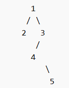

# 代码随想录算法训练营第十一天|513.找树左下角的值， **路径总和**  ，**从中序与后序遍历序列构造二叉树** 

## 513.找树左下角的值

[513.找树左下角的值 | 代码随想录](https://programmercarl.com/0513.找树左下角的值.html#算法公开课)

## 我的思路

用中右左的顺序遍历，在遍历和回溯过程中带上深度参数，找到一个左叶子结点而且深度大于等于当前result就更新result。等于是因为相当于左边还有叶子。

理解错了，最左的不一定是左叶子



正常中左右顺序遍历，最深结点第一次遇到的就是左下角

树题如果写了很多分支情况，那就是思路还是没有想明白。

## 问题总结

## 卡的思路

使用前序遍历（当然中序，后序都可以，因为本题没有 中间节点的处理逻辑，只要左优先就行），保证优先左边搜索，然后记录深度最大的叶子节点，此时就是树的最后一行最左边的值

## 我的代码

```
class Solution {
public:
    int findBottomLeftValue(TreeNode* root) {
        int result;
        int maxdepth=0;
        int curdepth=0;
        travesal(result,curdepth+1,maxdepth,root);
        return result;
        
    }
    void travesal(int &result,int curdepth,int &maxdepth,TreeNode* cur){
        if(cur==NULL)return;
        if(curdepth>maxdepth){
            maxdepth=curdepth;
            result=cur->val;
        }
        travesal(result,curdepth+1,maxdepth,cur->left);
        travesal(result,curdepth+1,maxdepth,cur->right);
    }
};
```

40min

##  **路径总和**

[112. 路径总和 | 代码随想录](https://programmercarl.com/0112.路径总和.html)

## 我的思路

递归和回溯，因为有负数，没法剪枝。

到叶子结点就返回，和等于返回true，不等返回false。

参数传结点，和，targetSum.


`sum` 记录从根到当前节点之前的路径和

到叶子节点时：

- 把当前节点值加上
- 判断是否等于 `targetSum`

如果不是叶子：

- 分情况：
  - 左右都在 → `left || right`
  - 只有一边 → 递归那一边

## 问题总结

1.NULL不是路径终点，在NULL储比较和返回是错误的

## 卡的思路

用减法做更精简

```
class Solution {
public:
    bool hasPathSum(TreeNode* root, int sum) {
        if (!root) return false;
        if (!root->left && !root->right && sum == root->val) {
            return true;
        }
        return hasPathSum(root->left, sum - root->val) || hasPathSum(root->right, sum - root->val);
    }
};
```


## 我的代码

```
class Solution {
public:
    bool hasPathSum(TreeNode* root, int targetSum) {
        int sum=0;
        if(root==NULL)return false;
        bool result=travesal(root,sum,targetSum);
        return result;
    }
    bool travesal(TreeNode*cur,int sum,int&targetSum){
        
        if(!cur->left&&!cur->right){
             if((sum+=cur->val)==targetSum)return true;
            else return false;
            
        }

        if(cur->left&&cur->right)
         return travesal(cur->left,sum+cur->val,targetSum)||travesal(cur->right,sum+cur->val,targetSum);
        else if(cur->right)
         return travesal(cur->right,sum+cur->val,targetSum);
        
         return travesal(cur->left,sum+cur->val,targetSum);
  
    }
};
```

45min

## **从中序与后序遍历序列构造二叉树** 

[106.从中序与后序遍历序列构造二叉树 | 代码随想录](https://programmercarl.com/0106.从中序与后序遍历序列构造二叉树.html)

## 我的思路

我没思路。

## 问题总结

## 卡的思路

好复杂我的脑子爆炸了，后面回来看吧

## 我的代码