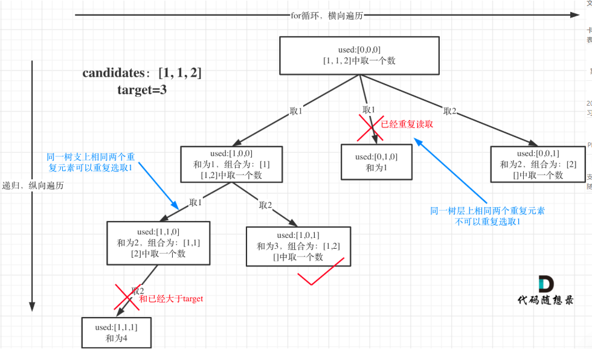
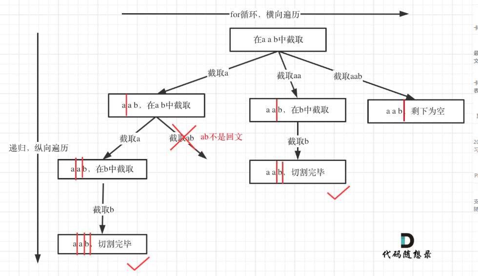

# 代码随想录算法训练营第十七天|39. 组合总和，40.组合总和II， 131.分割回文串

## 39. 组合总和

[39. 组合总和 | 代码随想录](https://programmercarl.com/0039.组合总和.html)

## 我的思路

树的深度是数字的个数（非固定），树的宽度是数组大小。

剪枝可以把candidates排序

## 问题总结

1.你现在递归是这样写的：

```
backTracking(candidates,target,sum,startIndex+1);
```

但循环变量是 **`i`**，不是 `startIndex`。

所以即使当前选的是 `candidates[i]`，下一层递归仍然可能从 **更小的位置重新开始**。

正确写法

递归应该用 **`i`**：

```
backTracking(candidates,target,sum,i);
```

2.剪枝应该写成

你现在是

```
if(sum>target)break;
```

但 `sum` 还没加当前数。

正确：

```
if(sum + candidates[i] > target) break;
```

因为数组已经排序了。

## 卡的思路

## 我的代码

```
class Solution {
public:
    vector<vector<int>> result;
    vector<int> path;
    vector<vector<int>> combinationSum(vector<int>& candidates, int target) {
        sort(candidates.begin(),candidates.end());
        backTracking(candidates,target,0,0);
        return result;
    }
    void backTracking(vector<int>& candidates,int target,int sum,int startIndex){
        if(sum==target){
            result.push_back(path);
            return;
        }
        
        for(int i=startIndex;i<candidates.size();i++){
           if(sum + candidates[i] > target) break;
            path.push_back(candidates[i]);
            sum+=candidates[i];
            backTracking(candidates,target,sum,i);
            path.pop_back();
            sum-=candidates[i];
        }
        return;
    }
};
```

10min

## 40.组合总和II

[40.组合总和II | 代码随想录](https://programmercarl.com/0040.组合总和II.html)

## 我的思路

跟上一题差不多，但是不能重复选，所以传的应该是i+1。

## 问题总结

这题的难点在于想到同层去重，因为集合中每一个数字不是只出现一遍的。

当i大于startIndex并且跟前一个数字相同，就要跳过了。

` if(i > startIndex && candidates[i] == candidates[i-1]) continue;`

## 卡的思路

回看一下题目，元素在同一个组合内是可以重复的，怎么重复都没事，但两个组合不能相同。

**所以我们要去重的是同一树层上的“使用过”，同一树枝上的都是一个组合里的元素，不用去重**。

为了理解去重我们来举一个例子，candidates = [1, 1, 2], target = 3，（方便起见candidates已经排序了）

**强调一下，树层去重的话，需要对数组排序！**



## 我的代码

```
class Solution {
public:
    vector<vector<int>>result;
    vector<int> path;
    vector<vector<int>> combinationSum2(vector<int>& candidates, int target) {
        sort(candidates.begin(),candidates.end());
        backTracking(candidates,target,0,0);
        return result;
        
    }
    void backTracking(vector<int>& candidates, int target,int startIndex,int sum){
        if(sum==target){
            result.push_back(path);
            return;
        }
        for(int i=startIndex;i<candidates.size();i++){
            if(i > startIndex && candidates[i] == candidates[i-1]) continue;
            if(sum+candidates[i]>target)break;
            path.push_back(candidates[i]);
            sum+=candidates[i];
            backTracking(candidates,target,i+1,sum);
            path.pop_back();
            sum-=candidates[i];
        }
        return;

    }
};
```


##  131.分割回文串

[131.分割回文串 | 代码随想录](https://programmercarl.com/0131.分割回文串.html)

## 我的思路

之前做过，但是现在看到还是没有思路。

## 问题总结

1.`substr` 参数写错了

写的是：

```
s.substr(startIndex,i)
```

但 `substr` 第二个参数 **不是结束位置**，而是 **长度**。

应该是 `path.push_back(s.substr(startIndex, i - startIndex + 1));`

2.终止条件写错了

写的是：

```
if(startIndex>s.size()){
    result.push_back(path);
    return;
}
```

但正确应该是：

```
if(startIndex == s.size())
```

因为：

- `startIndex == s.size()` → 说明 **字符串正好被切完**
- `startIndex > s.size()` → 正常情况下根本不会发生

3.`backTracking` 被放在了错误位置

现在代码：

```
if(ishuiwen(...)){
    path.push_back(...);
    return;
}
else continue;
backTracking(...)
```

backTracking 永远执行不到

正确结构应该是

```
for
    判断
    做选择
    递归
    撤销选择
```

## 卡的思路

本题这涉及到两个关键问题：

1. 切割问题，有不同的切割方式
2. 判断回文

所以切割问题，也可以抽象为一棵树形结构，如图：



## 我的代码

```
class Solution {
public:
    vector<vector<string>>result;
    vector<string> path;
    vector<vector<string>> partition(string s) {
        backTracking(s,0);
        return result;
    }
    void backTracking(string& s,int startIndex){
        if(startIndex==s.size()){
            result.push_back(path);
            return;
        }
        for(int i=startIndex;i<s.size();i++){
            if(ishuiwen(s,startIndex,i)){
                path.push_back(s.substr(startIndex, i - startIndex + 1));
                backTracking(s,i+1);
                path.pop_back();

            }
            else continue;
            
        }
        return;
    }
    bool ishuiwen(string&s,int start,int end){
        while(start<end){
            if(s[start++]==s[end--])continue;
            else return false;
        }
        return true;
    }
};
```

36min