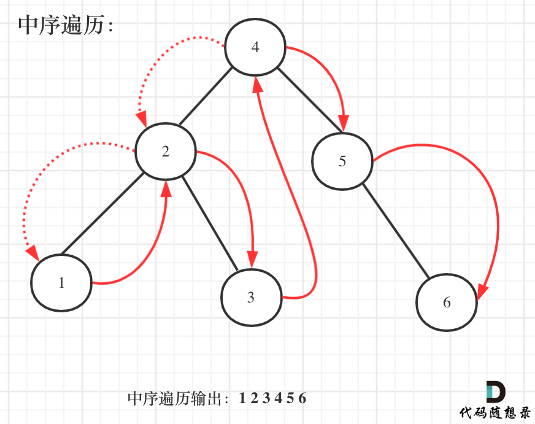
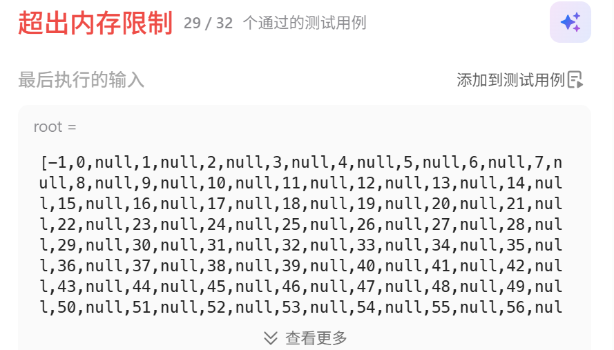
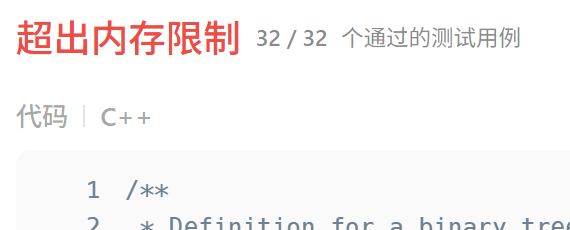
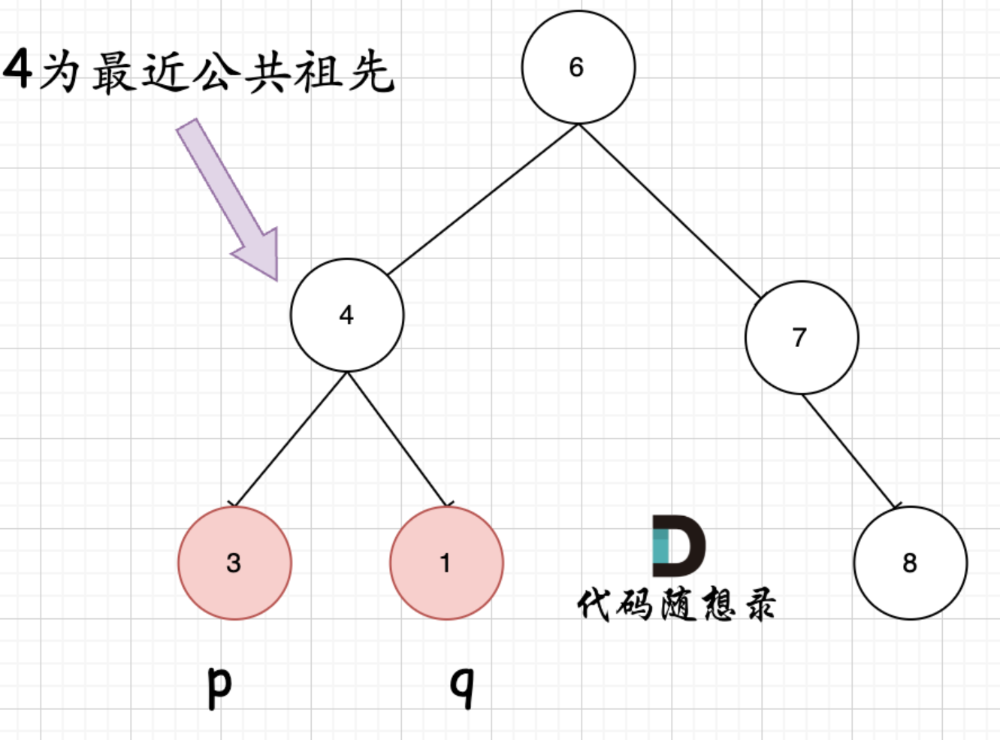
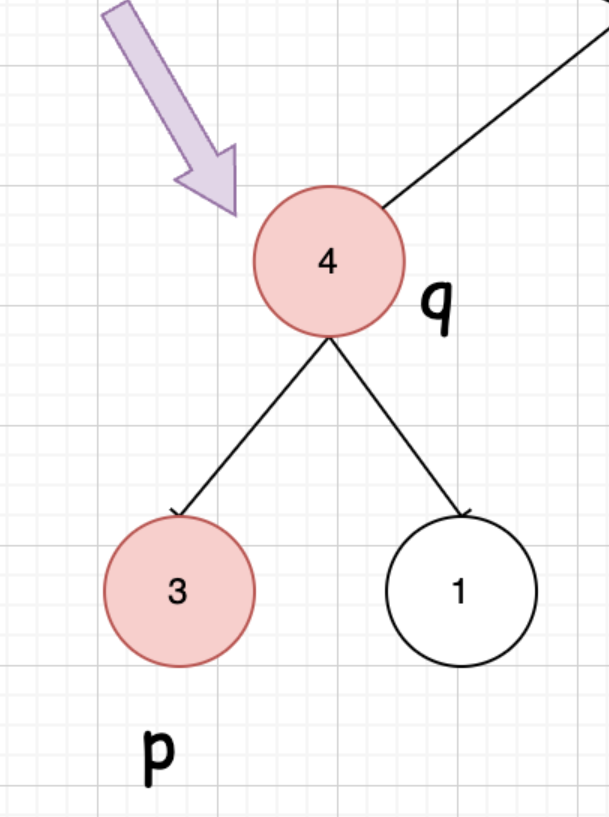

# 代码随想录算法训练营第十三天|530.二叉搜索树的最小绝对差，**501.二叉搜索树中的众数** ，**236. 二叉树的最近公共祖先** 

## 530.二叉搜索树的最小绝对差

[530.二叉搜索树的最小绝对差 | 代码随想录](https://programmercarl.com/0530.二叉搜索树的最小绝对差.html)

## 我的思路

BST 中序遍历是升序序列
 最小差值一定出现在相邻节点之间

## 问题总结

mi没有初始化，一定记得初始化。

## 卡的思路

## 我的代码

```cpp
class Solution {
public:
    TreeNode*pre=NULL;
    int mi=100000;
    int getMinimumDifference(TreeNode* root) {
        getMin(root);
        return mi;
       
    }

    void getMin(TreeNode*root){
        if(root==NULL)return;
        getMin(root->left);
        if(pre!=NULL)mi=min(root->val-pre->val,mi);
        pre=root;
        getMin(root->right);
        return;
    }
};
```


##  **501.二叉搜索树中的众数** 

[501.二叉搜索树中的众数 | 代码随想录](https://programmercarl.com/0501.二叉搜索树中的众数.html)

**当遇到更好的结果时，把结果集清空重装可以避免二次扫描。**

## 我的思路

一种方法是把所有结点遍历一遍，存map<数字,频率>，然后转vector<频率，数字>，不过这样没有用上搜索二叉树。

## 问题总结

1.清空vector

`v.clear();`

2.遍历vector

```
for (int x : v) {
    cout << x << " ";
}
```

需要修改元素

```
for (int &x : v) {
    x += 1;
}
```

3.存一对整数进vector

`vector<pair<int,int>> result;`

4.指针一开始不用一定要设NULL，不然很容易用到野指针。

5.每次值变化的时候都是结算上一段，那最后一定要记得单独结算最后一段

6.result访问前一定要判不为空

## 卡的思路



遍历有序数组的元素出现频率，从头遍历，那么一定是相邻两个元素作比较，然后就把出现频率最高的元素输出就可以了。

使用了pre指针和cur指针的技巧，这次又用上了。

弄一个指针指向前一个节点，这样每次cur（当前节点）才能和pre（前一个节点）作比较。

而且初始化的时候pre = NULL，这样当pre为NULL时候，我们就知道这是比较的第一个元素。

 频率count 等于 maxCount（最大频率），当然要把这个元素加入到结果集中（以下代码为result数组）

频率count 大于 maxCount的时候，不仅要更新maxCount，而且要清空结果集（以下代码为result数组），因为结果集之前的元素都失效了。

## 我的代码

```
class Solution {
public:
    TreeNode* pre = NULL;
    int conut = 0;
    vector<pair<int,int>> result;

    vector<int> findMode(TreeNode* root) {
        travesal(root);
        if (pre != NULL) {
            if (result.empty() || conut > result[0].first) {
                result.clear();
                result.push_back({conut, pre->val});
            }
            else if (conut == result[0].first) {
                result.push_back({conut, pre->val});
            }
        }

        vector<int> num;
        for (auto x : result) {
            num.push_back(x.second);
        }
        return num;
    }

    void travesal(TreeNode* root) {
        if (root == NULL) return;

        travesal(root->left);

        if (pre == NULL) {
            conut = 1;
        }
        else if (root->val == pre->val) {
            conut++;
        }
        else {
            if (result.empty() || conut > result[0].first) {
                result.clear();
                result.push_back({conut, pre->val});
            }
            else if (conut == result[0].first) {
                result.push_back({conut, pre->val});
            }
            conut = 1; 
        }

        pre = root;
        travesal(root->right);
    }
};
```


## **236. 二叉树的最近公共祖先** 

[236. 二叉树的最近公共祖先 - 力扣（LeetCode）](https://leetcode.cn/problems/lowest-common-ancestor-of-a-binary-tree/description/)

## 我的思路

我可以用path记录每一个结点的路径，用map来存每个结点的路径，需要哪两个结点就找他们的路径中的公共结点。



这个思路有些用例过不去，空间太大了

path值传递可以省去回溯的代码，但是每次都会复制一遍，内存占用大，改成值传递可以节省一部分的空间，但是仍然大。



看完思路我感觉我这个再加一个判断，当当前结点是我们要找的结点的时候我再存path，又可以省很多空间。这样就能通过了。


## 问题总结


## 卡的思路

后序遍历（左右中）就是天然的回溯过程，可以根据左右子树的返回值，来处理中节点的逻辑。

**首先最容易想到的一个情况：如果找到一个节点，发现左子树出现结点p，右子树出现节点q，或者 左子树出现结点q，右子树出现节点p，那么该节点就是节点p和q的最近公共祖先。**



**但是很多人容易忽略一个情况，就是节点本身p(q)，它拥有一个子孙节点q(p)。** 情况二：



## 我的代码

版本1

```
class Solution {
public:
    map<TreeNode*,vector<TreeNode*>>ma;
    TreeNode* lowestCommonAncestor(TreeNode* root, TreeNode* p, TreeNode* q) {
        
        vector<TreeNode*>path;
        travesal(root,path);
        vector<TreeNode*>path1=ma[p];
        vector<TreeNode*>path2=ma[q];
        set<TreeNode*>path3(path1.begin(),path1.end());
        for (auto it = path2.rbegin(); it != path2.rend(); ++it) {
            TreeNode* i = *it;
            if (path3.count(i)) return i;
}
        return NULL;

    }
    void travesal(TreeNode* root,vector<TreeNode*>path){
        if(root==NULL)return;
        path.push_back(root);
        ma[root]=path;
        travesal(root->left,path);
        
        travesal(root->right,path);
        return;
        

    }
};
```

版本2

```
class Solution {
public:
    map<TreeNode*, vector<TreeNode*>> ma;
    
    TreeNode* lowestCommonAncestor(TreeNode* root, TreeNode* p, TreeNode* q) {
        vector<TreeNode*> path;
        traversal(root, path);  // 注意：函数名拼写错误，应该是 traversal
        
        vector<TreeNode*> path1 = ma[p];
        vector<TreeNode*> path2 = ma[q];
        set<TreeNode*> path3(path1.begin(), path1.end());
        
        for (auto it = path2.rbegin(); it != path2.rend(); ++it) {
            TreeNode* i = *it;
            if (path3.count(i)) return i;
        }
        return NULL;
    }
    
    void traversal(TreeNode* root, vector<TreeNode*>& path) {  // 改为引用传递
        if (root == NULL) return;
        
        path.push_back(root);
        ma[root] = path;  // 这里会复制 path，这是必要的
        
        traversal(root->left, path);
        traversal(root->right, path);
        
        path.pop_back();  // 回溯，移除当前节点
        return;
    }
};
```

版本3

```
class Solution {
public:
    map<TreeNode*, vector<TreeNode*>> ma;
    TreeNode* targetP = nullptr;
    TreeNode* targetQ = nullptr;
    
    TreeNode* lowestCommonAncestor(TreeNode* root, TreeNode* p, TreeNode* q) {
        targetP = p;
        targetQ = q;
        vector<TreeNode*> path;
        traversal(root, path);
        
        vector<TreeNode*> path1 = ma[p];
        vector<TreeNode*> path2 = ma[q];
        set<TreeNode*> path3(path1.begin(), path1.end());
        
        for (auto it = path2.rbegin(); it != path2.rend(); ++it) {
            TreeNode* i = *it;
            if (path3.count(i)) return i;
        }
        return NULL;
    }
    
    void traversal(TreeNode* root, vector<TreeNode*>& path) {
        if (root == NULL) return;
        
        path.push_back(root);
        
        // 只有当当前节点是我们要找的节点时，才存储路径
        if (root == targetP || root == targetQ) {
            ma[root] = path;  // 存储当前路径的副本
        }
        
        // 如果已经找到了两个目标节点，可以提前返回（可选优化）
        if (ma.size() < 2) {
            traversal(root->left, path);
            traversal(root->right, path);
        }
        
        path.pop_back();
        return;
    }
};
```

写不动了，版本2和3代码是ai按照我的思路来修正的。