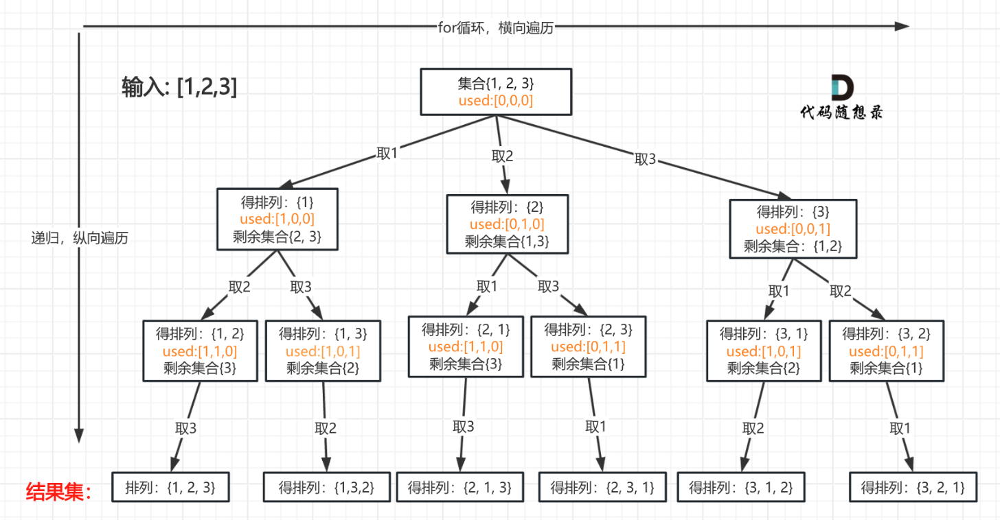

# 代码随想录算法训练营第十九天|491.递增子序列，**46.全排列**，**47.全排列 II** 

## 491.递增子序列

[491.递增子序列 | 代码随想录](https://programmercarl.com/0491.递增子序列.html)

## 我的思路

要找递增子序列，就不能sort

路径全收集，加入path的条件是大于或等于上一个数字。我想用一个int把上一个数字存一下

## 问题总结

1.没有考虑到树层去重，树层去重的方法是用一个uesd数组记录本层用过的数字

2.for循环的逻辑应该是：

跳过已用过的数字（剪枝）

跳过不为空且小于back（）的数字（剪枝）

3.加入path（这样为空就不用单独判断了）

4.path的大小大于1时加入result（放在回溯函数的最开始也可以，逻辑更清晰）

## 卡的思路

用数组来做树层去重

```cpp
  int used[201] = {0}; 
```

## 我的代码

```
class Solution {
public:
    vector<vector<int>>result;
    vector<int>path;
    vector<vector<int>> findSubsequences(vector<int>& nums) {
        backTracking(nums,0);
        return result;
        
    }
    void backTracking(vector<int>&nums,int startIndex){
        unordered_set<int>se;
        for(int i=startIndex;i<nums.size();i++){
             if(se.find(nums[i])!=se.end())continue;
             if(!path.empty()&&nums[i]<path.back())continue;
               
                path.push_back(nums[i]);
                if(path.size()>1)
                result.push_back(path);   
                se.insert(nums[i]);
                backTracking(nums,i+1);
                path.pop_back();
            }
        
        return;
    }
};
```

## 46.全排列

[46.全排列 | 代码随想录](https://programmercarl.com/0046.全排列.html)

## 我的思路

没思路。因为要全排列，回溯要记录哪些数字被用过了，然后每次都从头开始选吗。

-

卡跟我的思路差不多，确实需要每次都从头去遍历。但是用一个跟nums一样大的数组可以不用花检索是否用过的开销。

## 问题总结

1.初始化数组的方法

`  vector<bool> used(nums.size(), false);`

## 卡的思路



## 我的代码

```
class Solution {
public:
    vector<vector<int>>result;
    vector<int>path;
    vector<vector<int>> permute(vector<int>& nums) {
        vector<bool>used(nums.size(),false);
        Backtracking(nums,used);
        return result;
        
    }
    void Backtracking(vector<int>&nums,vector<bool>&used){
        if(path.size()==nums.size()){
            result.push_back(path);
            return;
        }
        for(int i=0;i<used.size();i++){
            if(used[i]==1)continue;
            path.push_back(nums[i]);
            used[i]=1;
            Backtracking(nums,used);
            used[i]=0;
            path.pop_back();
        }
        return;

    }
};
```


## **47.全排列 II** 

[47.全排列 II | 代码随想录](https://programmercarl.com/0047.全排列II.html)

## 我的思路

先排列，要做树层去重

## 问题总结

## 卡的思路

```cpp
如果同一树层nums[i - 1]使用过则直接跳过
```

## 卡的代码

```
class Solution {
private:
    vector<vector<int>> result;
    vector<int> path;
    void backtracking (vector<int>& nums, vector<bool>& used) {
        // 此时说明找到了一组
        if (path.size() == nums.size()) {
            result.push_back(path);
            return;
        }
        for (int i = 0; i < nums.size(); i++) {
            // used[i - 1] == true，说明同一树枝nums[i - 1]使用过
            // used[i - 1] == false，说明同一树层nums[i - 1]使用过
            // 如果同一树层nums[i - 1]使用过则直接跳过
            if (i > 0 && nums[i] == nums[i - 1] && used[i - 1] == false) {
                continue;
            }
            if (used[i] == false) {
                used[i] = true;
                path.push_back(nums[i]);
                backtracking(nums, used);
                path.pop_back();
                used[i] = false;
            }
        }
    }
public:
    vector<vector<int>> permuteUnique(vector<int>& nums) {
        result.clear();
        path.clear();
        sort(nums.begin(), nums.end()); // 排序
        vector<bool> used(nums.size(), false);
        backtracking(nums, used);
        return result;
    }
};

```

## 时长   

1h5min