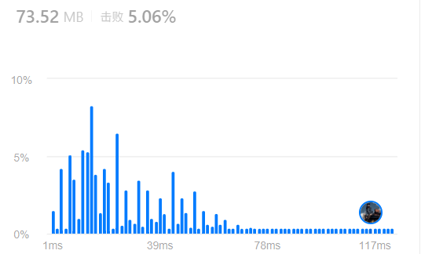
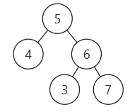

# 代码随想录算法训练营第十二天|654.最大二叉树，**617.合并二叉树** ， **700.二叉搜索树中的搜索** ，**98.验证二叉搜索树**

## 654.最大二叉树

[654.最大二叉树 | 代码随想录](https://programmercarl.com/0654.最大二叉树.html)

## 我的思路

这道题采用递归构建二叉树。首先在当前数组中找到最大值及其下标，把最大值作为当前子树的根节点；然后根据最大值的位置，将原数组分成左侧子数组和右侧子数组；接着分别在左右子数组中重复同样的操作——再次找到最大值作为子节点，并递归构建其左右子树；当某一侧子数组为空时递归终止。

我这个写法竞争这题史上最低效写法很有竞争力



## 问题总结

1.复制截断vector这样写

`vector<int> numsright(nums.begin() + pos + 1, nums.end());`

不能直接写pos，不支持int

左开右闭

2.结点的定义方式

`TreeNode* root = new TreeNode();`

3.需要优化的点

①现在每一层都在做：

```cpp
vector<int> numsleft(...)
vector<int> numsright(...)
```

这会：

- 分配新内存
- 拷贝元素
- 递归层层复制

优化方式

不要切数组，改成传区间：

```
build(nums, left, right)
```

**注意类似用数组构造二叉树的题目，每次分隔尽量不要定义新的数组，而是通过下标索引直接在原数组上操作，这样可以节约时间和空间上的开销。**

②getMax 每次都线性扫描，可以用 **单调栈** 一次遍历建树。

③temp 其实可以不要，直接传pos

## 卡的思路

类似

## 我的代码

```
class Solution {
public:
    TreeNode* constructMaximumBinaryTree(vector<int>& nums) {
        TreeNode* root = new TreeNode();
        auto temp=getMax(nums);
        root->val = temp[0];
        
        makeTree(root,nums,temp);
        return root;

        
    }
    //temp第一位是最大值，第二位是最大值位置
    void makeTree(TreeNode*root,vector<int>& nums,vector<int>temp){
        int pos=temp[1];
        if(pos!=0){
           vector<int> numsleft(nums.begin(), nums.begin() + pos);
            vector<int>temp=getMax(numsleft);

            TreeNode* leftroot = new TreeNode();
            leftroot->val = temp[0];
            root->left=leftroot;
            makeTree(leftroot,numsleft,temp);
        }
        if(pos!=nums.size()-1){
           vector<int> numsright(nums.begin() + pos + 1, nums.end());
            vector<int>temp=getMax(numsright);

             TreeNode* rightroot = new TreeNode();
            rightroot->val = temp[0];
             root->right=rightroot;
            makeTree(rightroot,numsright,temp);
        }
        return;

    }
    vector<int> getMax(vector<int>&nums){
        int max=-1;
        int pos=-1;
        for(int i=0;i<nums.size();i++){
               if(nums[i]>max){
                max=nums[i];
               pos=i;
               }

        }
        return {max,pos};

    }
};
```

60min

##  **617.合并二叉树**

[617.合并二叉树 | 代码随想录](https://programmercarl.com/0617.合并二叉树.html)

## 我的思路

首先判断根节点是否为空，如果其中一棵为空，则直接返回另一棵树；如果两棵树的根节点都存在，则创建一个新节点，其值为两个根节点值之和。随后递归处理左右子树：当两个对应子节点都存在时，创建新节点并将值相加继续递归；当其中一棵子树为空时，直接将另一棵子树接到当前节点上。整个过程是对两棵树进行同步递归合并。

## 问题总结

一遍过

## 卡的思路

差不多

## 我的代码

```
class Solution {
public:
void makeTree(TreeNode*root,TreeNode*root1,TreeNode*root2){
        if(!root1&&!root2)return;
        if(root1->left&&root2->left){
            root->left=new TreeNode();
            root->left->val=root1->left->val+root2->left->val;
            makeTree(root->left,root1->left,root2->left);
        }
        else{
            root->left=(root1->left==NULL?root2->left:root1->left);
        }

        if(root1->right&&root2->right){
            root->right=new TreeNode();
            root->right->val=root1->right->val+root2->right->val;
            makeTree(root->right,root1->right,root2->right);
        }
        else{
            root->right=(root1->right==NULL?root2->right:root1->right);
        }
        return;

    }
    TreeNode* mergeTrees(TreeNode* root1, TreeNode* root2) {
        TreeNode* root=new TreeNode();
        if(root1==NULL||root2==NULL)return root1==NULL?root2:root1;
        root->val=root1->val+root2->val;
        makeTree(root,root1,root2);
        return root;
        
    }
    
};
```

20min

## 700.二叉搜索树中的搜索

[700.二叉搜索树中的搜索 | 代码随想录](https://programmercarl.com/0700.二叉搜索树中的搜索.html)

## 我的思路

这个简单，很容易就过了

## 问题总结

一遍过

## 卡的思路

相同

## 我的代码

```
class Solution {
public:
    TreeNode* searchBST(TreeNode* root, int val) {
        TreeNode* result=new  TreeNode();
        if(root==NULL)return NULL;
        if(val==root->val)return root;
        if(val>root->val)result=searchBST(root->right,val);
        if(val<root->val)result=searchBST(root->left,val);
        return result;
        
    }
};
```

10min

## 98.验证二叉搜索树

[98.验证二叉搜索树 | 代码随想录](https://programmercarl.com/0098.验证二叉搜索树.html)

## 我的思路

本来我想比较左右孩子跟cur的大小，遇到NULL或者错误就返回，但是下面这种情况会有问题。



没有考虑到。

## 问题总结

**我们要比较的是 左子树所有节点小于中间节点，右子树所有节点大于中间节点**。

这题感觉在原树上的递归法还不是很通透，但是转化数组的理解了。

## 卡的思路

要知道中序遍历下，输出的二叉搜索树节点的数值是有序序列。

有了这个特性，**验证二叉搜索树，就相当于变成了判断一个序列是不是递增的了。**

### [#](https://programmercarl.com/0098.验证二叉搜索树.html#递归法)递归法

可以递归中序遍历将二叉搜索树转变成一个数组，代码如下：

```cpp
vector<int> vec;
void traversal(TreeNode* root) {
    if (root == NULL) return;
    traversal(root->left);
    vec.push_back(root->val); // 将二叉搜索树转换为有序数组
    traversal(root->right);
}
```

然后只要比较一下，这个数组是否是有序的，**注意二叉搜索树中不能有重复元素**。

以上代码中，我们把二叉树转变为数组来判断，是最直观的，但其实不用转变成数组，可以在递归遍历的过程中直接判断是否有序。

样例中最小节点 可能是int的最小值，如果这样使用最小的int来比较也是不行的。

此时可以初始化比较元素为longlong的最小值。

## 卡的代码

```
class Solution {
public:
    TreeNode* pre = NULL; // 用来记录前一个节点
    bool isValidBST(TreeNode* root) {
        if (root == NULL) return true;
        bool left = isValidBST(root->left);

        if (pre != NULL && pre->val >= root->val) return false;
        pre = root; // 记录前一个节点

        bool right = isValidBST(root->right);
        return left && right;
    }
};
```


## 时长   