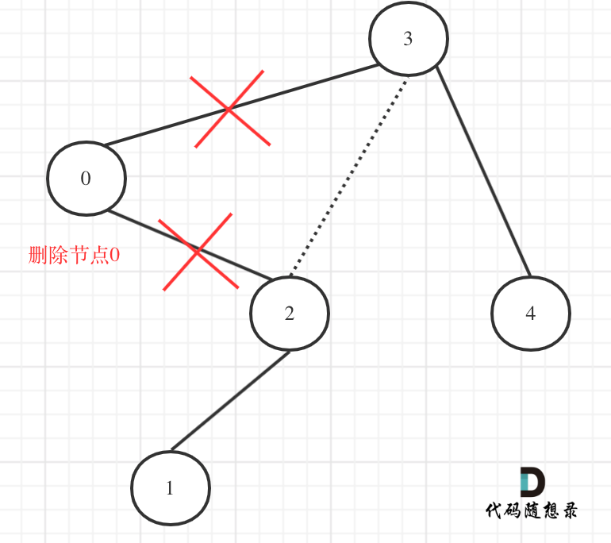
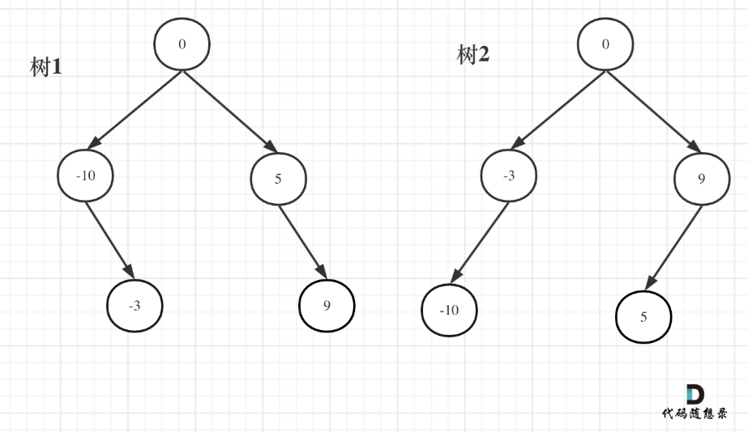
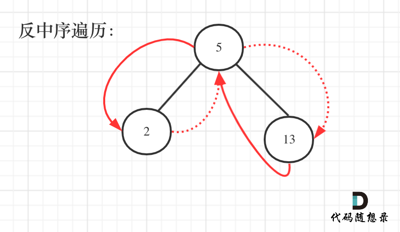

# 代码随想录算法训练营第十五天|**669. 修剪二叉搜索树** ，**108.将有序数组转换为二叉搜索树**，538.把二叉搜索树转换为累加树，总结

## **669. 修剪二叉搜索树** 

[669. 修剪二叉搜索树 | 代码随想录](https://programmercarl.com/0669.修剪二叉搜索树.html)

## 我的思路

一开始的想法就是跟昨天一样的删除二叉树结点的题目。为什么不用分五种情况了呢。

## 问题总结

确实不好理解结点是怎么移除的。

我的总结：

**如果这个结点是不合法的，大于就在它左子树里找一个符合要求的结点return回去来替代，小于则反之。**

**如果这个结点是合法的，就方便调用函数在左右子树里找合法结点接在他的左右孩子上。**

## 卡的思路

节点0并不符合区间要求，那么将节点0的右孩子 节点2 直接赋给 节点3的左孩子就可以了（就是把节点0从二叉树中移除），如图：



## 我的代码

```
class Solution {
public:
    TreeNode* trimBST(TreeNode* root, int low, int high) {
        if(root==NULL)return  NULL;
        if(root->val>high)return trimBST(root->left,low,high);
        if(root->val<low)return trimBST(root->right,low,high);
        root->left=trimBST(root->left,low,high);
        root->right=trimBST(root->right,low,high);
        return root;
        
    }
};
```


## **108.将有序数组转换为二叉搜索树**

[108.将有序数组转换为二叉搜索树 | 代码随想录](https://programmercarl.com/0108.将有序数组转换为二叉搜索树.html)

## 我的思路

这个真简单吗，如果按照数组的顺序建树，树的形状是固定的，如果失衡就要左右旋，我忘了怎么旋了。。

## 问题总结

结果跑不对的时候先检查一下代码是不是按照自己的逻辑写的，有没有手滑写错变量。

## 卡的思路

一个高度平衡二叉树是指一个二叉树每个节点 的左右两个子树的高度差的绝对值不超过 1。

如果根据数组构造一棵二叉树。

**本质就是寻找分割点，分割点作为当前节点，然后递归左区间和右区间**。

本题其实要比[二叉树：构造二叉树登场！ (opens new window)](https://programmercarl.com/0106.从中序与后序遍历序列构造二叉树.html)和 [二叉树：构造一棵最大的二叉树 (opens new window)](https://programmercarl.com/0654.最大二叉树.html)简单一些，因为有序数组构造二叉搜索树，寻找分割点就比较容易了。

分割点就是数组中间位置的节点。

如果要分割的数组长度为偶数的时候，中间元素为两个，是取左边元素 就是树1，取右边元素就是树2。

这也是题目中强调答案不是唯一的原因。 

### 

## 我的代码

```
class Solution {
public:
    TreeNode* sortedArrayToBST(vector<int>& nums) {
        if(nums.size()==0)return NULL;
        int n=nums.size();
        TreeNode* root=new TreeNode(nums[n/2]);
        root->left=makeTree(0,n/2-1,nums);
        root->right=makeTree(n/2+1,n-1,nums);
        return root;
        
    }
    TreeNode*makeTree(int left,int right,vector<int> &nums){
        if(left>right)return  NULL;
        TreeNode* node=new TreeNode(nums[(left+right)/2]);
        node->left=makeTree(left,(left+right)/2-1,nums);
        node->right=makeTree((left+right)/2+1,right,nums);
        return node;
    }
};
```


##  **538.把二叉搜索树转换为累加树**  

[538.把二叉搜索树转换为累加树 | 代码随想录](https://programmercarl.com/0538.把二叉搜索树转换为累加树.html)

**以后遇到二叉搜索树把它当成一个有序数组去思考。**

## 我的思路

对于每一个右孩子来说，就是她所有右子树相加 对于每一个左孩子，就是他的所有右子树，加上父节点 右中左的遍历方式

但是如果这样从下往上遍历的话下面会被先覆盖。

我的思路是对的，但是没有想的很透彻所以自己否决了。没能高度总结规律。

**以后遇到二叉搜索树把它当成一个有序数组去思考。**

## 问题总结

依旧是改了两个手滑的错误后通过。

## 卡的思路

二叉搜索树啊，这是有序的啊。那么有序的元素如何求累加呢？

**其实这就是一棵树，大家可能看起来有点别扭，换一个角度来看，这就是一个有序数组[2, 5, 13]，求从后到前的累加数组，也就是[20, 18, 13]，是不是感觉这就简单了。**

为什么变成数组就是感觉简单了呢？

因为数组大家都知道怎么遍历啊，从后向前，挨个累加就完事了，这换成了二叉搜索树，看起来就别扭了一些是不是。

那么知道如何遍历这个二叉树，也就迎刃而解了，**从树中可以看出累加的顺序是右中左，所以我们需要反中序遍历这个二叉树，然后顺序累加就可以了**。



## 我的代码

```
class Solution {
public:
    TreeNode*pre=NULL;
    TreeNode* convertBST(TreeNode* root) {
        makeTree(root);
        return root;

    }
    void makeTree(TreeNode*root){
        if(root==NULL)return;
        makeTree(root->right);
        if(pre!=NULL)root->val=root->val+pre->val;
        pre=root;
        makeTree(root->left);
    }
};
```


## 总结

[二叉树：总结篇！（需要掌握的二叉树技能都在这里了） | 代码随想录](https://programmercarl.com/二叉树总结篇.html#阶段总结)

## 卡的思路

- 涉及到二叉树的构造，无论普通二叉树还是二叉搜索树一定前序，都是先构造中节点。
- 求普通二叉树的属性，一般是后序，一般要通过递归函数的返回值做计算。
- 求二叉搜索树的属性，一定是中序了，要不白瞎了有序性了。

## 时长   

1h