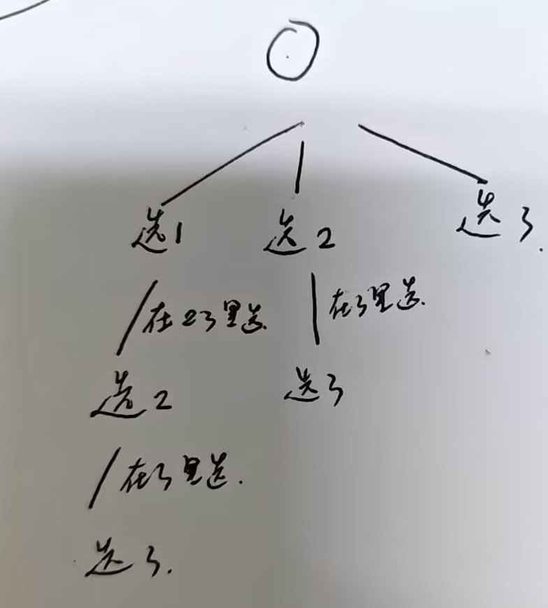

# 代码随想录算法训练营第十八天|**93.复原IP地址**， **78.子集**，**90.子集II** 

## 93.复原IP地址

[93.复原IP地址 | 代码随想录](https://programmercarl.com/0093.复原IP地址.html)

## 我的思路

一个函数判断有效，在回溯中切分字符串。

## 问题总结

1.字符串按 **位置删除**

```
string s = "abcdef";
s.erase(2, 2);   // 从下标2开始删2个字符
```

2.循环：

```
for(int i=startIndex;i<startIndex+3;i++)
```

但没有限制 `i < s.size()`。

注意对字符串的循环一定不要越界

3.`isVaild` 里面算数字是错的

我写的是：

```
sum=sum*10+i;
```

这里加的是 **下标 i**，不是字符。

应该写：

```
sum = sum * 10 + (s[i] - '0');
```

区分开下标和内容，注意int和char的转换

4.撤销一段字符的方法

```
int len = path.size();

path += s.substr(startIndex,i-startIndex+1);
path += '.';

backTracking(s,i+1);

path.resize(len);
```

`resize` 是回溯神器 👍

5.结束条件也错了

你写：

```
if(path.size()==4 && startIndex==s.size())
```

但 `path.size()` 是字符数量，不是段数。

正确逻辑是：

```
已经放了 4 段
且字符串用完
```

一般写法是 **统计点号** 或 **传段数**。

## 卡的思路

无

## 我的代码

```
class Solution {
public:
    vector<string> result;
    string path;
    int pointNumber=0;
    vector<string> restoreIpAddresses(string s) {
        backTracking(s,0);
        return result;
        
    }
    //左闭右闭
    bool isVaild(string& s,int start,int end){
        if(s[start]=='0'){
            if(start==end)return true;
            else return false;
        }
        int sum=0;
        for(int i=start;i<=end;i++){
            sum=sum*10+(s[i]-'0');
        }
        if(sum>0&&sum<256)return true;
        else return false;

    }
    void backTracking(string &s,int startIndex){
        if(pointNumber==4&&startIndex==s.size()){
            path.pop_back();
            result.push_back(path);
            return;
        }
        for(int i=startIndex;i<s.size()&&i<startIndex+3;i++){
            if(isVaild(s,startIndex,i)){
                int len=path.size();
                pointNumber++;
                path+=s.substr(startIndex,i-startIndex+1);
                path+='.';
                backTracking(s,i+1);
                path.resize(len);
                pointNumber--;
            }
        }
        return;
    }
};
```

33min

##  **78.子集**

[78.子集 | 代码随想录](https://programmercarl.com/0078.子集.html)

## 我的思路

先对数组排序，然后回溯，纵向的是……有点说不清楚，看图吧。需要收集所有路上的情况。空集单独加入。



其实不排序也行了，没有重复元素。

## 问题总结

您猜怎么着，一遍过。

## 卡的思路

## 我的代码

```
class Solution {
public:
    vector<vector<int>> result;
    vector<int> path;
    
    vector<vector<int>> subsets(vector<int>& nums) {
        result.push_back(path);
        backTracking(nums,0);
        return result;
   
    }
    void backTracking(vector<int>& nums,int startIndex){
        for(int i=startIndex;i<nums.size();i++){
            path.push_back(nums[i]);
            result.push_back(path);
            backTracking(nums,i+1);
            path.pop_back();
        }
        return;
    }
};
```


## **90.子集II** 

[90.子集II | 代码随想录](https://programmercarl.com/0090.子集II.html)

## 我的思路

这题有重复元素，要先排序，然后要树层去重。也是路径全收集的。

## 问题总结

for循环内掌握的是本层，对本层去重的话`i!=startIndex&&nums[i]==nums[i-1]`，如果写

`i！=0`会让重复的数无法出现在一条路径上。去重必须以当前层为起点。

## 卡的思路

## 我的代码

```
class Solution {
public:
    vector<vector<int>>result;
    vector<int> path;
    vector<vector<int>> subsetsWithDup(vector<int>& nums) {
        sort(nums.begin(),nums.end());
        result.push_back(path);
        backTracking(nums,0);
        return result;
        
    }
    void backTracking(vector<int>&nums,int startIndex){
        for(int i=startIndex;i<nums.size();i++){
            if(i!=startIndex&&nums[i]==nums[i-1])continue;
            path.push_back(nums[i]);
            result.push_back(path);
            backTracking(nums,i+1);
            path.pop_back();
        }
        return;
    }
};
```

一共1h