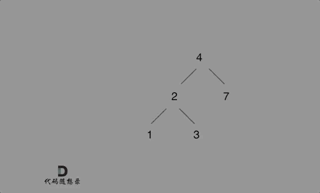
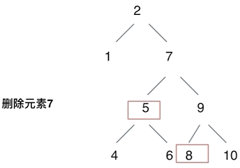

# 代码随想录算法训练营第十四天| **235. 二叉搜索树的最近公共祖先** ，**701.二叉搜索树中的插入操作**  ，**450.删除二叉搜索树中的节点**  

##  **235. 二叉搜索树的最近公共祖先** 

[235. 二叉搜索树的最近公共祖先 | 代码随想录](https://programmercarl.com/0235.二叉搜索树的最近公共祖先.html)

## 我的思路

我画图分析下来发现应该是找到第一个大于小数小于大数的结点就行

我想直接用回溯一个一个找，但是应该可以根据二叉树的特征分左右下。这种理不出应该分哪些情况。

我咋就没想到这么简单的思路呢，对于搜索树的特征还没有理解那么透彻。

## 问题总结

## 卡的思路

利用 BST 的性质可以写得更清晰：

逻辑是：

```
如果 root 比 p 和 q 都大 -> 去左子树
如果 root 比 p 和 q 都小 -> 去右子树
否则 root 就是 LCA
```

## 我的代码

思路一：中序遍历二叉树，找到大小在两数中间或者等于其中一数的结点

```
class Solution {
public:
    TreeNode* lowestCommonAncestor(TreeNode* root, TreeNode* p, TreeNode* q) {
        if(root==NULL)return NULL;
        TreeNode* left= lowestCommonAncestor(root->left,p,q);
        if((root->val>p->val&&root->val<q->val)||(root->val<p->val&&root->val>q->val)||root->val==p->val||root->val==q->val)
        return root;
        TreeNode* right=lowestCommonAncestor(root->right,p,q);
        return right==NULL?left:right;

    }
};
```

思路二（卡的思路）

```
class Solution {
public:
    TreeNode* lowestCommonAncestor(TreeNode* root, TreeNode* p, TreeNode* q) {
        if(root==NULL)return NULL;
       if(root->val>p->val&&root->val>q->val)return lowestCommonAncestor(root->left,p,q);
        if(root->val<p->val&&root->val<q->val)return lowestCommonAncestor(root->right,p,q);
        else return root;
    }
};
```


## **701.二叉搜索树中的插入操作**  

[701.二叉搜索树中的插入操作 | 代码随想录](https://programmercarl.com/0701.二叉搜索树中的插入操作.html)

## 我的思路

我理不清楚，我不知道怎么判断接哪

昨天看过卡的思路了，今天试写一下，一直下到NULL，直接都插到叶子上。

## 问题总结

这个就不用pre存前一个结点了，因为回溯已经帮你存了，直接返回root，结到上一个结点的left、right上就可以

## 卡的思路

**可以不考虑题目中提示所说的改变树的结构的插入方式。**

如下演示视频中可以看出：只要按照二叉搜索树的规则去遍历，遇到空节点就插入节点就可以了。



例如插入元素10 ，需要找到末尾节点插入便可，一样的道理来插入元素15，插入元素0，插入元素6，**需要调整二叉树的结构么？ 并不需要。**。

只要遍历二叉搜索树，找到空节点 插入元素就可以了，那么这道题其实就简单了。

接下来就是遍历二叉搜索树的过程了。

## 我的代码

```
class Solution {
public:
    TreeNode* pre=NULL;
    TreeNode* insertIntoBST(TreeNode* root, int val) {
        if(root==NULL){
           return new TreeNode(val);
        }
        if(root->val>val)root->left= insertIntoBST(root->left,val);
        if(root->val<val)root->right= insertIntoBST(root->right,val);
        return root;
    }
};
```


## **450.删除二叉搜索树中的节点**  

[450.删除二叉搜索树中的节点 | 代码随想录](https://programmercarl.com/0450.删除二叉搜索树中的节点.html)

## 我的思路

好像要左旋右旋之类的。。

昨天看过思路了，大致回忆一下。

没找到结点，直接返回

这个结点左右孩子都为空，直接返回NULL

这个结点左孩子有，右孩子没有，返回左孩子

这个结点右孩子有，左孩子没有，返回右孩子

这个结点左右孩子都有，

## 问题总结

## 卡的思路



## 我的代码

```
class Solution {
public:
    TreeNode* deleteNode(TreeNode* root, int key) {
        //1
        if(root==NULL)return NULL;
        if(root->val==key)
        {//2
        if(root->left==NULL&&root->right==NULL)return NULL;
        //3
        if(root->left==NULL&&root->right){
            return root->right;
        }
        //4
        if(root->left&&root->right==NULL){
            return root->left;
        }
        //5
        if(root->left&&root->right){
            TreeNode* leftMAX=root->right;
            while(leftMAX->left!=NULL){
                leftMAX=leftMAX->left;
            }
            leftMAX->left= root->left;
            return root->right;
        }}
      if (root->val > key) root->left = deleteNode(root->left, key);
        if (root->val < key) root->right = deleteNode(root->right, key);
        return root;  
    } 
};
```


费老鼻子劲了。。

## 时长   

1.5h