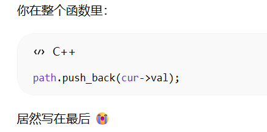
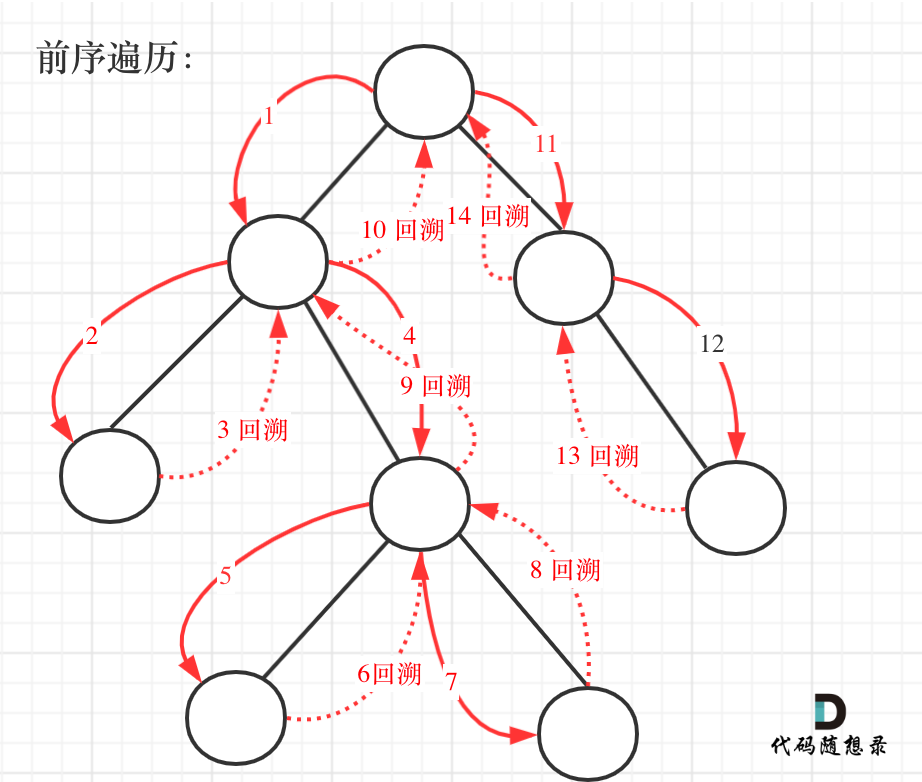
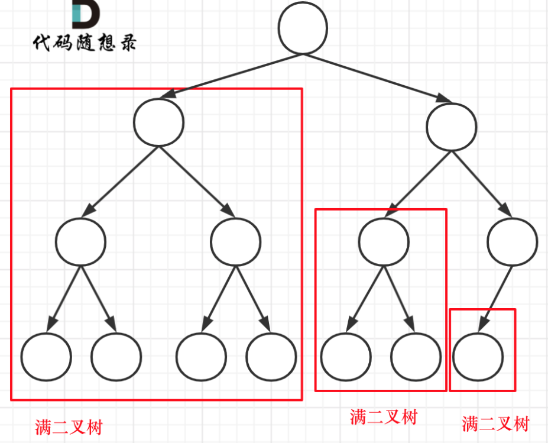
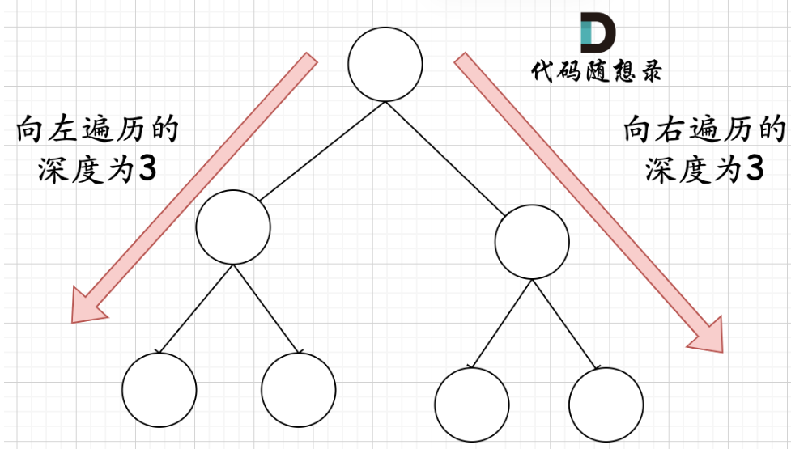

# 代码随想录算法训练营第十天|**110.平衡二叉树**， **257. 二叉树的所有路径**， **404.左叶子之和**， **222.完全二叉树的节点个数**

## 110.平衡二叉树

[110.平衡二叉树 | 代码随想录](https://programmercarl.com/0110.平衡二叉树.html)

## 我的思路

如果左右都为空则返回1 

如果一个子树为空，就返回不为空的那个字数加一。

 如果左右都不为空，就先算左右相减，是不是大于一大于直接返回false，如果如果小于一应该返回大的那个加一

有问题，这种方法没有办法提前终止

但是只返回bool类型又没办法知道两个子树高度差。

## 问题总结

1.出现了巨量的手滑写错变量

2.返回大的值用max（）就行了，高度记得+1

## 卡的思路

要求比较高度，必然是要后序遍历。因为cur要最后比较两子树高度

1.参数：当前传入节点。 返回值：以当前传入节点为根节点的树的高度。

如果已经不是二叉平衡树了，可以返回-1 来标记已经不符合平衡树的规则了。

2.明确终止条件

递归的过程中依然是遇到空节点了为终止，返回0，表示当前节点为根节点的树高度为0

## 我的代码

```
class Solution {
public:
    bool isBalanced(TreeNode* root) {
        int result=balance(root);
        if(result==-1)return false;
        else return true;

      
        
    }
    int balance(TreeNode* cur){
        if(cur==NULL)return 0;
        else if(cur->left==NULL&&cur->right==NULL)return 1;
        int left,right;
        left=balance(cur->left);
        right=balance(cur->right);
        if(left==-1||right==-1)return -1;

        int height=abs(left-right);
        if(height>1)return -1;
        return max(left,right)+1;
    }
   
};
```

##  **257. 二叉树的所有路径**

[257. 二叉树的所有路径 | 代码随想录](https://programmercarl.com/0257.二叉树的所有路径.html)

## 我的思路

每个叶子结点对应一条路径，应该是回溯的时候写路径，但是怎么把路径区分开来呢，感觉到上面路径会越写越少。。

因为不是在回溯的时候写，是第一遍向下遍历的时候就记录路径了。

## 问题总结

当前元素的访问一定要放在函数最前面，你把它放在回溯后面那path一直都是空的。




对了今天gpt被我无语哭了。。

## 卡的思路

这道题目要求从根节点到叶子的路径，所以需要前序遍历，这样才方便让父节点指向孩子节点，找到对应的路径。

在这道题目中将第一次涉及到回溯，因为我们要把路径记录下来，需要回溯来回退一个路径再进入另一个路径。



本题要找到叶子节点，就开始结束的处理逻辑了

精简代码隐藏了回溯逻辑

```
class Solution {
private:

    void traversal(TreeNode* cur, string path, vector<string>& result) {
        path += to_string(cur->val); // 中
        if (cur->left == NULL && cur->right == NULL) {
            result.push_back(path);
            return;
        }
        if (cur->left) traversal(cur->left, path + "->", result); // 左
        if (cur->right) traversal(cur->right, path + "->", result); // 右
    }

public:
    vector<string> binaryTreePaths(TreeNode* root) {
        vector<string> result;
        string path;
        if (root == NULL) return result;
        traversal(root, path, result);
        return result;

    }
};
```

注意在函数定义的时候`void traversal(TreeNode* cur, string path, vector<string>& result)` ，定义的是`string path`，每次都是复制赋值，不用使用引用，否则就无法做到回溯的效果。（这里涉及到C++语法知识）

那么在如上代码中，**貌似没有看到回溯的逻辑，其实不然，回溯就隐藏在`traversal(cur->left, path + "->", result);`中的 `path + "->"`。** 每次函数调用完，path依然是没有加上"->" 的，这就是回溯了。

## 我的代码

```
class Solution {
public:
    vector<string> binaryTreePaths(TreeNode* root) {
        vector<string> result;
        vector<int>path;
        if(root==NULL)return result;

        findPath(root,path,result);
        return result;
        
    }
    void findPath(TreeNode*cur,vector<int>&path,vector<string>&result){
        path.push_back(cur->val);
        if(cur->left==NULL&&cur->right==NULL) {
            string s;
            for(int i=0;i<path.size()-1;i++){
                s+=to_string(path[i]);
                s+="->";
            }
            s+=to_string(path[path.size()-1]);
            result.push_back(s);
            return;
        }

        if(cur->left){
            findPath(cur->left,path,result);
            path.pop_back();
        }
        if(cur->right){
            findPath(cur->right,path,result);
            path.pop_back();
        }
        
    }
};
```

## 404.左叶子之和

[404.左叶子之和 | 代码随想录](https://programmercarl.com/0404.左叶子之和.html)

## 我的思路

不知道有没有坑，就是递归遍历，如果有左孩子，把左孩子的值加入和

不对不对，是左叶子不是左孩子

怎么写分类逻辑，绕晕了

## 问题总结

分类是这样分的：

当前结点为空

当前结点是叶子（不能在这判左叶子，因为是不是左叶子，不是由它自己决定）

当前结点有左孩子1.左孩子是叶子`leftVal = cur->left->val;`2.左孩子是树，递归进去`leftVal = traversal(cur->left);`

当前结点有右孩子 直接递归进去，因为不可能是左叶子


## 卡的思路

**判断当前节点是不是左叶子是无法判断的，必须要通过节点的父节点来判断其左孩子是不是左叶子。**

1. 确定递归函数的参数和返回值

判断一个树的左叶子节点之和，那么一定要传入树的根节点，递归函数的返回值为数值之和，所以为int

使用题目中给出的函数就可以了。

1. 确定终止条件

如果遍历到空节点，那么左叶子值一定是0

```cpp
if (root == NULL) return 0;
```

注意，只有当前遍历的节点是父节点，才能判断其子节点是不是左叶子。 所以如果当前遍历的节点是叶子节点，那其左叶子也必定是0，那么终止条件为：

```cpp
if (root == NULL) return 0;
if (root->left == NULL && root->right== NULL) return 0; //其实这个也可以不写，如果不写不影响结果，但就会让递归多进行了一层。
```

1. 确定单层递归的逻辑

当遇到左叶子节点的时候，记录数值，然后通过递归求取左子树左叶子之和，和 右子树左叶子之和，相加便是整个树的左叶子之和。

代码如下：

```cpp
int leftValue = sumOfLeftLeaves(root->left);    // 左
if (root->left && !root->left->left && !root->left->right) {
    leftValue = root->left->val;
}
int rightValue = sumOfLeftLeaves(root->right);  // 右

int sum = leftValue + rightValue;               // 中
return sum;
```

## 我的代码

```
class Solution {
public:
    int sumOfLeftLeaves(TreeNode* root) {
        return traversal(root); 
    }
    int traversal(TreeNode*cur){
        if(cur==NULL)return 0;
        if(!cur->left&&!cur->right)return 0;
        int leftVal=traversal(cur->left);
        if(cur->left&&cur->left->left==NULL&&cur->left->right==NULL)
        leftVal=cur->left->val;
        int rightVal=traversal(cur->right);
        return leftVal+rightVal;
    }
};
```

###  **222.完全二叉树的节点个数**

[222.完全二叉树的节点个数 | 代码随想录](https://programmercarl.com/0222.完全二叉树的节点个数.html)

## 我的思路

只想到遍历，没有用上完全二叉树 

卡是按照深度来写的 

我能不能直接用all，遍历到一个结点就加一

## 问题总结

2的n次方是2<<n，别指反了。2左移n位

## 卡的思路

对于情况一，可以直接用 2^树深度 - 1 来计算，注意这里根节点深度为1。

对于情况二，分别递归左孩子，和右孩子，递归到某一深度一定会有左孩子或者右孩子为满二叉树，然后依然可以按照情况1来计算。



在完全二叉树中，如果递归向左遍历的深度等于递归向右遍历的深度，那说明就是满二叉树



## 我的代码

```
class Solution {
public:
    int countNodes(TreeNode* root) {
        if(root==NULL)return 0;
        int leftDepth=0,rightDepth=0;
        TreeNode* left=root->left;
         TreeNode* right=root->right;
        while(left){
            leftDepth++;
            left=left->left;
        }
        while(right){
            rightDepth++;
            right=right->right;
        }
        if(leftDepth==rightDepth)return (2<<leftDepth)-1;
        return countNodes(root->left)+countNodes(root->right)+1;
        
    }
};
```

