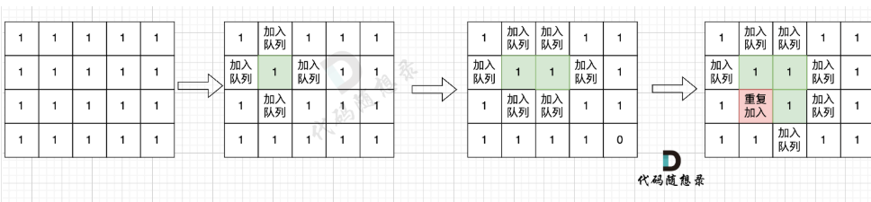

# 代码随想录算法训练营第四十一天|99.岛屿数量 **深搜** ，**岛屿数量** **广搜**，100.岛屿的最大面积

## 99.岛屿数量 **深搜**

[99. 岛屿数量 | 深度优先搜索 | 矩阵遍历 | 连通分量 | 代码随想录](https://www.programmercarl.com/kamacoder/0099.岛屿的数量深搜.html)

## 我的思路

## 问题总结

模板题也不好写，细节非常多。

## 卡的思路

## 我的代码

```
#include<iostream>
#include<vector>
using namespace std;
int dir[4][2]={0,1,1,0,0,-1,-1,0};
void dfs(vector<vector<int>>&grid,vector<vector<int>>&visited,int x,int y){
    int nextx,nexty;
    for(int i=0;i<4;i++){
        nextx=x+dir[i][0];
        nexty=y+dir[i][1];
        if(nextx<0||nextx>=grid.size()||nexty<0||nexty>=grid[0].size())continue;
        if(!visited[nextx][nexty]&&grid[nextx][nexty]==1){
            visited[nextx][nexty]=1;
            dfs(grid,visited,nextx,nexty);
        }
    }

}

int main(){
    int n,m,result=0;
    cin>>n>>m;
    vector<vector<int>>grid(n,vector<int>(m,0));
    vector<vector<int>>visited(n,vector<int>(m,0));
    for(int i=0;i<n;i++){
        for(int j=0;j<m;j++){
           cin>> grid[i][j];
        }
       
    }
   for(int i=0;i<n;i++){
    for(int j=0;j<m;j++){
        if(grid[i][j]==1&&visited[i][j]==0){
            visited[i][j]=1;
            result++;
            dfs(grid,visited,i,j);

        }
    }
   }
    cout<<result<<endl;
    return 0;
}
```


## **岛屿数量** **广搜**

[99. 岛屿数量 | 广度优先搜索 | 深度优先搜索 | 并查集 | 代码随想录](https://www.programmercarl.com/kamacoder/0099.岛屿的数量广搜.html)

## 我的思路

比昨天写的顺畅一些，细节错误减少了很多

## 问题总结

1.问题出在你的 `bfs` 里这两句：

```
curx=curx+dir[i][0];
cury=cury+dir[i][1];
```

你这里把 `curx` 和 `cury` 直接改掉了，但它们本来表示的是**当前出队节点的位置**。这样一来，循环到第二个方向、第三个方向时，就不是在“原来的点”基础上找四个邻居了，而是在“已经改过的位置”上继续偏移，所以四个方向会串掉，导致有些相邻陆地根本没被搜到，最后岛屿数就可能偏少。

应该每次都从当前点重新算邻居，写成新的变量

你这个错误本质上就是：**找邻居时把当前节点坐标改坏了**。DFS 和 BFS 里这种问题都很常见，当前点坐标一般只读，不直接改，另外开 `nextx`、`nexty`。

## 卡的思路

 这里有一个广搜中很重要的细节：

根本原因是**只要 加入队列就代表 走过，就需要标记，而不是从队列拿出来的时候再去标记走过**。



## 我的代码

```
#include<iostream>
#include<vector>
#include<queue>
using namespace std;
int dir[4][2]={0,1,1,0,-1,0,0,-1};
void bfs(vector<vector<bool>>&visited,int x,int y,vector<vector<int>>&graph){
   queue<pair<int,int>>que;
    que.push({x,y});
    visited[x][y]=true;
    while(!que.empty()){
        pair<int,int>cur=que.front();que.pop();
        int curx=cur.first;
        int cury=cur.second;
        for(int i=0;i<4;i++){
            int nextx=curx+dir[i][0];
            int nexty=cury+dir[i][1];
          if(nextx<0 || nextx>=graph.size() || nexty<0 || nexty>=graph[0].size()) continue;
            if(!visited[nextx][nexty]&&graph[nextx][nexty]==1){
                que.push({nextx,nexty});
                visited[nextx][nexty]=true;
            }
        }
    }
}

int main(){
    int n,m;
    cin>>n>>m;
    vector<vector<bool>>visited(n,vector<bool>(m,0));
    vector<vector<int>>graph(n,vector<int>(m,0));
    for(int i=0;i<n;i++){
        for(int j=0;j<m;j++){
            cin>>graph[i][j];
        }
    }
    int result=0;
    for(int i=0;i<n;i++){
        for(int j=0;j<m;j++){
            if(!visited[i][j]&&graph[i][j]==1){
                result++;
                bfs(visited,i,j,graph);
            }
        }
    }
    cout<<result;
}
```


## 100.岛屿的最大面积

[100. 岛屿的最大面积 | 深度优先搜索 | 广度优先搜索 | 代码随想录](https://www.programmercarl.com/kamacoder/0100.岛屿的最大面积.html)

## 我的思路

简单的模板题，报错的地方前后仔细检查，基本都是手滑。

## 问题总结

1. int dir[4][2]={0,1,1,0,-1,0,0,-1};这种写法跟vector有什么区别，邻接矩阵和visited可以这样写吗

   和 `vector` 的区别主要体现在几个方面。

   第一，大小是否固定。
    数组 `int dir[4][2]` 的大小在编译时就确定，不能改变。
    而 `vector<vector<int>>` 是动态的，可以根据输入的 `n、m` 决定大小。

   第二，内存管理。
    数组一般在栈上分配（或静态区），不需要管理。
    `vector` 在堆上分配，自动 管理内存，更安全。

   第三，传参行为。
    数组传参时会**退化为指针**，容易出问题。
    `vector` 是对象，支持引用传递，语义清晰。

   第四，功能性。
    数组几乎没有接口。
    `vector` 有 `.size()`、`.push_back()` 等方法，更方便写算法。

   如果你写：

   ```
   int graph[n][m];
   bool visited[n][m];
   ```

   存在两个问题：

   第一，标准 C++ 不支持这种写法（变长数组）。
    `n、m` 不是编译期常量，这在标准 C++ 里是非法的（有些编译器当扩展支持，但不规范）。

   第二，可能栈溢出。
    如果 `n,m` 比较大（比如 1000×1000），数组会占很大栈空间，容易崩。

   

## 卡的思路

## 我的代码

```
#include<iostream>
#include<vector>
#include<queue>
using namespace std;
int bfs(vector<vector<bool>>&visited,vector<vector<int>>&graph,int x,int y){
    int result=0;
    queue<pair<int,int>>que;
    que.push({x,y});
    visited[x][y]=true;
    result++;
    int dir[4][2]={0,1,1,0,-1,0,0,-1};
    while(!que.empty()){
        pair<int,int>cur=que.front();que.pop();
        int curx=cur.first;
        int cury=cur.second;
        for(int i=0;i<4;i++){
            int nextx=curx+dir[i][0];
            int nexty=cury+dir[i][1];
            if(nextx<0||nextx>=graph.size()||nexty<0||nexty>=graph[0].size())continue;
            if(!visited[nextx][nexty]&&graph[nextx][nexty]==1){
                que.push({nextx,nexty});
                visited[nextx][nexty]=true;
                result++;
            }

        }
    }
    return result;
}

int main(){
    int n,m;
    int result=0;
    cin>>n>>m;
    vector<vector<bool>>visited(n,vector<bool>(m,0));
    vector<vector<int>>graph(n,vector<int>(m,0));
    for(int i=0;i<n;i++){
        for(int j=0;j<m;j++){
            cin>>graph[i][j];
        }
    }

    for(int i=0;i<n;i++){
        for(int j=0;j<m;j++){
            if(!visited[i][j]&&graph[i][j]==1){
                int cur=bfs(visited,graph,i,j);
                result=result>cur?result:cur;
            }
        }
    }
    cout<<result;
}
```

