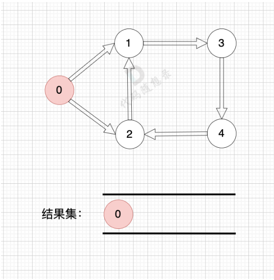

# 代码随想录算法训练营第四十七天|**拓扑排序精讲** ，**dijkstra（朴素版）精讲** 

## 拓扑排序精讲

[拓扑排序精讲 | 拓扑排序 | 有向无环图 | 广度优先搜索 | 代码随想录](https://www.programmercarl.com/kamacoder/0117.软件构建.html#拓扑排序的背景)

## 卡的思路

做拓扑排序的话，如果肉眼去找开头的节点，一定能找到 节点0 吧，都知道要从节点0 开始。

但为什么我们能找到 节点0呢，因为我们肉眼看着 这个图就是从 节点0出发的。

作为出发节点，它有什么特征？

你看节点0 的入度 为0 出度为2， 也就是 没有边指向它，而它有两条边是指出去的。

> 节点的入度表示 有多少条边指向它，节点的出度表示有多少条边 从该节点出发。

所以当我们做拓扑排序的时候，应该优先找 入度为 0 的节点，只有入度为0，它才是出发节点。 **理解以上内容很重要**！

接下来我给出 拓扑排序的过程，其实就两步：

1. 找到入度为0 的节点，加入结果集
2. 将该节点从图中移除

循环以上两步，直到 所有节点都在图中被移除了。

结果集的顺序，就是我们想要的拓扑排序顺序 （结果集里顺序可能不唯一）

那么如果我们发现结果集元素个数 不等于 图中节点个数，我们就可以认定图中一定有 有向环！

### **dijkstra（朴素版）精讲** 

[dijkstra（朴素版）精讲 | dijkstra | 最短路径 | 朴素版 | 代码随想录](https://www.programmercarl.com/kamacoder/0047.参会dijkstra朴素.html)

## 卡的思路

前两天学过了。