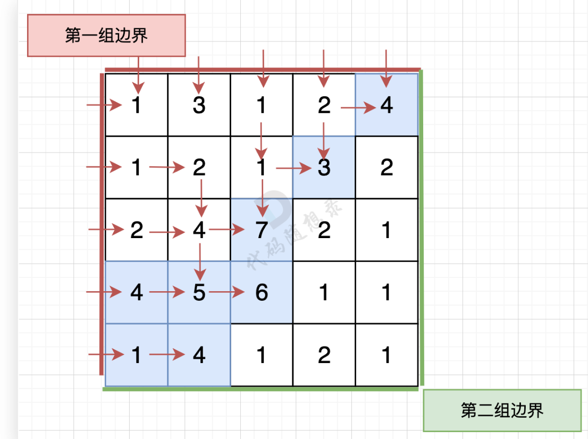
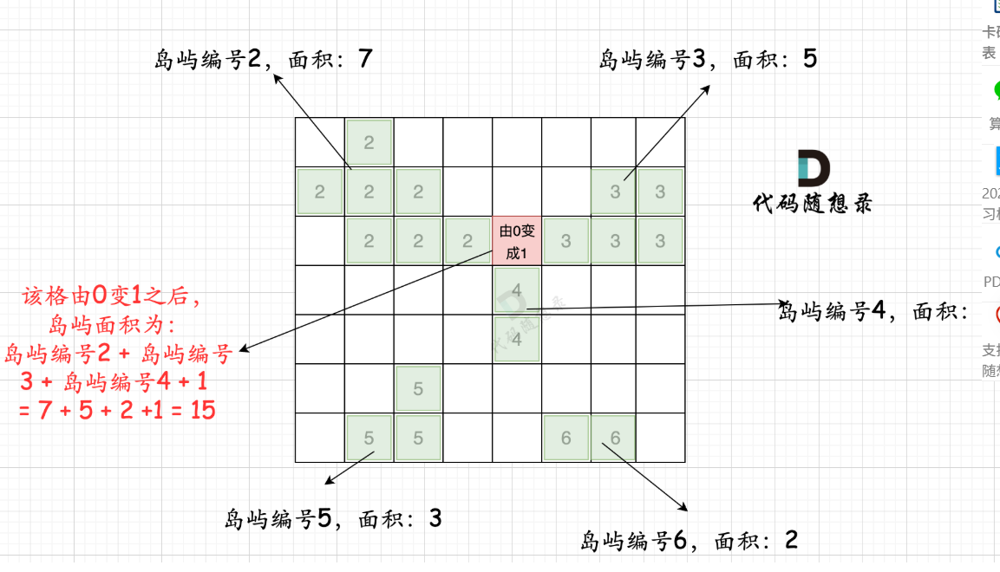

# 代码随想录算法训练营第四十三天|101. 孤岛的总面积，**102.沉没孤岛**，            **103.**     **水流问题** ，**104.建造最大岛屿**

## 101. 孤岛的总面积

[101. 孤岛的总面积 | 深度优先搜索 | 广度优先搜索 | 矩阵遍历 | 代码随想录](https://www.programmercarl.com/kamacoder/0101.孤岛的总面积.html)

## 我的思路

## 问题总结

## 卡的思路

本题要求找到不靠边的陆地面积，那么我们只要从周边找到陆地然后 通过 dfs或者bfs 将周边靠陆地且相邻的陆地都变成海洋，然后再去重新遍历地图 统计此时还剩下的陆地就可以了。

## 我的代码

```
#include<iostream>
#include<vector>
#include<queue>
using namespace std;
int dir[4][2]={0,1,1,0,-1,0,0,-1};
void dfs(vector<vector<int>>&graph,vector<vector<bool>>&visited,int x,int y){
    queue<pair<int,int>>que;
    visited[x][y]=true;
    graph[x][y]=0;
    que.push({x,y});
    while(!que.empty()){
        auto cur=que.front();que.pop();
        int x=cur.first;
        int y=cur.second;
        for(int i=0;i<4;i++){
            int nextx=x+dir[i][0];
            int nexty=y+dir[i][1];
            if(nextx<0||nextx>=graph.size()||nexty<0||nexty>=graph[0].size())continue;
            if(!visited[nextx][nexty]&&graph[nextx][nexty]==1){
                visited[nextx][nexty]=true;
                que.push({nextx,nexty});
                graph[nextx][nexty]=0;
 
            }
        }
    }
    return;

}


int main(){
    int n,m;
    cin>>n>>m;
    vector<vector<int>>graph(n,vector<int>(m,0));
    vector<vector<bool>>visited(n,vector<bool>(m,0));
    for(int i=0;i<n;i++){
        for(int j=0;j<m;j++){
            cin>>graph[i][j];
        }
    }

    for(int i=0;i<n;i++){
        for(int j=0;j<m;j++){
           if(graph[i][j]==1&&!visited[i][j]&&(i==0||i==graph.size()-1||j==0||j==graph[0].size()-1))dfs(graph,visited,i,j);
        }
    }
    int result=0;
    for(int i=0;i<n;i++){
        for(int j=0;j<m;j++){
            if(graph[i][j]==1){
               result++;
            }
        }
    }
    cout<<result;

}
```


## 102.沉没孤岛

[102. 沉没孤岛 | 深搜优先搜索DFS | 矩阵标记 | 代码随想录](https://www.programmercarl.com/kamacoder/0102.沉没孤岛.html#思路)

## 我的思路

## 问题总结

## 卡的思路

步骤一：深搜或者广搜将地图周边的 1 （陆地）全部改成 2 （特殊标记）

步骤二：将水域中间 1 （陆地）全部改成 水域（0）

步骤三：将之前标记的 2 改为 1 （陆地）

## 我的代码

```
#include<iostream>
#include<vector>
using namespace std;
int dir[4][2]={0,1,1,0,-1,0,0,-1};
void dfs(vector<vector<int>>&graph,vector<vector<bool>>&visited,int x,int y){
    visited[x][y]=true;
    for(int i=0;i<4;i++){
        int curx=x+dir[i][0];
        int cury=y+dir[i][1];
        if(curx<0||curx>=graph.size()||cury<0||cury>=graph[0].size())continue;
        if(graph[curx][cury]==1&&!visited[curx][cury]){
            graph[curx][cury]=2;
            dfs(graph,visited,curx,cury);
        }
    }
    return;
}
int main(){
    int n,m;
    cin>>n>>m;
    vector<vector<int>>graph(n,vector<int>(m,0));
    vector<vector<bool>>visited(n,vector<bool>(m,0));

    for(int i=0;i<n;i++){
        for(int j=0;j<m;j++){
            cin>>graph[i][j];
        }
    }

    for(int i=0;i<n;i++){
        for(int j=0;j<m;j++){
            if(!visited[i][j]&&graph[i][j]==1){
                if(i==0||i==graph.size()-1||j==0||j==graph[0].size()-1)
               {
                graph[i][j]=2; 
                dfs(graph,visited,i,j);}
            }
        }
    }

     for(int i=0;i<n;i++){
        for(int j=0;j<m;j++){
            if(graph[i][j]==1)graph[i][j]=0;
            if(graph[i][j]==2)graph[i][j]=1;
        }
    }
     for(int i=0;i<n;i++){
        for(int j=0;j<m;j++){
           cout<<graph[i][j]<<' ';
        }
        cout<<endl;
    }

}
```


##   **103.** **水流问题**

[103. 水流问题 | 深度优先搜索 | 广度优先搜索 | 逆流遍历 | 代码随想录](https://www.programmercarl.com/kamacoder/0103.水流问题.html)

## 我的思路

直觉上是，从每一个单元格出发，深搜，看能不能到两个边界。

## 问题总结

## 卡的思路

从第一组边界上的节点 逆流而上，将遍历过的节点都标记上。

同样从第二组边界的边上节点 逆流而上，将遍历过的节点也标记上。

然后**两方都标记过的节点就是既可以流向第一组边界也可以流向第二组边界的节点**。



## 我的代码

```
#include<iostream>
#include<vector>
using namespace std;
int dir[4][2]={0,1,1,0,-1,0,0,-1};
void dfs(vector<vector<int>>&graph,vector<vector<bool>>&box,int x,int y){
    box[x][y]=1;
    for(int i=0;i<4;i++){
        int curx=x+dir[i][0];
        int cury=y+dir[i][1];
        if(curx<0||curx>=graph.size()||cury<0||cury>=graph[0].size())continue;
        if(!box[curx][cury]&&graph[curx][cury]>=graph[x][y]){dfs(graph,box,curx,cury);}
    }
    return;


}

int main(){
    int n,m;
    cin>>n>>m;
    vector<vector<int>>graph(n,vector<int>(m,0));
    vector<vector<bool>>box(n,vector<bool>(m,0));
     vector<vector<bool>>box2(n,vector<bool>(m,0));
    for(int i=0;i<n;i++){
        for(int j=0;j<m;j++){
            cin>>graph[i][j];
        }
    }

    for(int j=0;j<graph[0].size();j++){
        dfs(graph,box,0,j);
    }

    for(int i=1;i<graph.size();i++){
        dfs(graph,box,i,0);
    }

    for(int j=0;j<graph[0].size();j++){
        dfs(graph,box2,graph.size()-1,j);
    }

    for(int i=1;i<graph.size();i++){
        dfs(graph,box2,i,graph[0].size()-1);
    }

    for(int i=0;i<graph.size();i++){
        for(int j=0;j<graph[0].size();j++){
            if(box[i][j]&&box2[i][j])
            cout<<i<<' '<<j<<endl;
        }
    }
    return 0;
     
}
```


## 104.建造最大岛屿

[104.建造最大岛屿 | 深度优先搜索 | 岛屿面积 | 矩阵 | 代码随想录](https://www.programmercarl.com/kamacoder/0104.建造最大岛屿.html)

## 我的思路

## 问题总结

## 卡的思路

只要用一次深搜把每个岛屿的面积记录下来就好。

第一步：一次遍历地图，得出各个岛屿的面积，并做编号记录。可以使用map记录，key为岛屿编号，value为岛屿面积

第二步：再遍历地图，遍历0的方格（因为要将0变成1），并统计该1（由0变成的1）周边岛屿面积，将其相邻面积相加在一起，遍历所有 0 之后，就可以得出 选一个0变成1 之后的最大面积。



## 我的代码