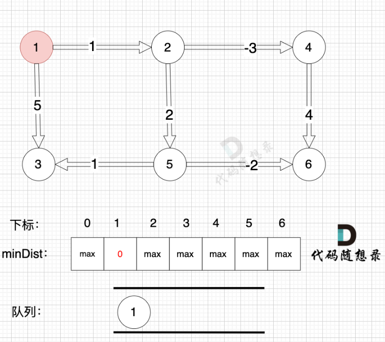
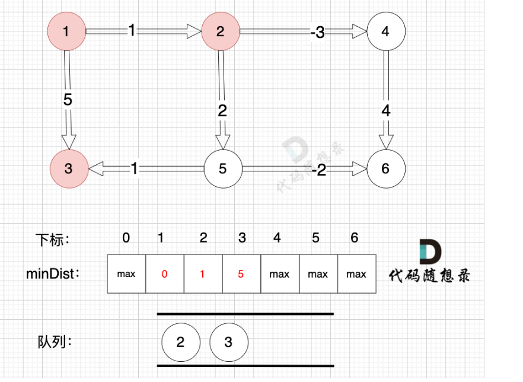
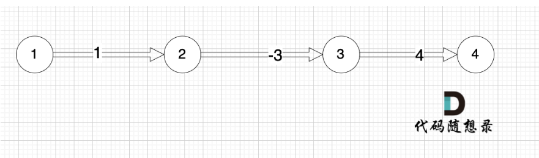

# 代码随想录算法训练营第四十九天|**Bellman_ford 队列优化算法（又名SPFA）**，**bellman_ford之判断负权回路**，**bellman_ford之单源有限最短路**

## Bellman_ford 队列优化算法

|笔记链接|

## 卡的思路

真正有效的松弛，是基于已经计算过的节点在做的松弛。

**只需要对 上一次松弛的时候更新过的节点作为出发节点所连接的边 进行松弛就够了**。

我们依然使用**minDist数组来表达 起点到各个节点的最短距离**，例如minDist[3] = 5 表示起点到达节点3 的最小距离为5

初始化，起点为节点1， 起点到起点的最短距离为0，所以minDist[1] 为 0。 将节点1 加入队列 （下次松弛从节点1开始）



从队列里取出节点1，松弛节点1 作为出发点连接的边（节点1 -> 节点2）和边（节点1 -> 节点3）

边：节点1 -> 节点2，权值为1 ，minDist[2] > minDist[1] + 1 ，更新 minDist[2] = minDist[1] + 1 = 0 + 1 = 1 。

边：节点1 -> 节点3，权值为5 ，minDist[3] > minDist[1] + 5，更新 minDist[3] = minDist[1] + 5 = 0 + 5 = 5。

将节点2、节点3 加入队列，如图：



## 我的代码

```cpp
struct{
int to;
int val;
    edge(int t,int w):to(t),val(w){}//构造函数
}

int main(){
    int n,m,p1,p2,val;
    cin>>n>>m;
    vector<list<edge>> grid(n+1);
    
    vector<bool> isInQueue(n+1);
    
    //将所有边保存起来
    for(int i=0;i<m;i++){
        cin>>p1>>p2>>val;
        //p1指向p2，权值为val
        grid[p1].push_back(Edge(p2,val));
    }
    int start =1;
    int end=n;
    
    vector<int> minDist(n+1,INI_MAX);
    minDist[start]=0;
    
    queue<int>que;
    que.push(start);
    
    while(!que.empty()){
        int node=que.front();que.pop();
        isInqueue[node]=false;//做标记，已经在队列里的元素不再重复添加
        for(Edge edge:grid[node]){
            int from=node;
            int to =edge.to;
            int value=edge.val;
            if(minDist[to]>minDIst[from]+valude){
                minDist[to]=minDist[from]+value;
                if(isInQueue[to]==false){
                    que.push(to);
                    isInqueue[to]=true;
                }
            }
        }
    }
     if (minDist[end] == INT_MAX) cout << "unconnected" << endl; // 不能到达终点
    else cout << minDist[end] << endl; // 到达终点最短路径
}

```


## bellman_ford之判断负权回路

|笔记链接|

## 我的思路

## 问题总结

## 卡的思路

## 我的代码

## bellman_ford之单源有限最短路

## 卡的思路

本题是最多经过 k 个城市， 那么是 k + 1条边相连的节点。 这里可能有录友想不懂为什么是k + 1，来看这个图：



## 代码

```
// 版本二
#include <iostream>
#include <vector>
#include <list>
#include <climits>
using namespace std;

int main() {
    int src, dst,k ,p1, p2, val ,m , n;
    
    cin >> n >> m;

    vector<vector<int>> grid;

    for(int i = 0; i < m; i++){
        cin >> p1 >> p2 >> val;
        grid.push_back({p1, p2, val});
    }

    cin >> src >> dst >> k;

    vector<int> minDist(n + 1 , INT_MAX);
    minDist[src] = 0;
    vector<int> minDist_copy(n + 1); // 用来记录上一次遍历的结果
    for (int i = 1; i <= k + 1; i++) {
        minDist_copy = minDist; // 获取上一次计算的结果
        for (vector<int> &side : grid) {
            int from = side[0];
            int to = side[1];
            int price = side[2];
            // 注意使用 minDist_copy 来计算 minDist 
            if (minDist_copy[from] != INT_MAX && minDist[to] > minDist_copy[from] + price) {  
                minDist[to] = minDist_copy[from] + price;
            }
        }
    }
    if (minDist[dst] == INT_MAX) cout << "unreachable" << endl; // 不能到达终点
    else cout << minDist[dst] << endl; // 到达终点最短路径

}

```

