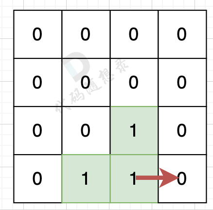
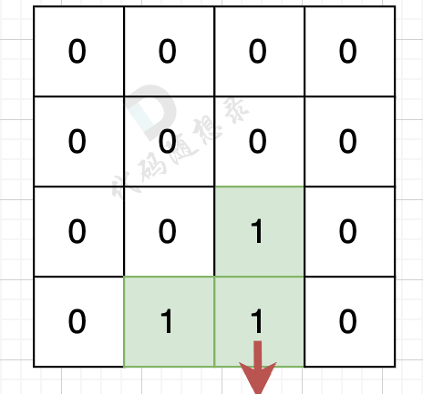

# 代码随想录算法训练营第四十二天|110.** **字符串接龙** ，105.有向图的完全可达性**，**106.** **岛屿的周长** 

## **110.** **字符串接龙**

[110. 字符串接龙 | 广度优先搜索 | 无权图 | 代码随想录](https://www.programmercarl.com/kamacoder/0110.字符串接龙.html)

## 我的思路

我去这题目叽里咕噜说什么呢。

## 问题总结

## 卡的思路

两个难点：

如何连接节点

如何找最短路径

连接节点用暴力。对每一个字符串用26个字母替换其每一位上的字母，看list中有没有出现过。用set存字符串find最快

找最短路径用广搜最方便，因为一圈一圈搜，一旦搜到终点，就是最短的。

## 我的代码

```
#include<iostream>
#include<vector>
#include<unordered_set>
#include<unordered_map>
#include<string>
#include<queue>
using namespace std;
int main(){
    string beginStr,endStr;
    unordered_map<string,int>visited;
    unordered_set<string>strSet;

    int n;
    cin>>n;
    cin>>beginStr>>endStr;
    for(int i=0;i<n;i++){
        string str;
        cin>>str;
        strSet.insert(str);
    }

    queue<string>que;
    que.push(beginStr);
    visited.insert(pair<string,int>(beginStr,1));

    while(!que.empty()){
        string cur=que.front();
        que.pop();
        int wordPath=visited[cur];
        for(int i=0;i<cur.size();i++){
            string nextstring=cur;
            for(int j=0;j<26;j++){
                nextstring[i]=j+'a';
                if(nextstring==endStr){
                    cout<<wordPath+1<<endl;
                    return 0;
                }
                if(strSet.find(nextstring)!=strSet.end()&&visited.find(nextstring)==visited.end()){
                    visited.insert(pair<string,int>(nextstring,wordPath+1));
                    que.push(nextstring);
                }
            }
        }
    }
cout<<0<<endl;
return 0;
}

```


## 105.有向图的完全可达性

[105.有向图的完全联通 | 有向图 | 深度优先搜索 | 广度优先搜索 | 代码随想录](https://www.programmercarl.com/kamacoder/0105.有向图的完全可达性.html)

## 我的思路

## 问题总结

1.`void dfs(vector<list<int>>&graph, vector<int> visited, int key)`。

这里的 `visited` 应该是引用，细一点。

2.第三个问题

```
cin >> n >> k;
for(int i=1;i<=n;i++){
    cin >> s >> t;
```

你读了 `n` 和 `k`，但循环是 `n` 次。
 正常应该是读 **k 条边**：

```
for(int i=0;i<k;i++)
```

否则如果输入只给了 k 行，你却读 n 行，程序会一直等输入，看起来就像“没有输出”。

3.**一个节点是否访问过，应该在进入这个节点时立刻标记，而不是由它的前驱替它标记**。标准写法应该是：

```
void dfs(vector<list<int>>& graph, vector<int>& visited, int key){
    if(visited[key]) return;
    visited[key] = 1;

    for(int cur : graph[key]){
        dfs(graph, visited, cur);
    }
}
```

## 卡的思路

## 我的代码

```
#include<iostream>
#include<vector>
#include<list>
using namespace std;
void dfs(vector<list<int>>&graph,vector<int>&visited,int key){
    if(visited[key])return;
    visited[key]=1;
    list<int> li=graph[key];
    for(int cur:li){
      
        dfs(graph,visited,cur);
    }
}

int main(){
    int n,k,s,t;
    cin>>n>>k;
    vector<list<int>>graph(n+1);
    vector<int>visited(n+1,0);
    for(int i=1;i<=k;i++){
        cin>>s>>t;
        graph[s].push_back(t);
    }
   
    dfs(graph,visited,1);
    for(int i=1;i<=n;i++){
        if(visited[i]==0){
            cout<<"-1"<<endl;
            return 0;
        }
    }
    cout<<"1"<<endl;
    return 0;

}
```


## **106.** **岛屿的周长** 

[106. 岛屿的周长 | 遍历 | 方向检查 | 代码随想录](https://www.programmercarl.com/kamacoder/0106.岛屿的周长.html)

## 我的思路

## 问题总结

## 卡的思路

遍历每一个空格，遇到岛屿则计算其上下左右的空格情况。

如果该陆地上下左右的空格是有水域，则说明是一条边，如图：



陆地的右边空格是水域，则说明找到一条边。

如果该陆地上下左右的空格出界了，则说明是一条边，如图：



## 我的代码

```
#include<iostream>
#include<vector>
using namespace std;
int main(){
    int n,m,result=0;
    cin>>n>>m;
    vector<vector<int>>graph(n,vector<int>(m,0));
    for(int i=0;i<n;i++){
        for(int j=0;j<m;j++){
            cin>>graph[i][j];
        }
    }

    int dir[4][2]={1,0,0,1,-1,0,0,-1};
    for(int i=0;i<n;i++){
        for(int j=0;j<m;j++){
           if(graph[i][j]==1){
            for(int k=0;k<4;k++){
                int x=i+dir[k][0];
                int y=j+dir[k][1];
                if(x<0||x>=graph.size()||y<0||y>=graph[0].size()||graph[x][y]==0)
                result++;
            }

           }
        }
    }
    cout<<result;
    return 0;
}
```

