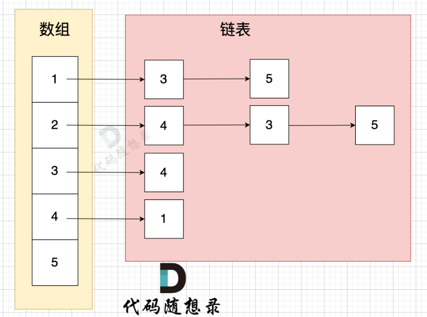
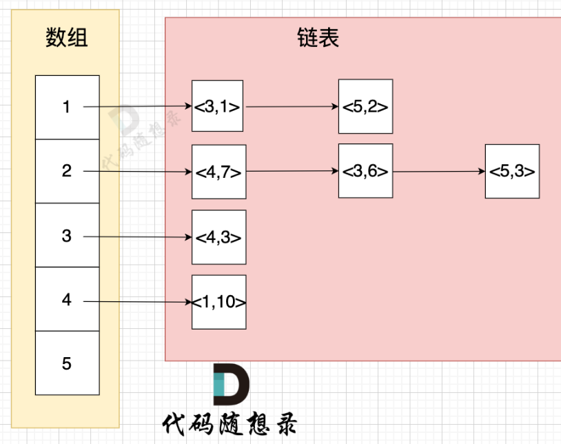

# 代码随想录算法训练营第四十八天|dijkstra（堆优化版）精讲，**Bellman_ford 算法精讲**

## dijkstra（堆优化版）精讲

[dijkstra（堆优化版）精讲 | 堆优化 | 邻接表 | dijkstra | 代码随想录](https://www.programmercarl.com/kamacoder/0047.参会dijkstra堆.html)

## 卡的思路

在n 很大的时候，也有另一个思考维度，即：从边的数量出发。

但 n 很大，边 的数量 很小的时候（稀疏图），是不是可以换成从边的角度来求最短路呢？

首先是 图的存储。

邻接矩阵的优点：

- 表达方式简单，易于理解
- 检查任意两个顶点间是否存在边的操作非常快
- 适合稠密图，在边数接近顶点数平方的图中，邻接矩阵是一种空间效率较高的表示方法。

缺点：

- 遇到稀疏图，会导致申请过大的二维数组造成空间浪费 且遍历 边 的时候需要遍历整个n * n矩阵，造成时间浪费

邻接表 使用 数组 + 链表的方式来表示。 邻接表是从边的数量来表示图，有多少边 才会申请对应大小的链表。

邻接表的构造如图：



邻接表的优点：

- 对于稀疏图的存储，只需要存储边，空间利用率高
- 遍历节点链接情况相对容易

缺点：

- 检查任意两个节点间是否存在边，效率相对低，需要 O(V)时间，V表示某节点链接其他节点的数量。
- 实现相对复杂，不易理解

那么当从 边 的角度出发， 在处理 三部曲里的第一步（选源点到哪个节点近且该节点未被访问过）的时候 ，我们可以不用去遍历所有节点了。

而且 直接把 边（带权值）加入到 小顶堆（利用堆来自动排序），那么每次我们从 堆顶里 取出 边 自然就是 距离源点最近的节点所在的边。

这样我们就不需要两层for循环来寻找最近的节点了。

而本题中 我们的边是有权值的，权值怎么表示？在哪里表示？

所以 在`vector<list<int>> grid(n + 1);` 中 就不能使用int了，而是需要一个键值对 来存两个数字，一个数表示节点，一个数表示 指向该节点的这条边的权值。



 可以 定一个类 来取代 `pair<int, int>`

类（或者说是结构体）定义如下：

```cpp
struct Edge {
    int to;  // 邻接顶点
    int val; // 边的权重

    Edge(int t, int w): to(t), val(w) {}  // 构造函数
};
```

这个类里有两个成员变量，有对应的命名，这样不容易搞混 两个int的含义。

所以 本题中邻接表的定义如下：

```cpp
struct Edge {
    int to;  // 链接的节点
    int val; // 边的权重

    Edge(int t, int w): to(t), val(w) {}  // 构造函数
};

vector<list<Edge>> grid(n + 1); // 邻接表
```

**堆优化**

思路依然是 dijkstra 三部曲：

1. 第一步，选源点到哪个节点近且该节点未被访问过
2. 第二步，该最近节点被标记访问过
3. 第三步，更新非访问节点到源点的距离（即更新minDist数组）

之前是 通过遍历节点来遍历边，通过两层for循环来寻找距离源点最近节点。 这次我们直接遍历边，且通过堆来对边进行排序，达到直接选择距离源点最近节点。

要选择距离源点近的节点（即：该边的权值最小），所以 我们需要一个 小顶堆 来帮我们对边的权值排序，每次从小顶堆堆顶 取边就是权值最小的边。

## Bellman_ford 算法精讲

[Bellman_ford 算法精讲 | Bellman_ford | 松弛 | 单源最短路 | 代码随想录](https://www.programmercarl.com/kamacoder/0094.城市间货物运输I.html)

## 卡的思路

带负权值的单源最短路问题，此时就轮到Bellman_ford登场了

Bellman_ford算法的核心思想是 对所有边进行松弛n-1次操作（n为节点数量），从而求得目标最短路。

#####  什么叫做松弛

举一个例子，每条边有起点、终点和边的权值。例如一条边，节点A 到 节点B 权值为value

minDist[B] 表示 到达B节点 最小权值，minDist[B] 有哪些状态可以推出来？

状态一： minDist[A] + value 可以推出 minDist[B] 状态二： minDist[B]本身就有权值 （可能是其他边链接的节点B 例如节点C，以至于 minDist[B]记录了其他边到minDist[B]的权值）

minDist[B] 应为如何取舍。

本题我们要求最小权值，那么 这两个状态我们就取最小的

```cpp
if (minDist[B] > minDist[A] + value) minDist[B] = minDist[A] + value
```

也就是说，如果 通过 A 到 B 这条边可以获得更短的到达B节点的路径，即如果 `minDist[B] > minDist[A] + value`，那么我们就更新 `minDist[B] = minDist[A] + value` ，**这个过程就叫做 “松弛**” 。

其实 Bellman_ford算法 也是采用了动态规划的思想，即：将一个问题分解成多个决策阶段，通过状态之间的递归关系最后计算出全局最优解。

**minDist数组来表达 起点到各个节点的最短距离**

模拟过程：[Bellman_ford 算法精讲 | Bellman_ford | 松弛 | 单源最短路 | 代码随想录](https://www.programmercarl.com/kamacoder/0094.城市间货物运输I.html)


## 我的代码