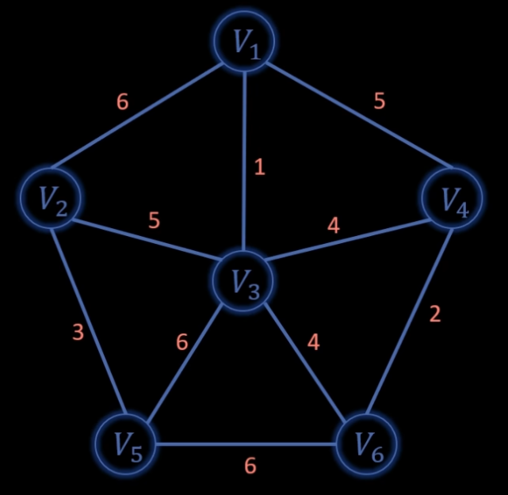
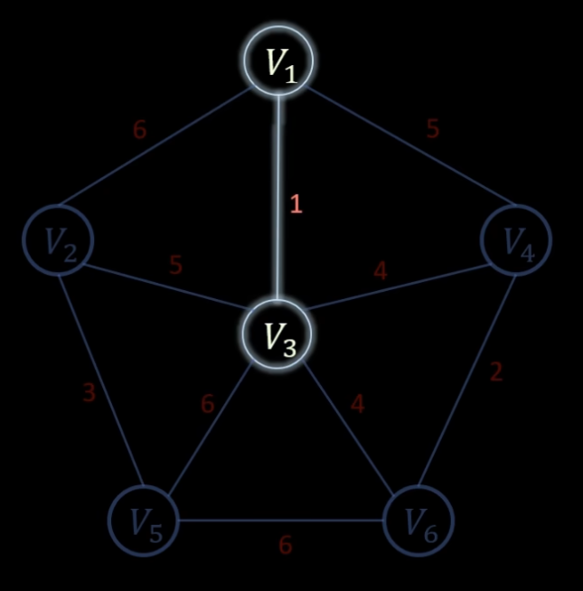
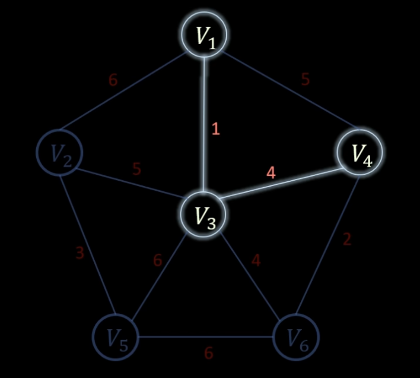
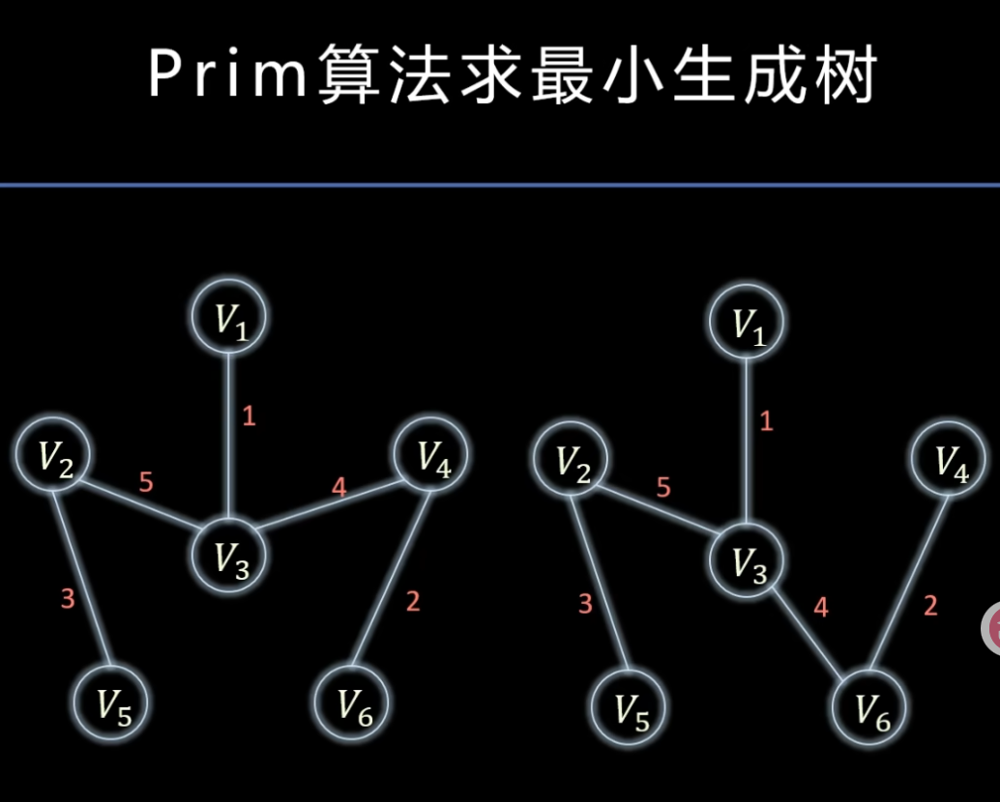
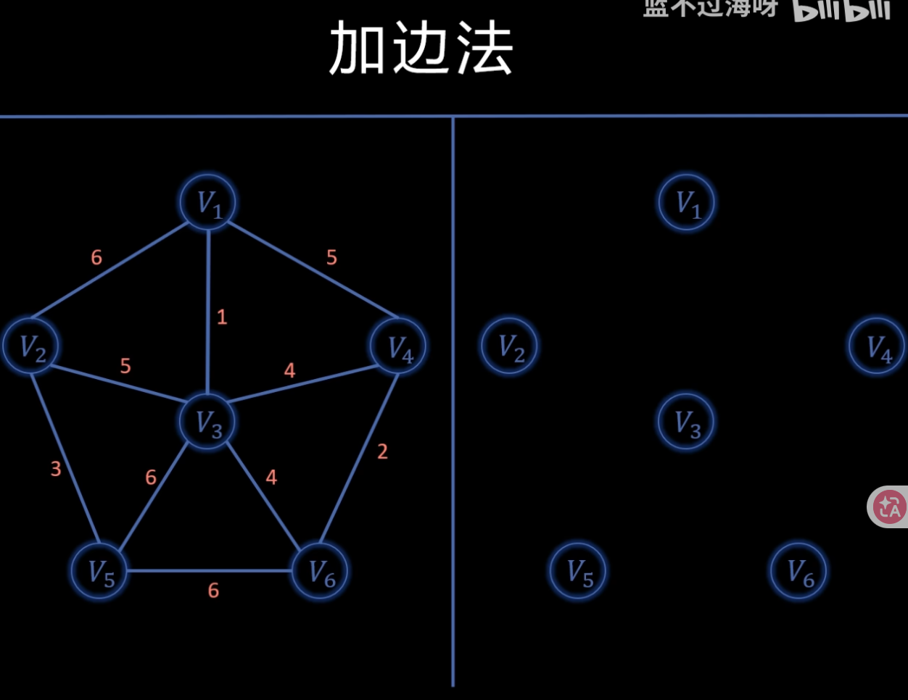
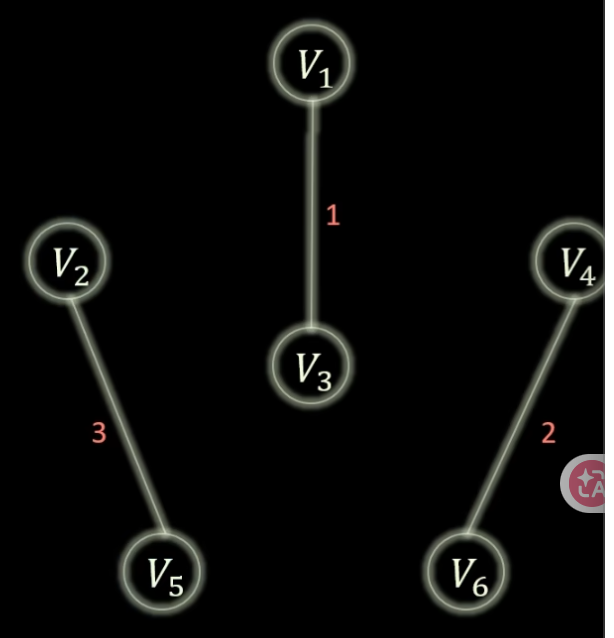

# 代码随想录算法训练营第四十六天|prim算法精讲，**kruskal算法精讲**

## prim算法精讲

[prim算法精讲 | prim算法 | 最小生成树 | 贪心策略 | 代码随想录](https://www.programmercarl.com/kamacoder/0053.寻宝-prim.html)

最小生成树

在图里面求一棵树，无环、连通所有点且权最小。

例如：城市之间修路

从任何一个点开始。

在其他的点里面找一个离当前点最近的点。

然后继续找距离**当前点亮的点**最近的路

最小生成树不唯一。

这个算法更适合稠密图。

## kruskal算法

[kruskal算法精讲 | Kruskal算法 | 并查集 | 最小生成树 | 代码随想录](https://www.programmercarl.com/kamacoder/0053.寻宝-Kruskal.html)

从小到大去加边。

每次 加边时，看边的两个端点是不是已经是连通了。如果连通则不可以加。

最小生成树仍然是不唯一的。

但是边权和一定是唯一的。