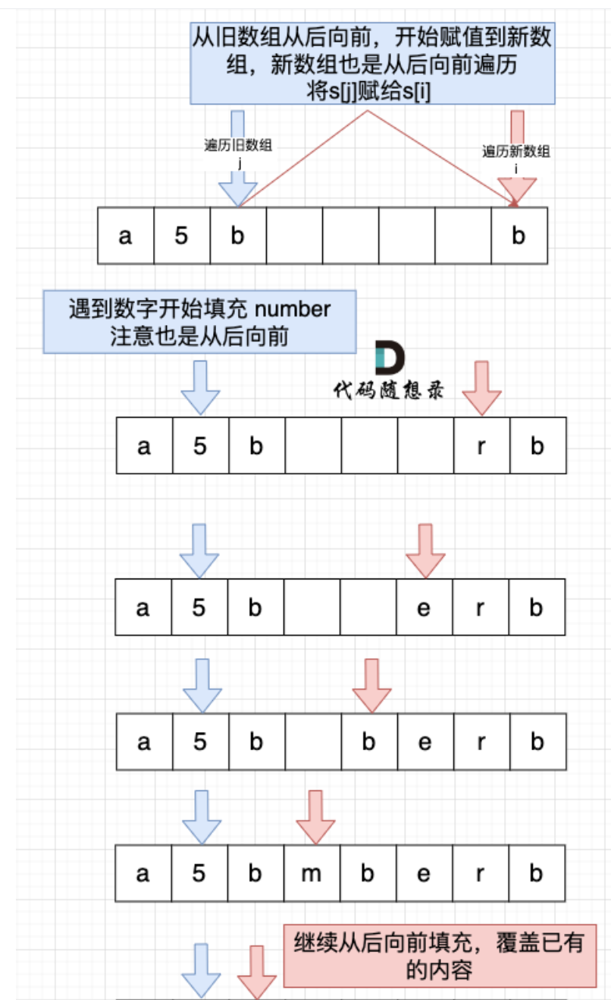

# 代码随想录算法训练营第四天|344.反转字符串、      541. 反转字符串II、卡码网：54.替换数字

## 344.反转字符串

[344.反转字符串 | 代码随想录](https://programmercarl.com/0344.反转字符串.html)

## 我的思路

无需多言

## 问题总结

1.注意一下数组最大下标是n-1

## 卡的思路

## 我的代码

```
class Solution {
public:
    void reverseString(vector<char>& s) {
        int n=s.size();
        int i=0,j=n-1;
        while(i<j){
            swap(s[i++],s[j--]);
        }
        
    }
};
```

## 541. 反转字符串II

[541. 反转字符串II | 代码随想录](https://programmercarl.com/0541.反转字符串II.html)

## 我的思路

我一开始是想有一个start指针有一个end指针有一个fast指针，然后三个指针每次往前移动两个K。但是发现手动管理边界很乱。后来用一个for循环，然后每次向前推两个K，``start=i， end=（i+k-1，n-1）`。这样简便。

## 问题总结

1.**所以当需要固定规律一段一段去处理字符串的时候，要想想在for循环的表达式上做做文章。**

2.

```cpp
  reverse(s.begin() + i, s.begin() + i + k );
```

左闭右开  [first, last)

3.对于在原地处理字符串的功能函数，参数表一定要加&

## 卡的思路

**所以当需要固定规律一段一段去处理字符串的时候，要想想在for循环的表达式上做做文章。**

## 我的代码

```
class Solution {
public:

     void swaps(string &s,int start,int end){
        while(start<end){
            swap(s[start++],s[end--]);
        }
    }

    string reverseStr(string s, int k) {
        int n=s.size();
        for(int i=0;i<n;i+=2*k){
            int start=i;
            int end=min(start+k-1,n-1);
            swaps(s,start,end);
        }
        return s;
        
    }
   
};
```

## 卡码网：54.替换数字

[替换数字 | 代码随想录](https://programmercarl.com/kamacoder/0054.替换数字.html)

## 我的思路

思路没什么难的就是自己写框架费老鼻子劲了

## 问题总结

1.输出`cout>>`

2.字符串拼接用`s+=`就可以

需要更灵活一点选择拼接范围可以用这个`append(t,1,3)`

3.万能头、命名空间、public、main()、Solution sol……

4.如果要在原地扩充的话先扫描一遍计算一下要扩充多少个位置然后从后向前扩充。

## 卡的思路



## 我的代码

```
#include <bits/stdc++.h>
using namespace std;
class Solution{
    public:
    void  alter(string s){
        int n=s.size();
        string result;
        for(int i=0;i<n;i++){
            if(s[i]>='0'&&s[i]<='9')
            result+="number";
            else
            result+=s[i];

        }
        cout<<result;

    }
};
int main(){
      Solution sol;
      string s;
      cin>>s;
    sol.alter(s);
    return 0;
}
```

## 时长   

1h10min
